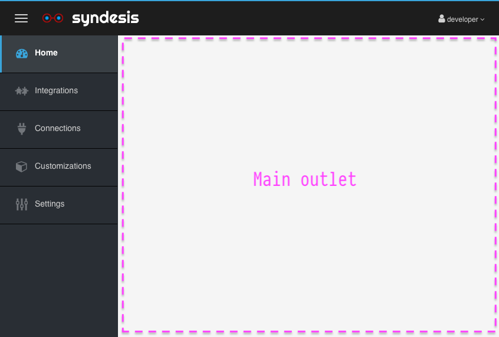

# Syndesis

Syndesis is a single page application built with React.

## Table of Contents

* [Architecture](#architecture)
  * [syndesis](#syndesis-1)
  * [packages](#packages)
      * [api](#packagesapi)
      * [models](#packagesmodels)
      * [ui](#packagesui)
      * [utils](#packagesutils)
      * [syndesis-context](#packagessyndesis-context)
  * [typings](#typings)
* [Installation](#installation)
* [Building](#building)
* [Scripts](#scripts)
* [Roadmap](#roadmap)

## Architecture 

We use [Lerna](https://github.com/lerna/lerna) to streamline the development process; the most common operations, 
like building the project or running the development mode can be done directly from the project root.  

Code is split in many packages, organized as a monorepo using [Yarn's workspaces](https://yarnpkg.com/lang/en/docs/workspaces/). 
The workspace is configured like this:

```
"syndesis",
"packages/*"
"typings/*"
```

### syndesis

`syndesis` is the main application. It handles the authentication against Syndesis's OAuth Server, and provides the main
 app layout where "sub-apps" can be injected. 



It also provides an [API for sub-apps](#packagessyndesis-context) - in the form of a [React's Context](https://reactjs.org/docs/context.html) - for 
interact with it, eg. closing the navigation bar, or redirecting to another sub-app.

It's built with [create-react-app](https://github.com/facebook/create-react-app).

#### Development server

```bash
# From the repository root
$ yarn watch:app
```

Or

```bash
# From the syndesis folder
$ yarn start
```


#### First time setup

The app requires some extra configuration on your Syndesis installation in order to work.

We need to create an OAuth Client to allow the UI to login against Syndesis OAuth Server, and then expose the 
server with a direct route.

First, login as an "admin" user of your cluster:    
```bash
$ oc login -u admin
```

Then, create a new OAuth Client:
```bash
oc create -f <(echo '
kind: OAuthClient
apiVersion: oauth.openshift.io/v1
metadata:
 name: camel-k-ui
secret: "..."
redirectURIs:
 - "http://localhost:5000/"
grantMethod: prompt
')
```

Finally, expose the server with a direct route.   
**Replace the `CLUSTER_ADDRESS` placeholder with the right address of your cluster.**
For a local development environment running on Minishift, it will look like this: `192.168.64.1.nip.io` 

```bash
oc create -f <(echo 'apiVersion: route.openshift.io/v1
kind: Route
metadata:
  annotations:
    openshift.io/host.generated: "true"
  labels:
    app: syndesis
    syndesis.io/app: syndesis
    syndesis.io/component: syndesis-server
    syndesis.io/type: infrastructure
  name: syndesis-server
  namespace: syndesis
spec:
  host: syndesis-server.CLUSTER_ADDRESS
  to:
    kind: Service
    name: syndesis-server
    weight: 100
  wildcardPolicy: None
')
```

Now we can setup the app. Run the [syndesis development server](#development-server) and open the address in a browser.  
You will be asked to provide two information:

* Api URI: write the value you specified in the host property when creating the server route. Eg. `http://syndesis-server.CLUSTER_ADDRESS`  
* Authorization URI: write the address to the authorize endpoint of your OAuth Server. When developing locally against 
Minishift, it will look like this: `https://CLUSTER_ADDRESS:8443/oauth/authorize`.  
**Replace the `CLUSTER_ADDRESS` placeholder with the right address of your cluster.**   

Click the Save button to persist the changes. If the value provided are correct, you should be redirected to Openshift Login page.

##### Resetting the configuration

Just clear the local storage for the localhost:3000 origin. You can do it with Chrome Dev Tools opened on the running app,
or you can do it from Chrome's special url chrome://settings/siteData  

###  packages

#### packages/api

This package contains a collection of React Components implementing the [render props pattern](https://reactjs.org/docs/render-props.html)
to ease interacting with Syndesis's Backend.

##### Development server

```bash
# From the repository root
$ yarn watch:packages --scope @syndesis/api
```

Or

```bash
# From the package folder
$ yarn dev
```
 

#### packages/models

This package contains the Typescript definitions of the models as read from the backend.


#### packages/ui

This package contains a collection UI elements that are common across the application. 

All the elements are written as React PureComponents or Stateless Functional Components. The idea is to decouple the 
presentation from the model that holds the data that needs to be presented to promote code reuse and easing the testing
efforts. 

##### Development server

```bash
# From the repository root
$ yarn watch:packages --scope @syndesis/ui
```

Or

```bash
# From the package folder
$ yarn dev
```

#### packages/utils

This package contains commonly used components of function that don't fit any of the above packages.

##### Development server

```bash
# From the repository root
$ yarn watch:packages --scope @syndesis/utils
```

Or

```bash
# From the package folder
$ yarn dev
```


### packages/syndesis-context

TBD. 

### typings

Extra typings for pure Javascript dependencies that should eventually be pushed on [DefinitelyTyped](https://github.com/DefinitelyTyped/DefinitelyTyped/).

## Installation 

[Yarn](https://yarnpkg.com) is the package manager required to work on the project.

To install all the dependencies: 

##### Development server

```
yarn install
```

## Building

To build syndesis and all the packages:

```bash
yarn build
```

## Scripts

To start the development server for `syndesis` and watch for changes in any of the packages:

```bash
# From the repository root
$ yarn watch
```

To start the development server only for `syndesis`:

```bash
# From the repository root
$ yarn watch:app
```
_The development server for the app will not be available at http://localhost:3000_

To start the development server only for the packages:

```bash
# From the repository root
$ yarn watch:packages
```

To start the development server for a specific package you can pass the package name to the previous command:

```bash
# From the repository root
$ yarn watch:packages --scope @syndesis/package-name
```


## Roadmap

- [ ] Extend the build system for the packages to extract any CSS file referenced in the project and make it available 
in the dist folder.
- [ ] Implement [syndesis-context](#packagessyndesis-context)
- [ ] ...so many things!

## License

[Apache](LICENSE.txt)