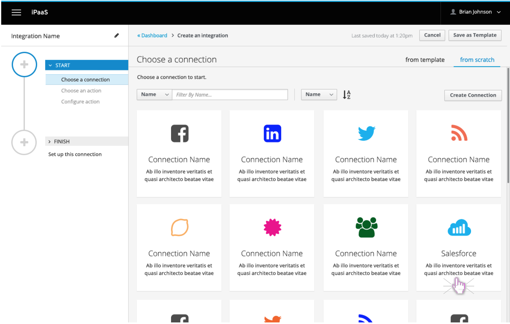
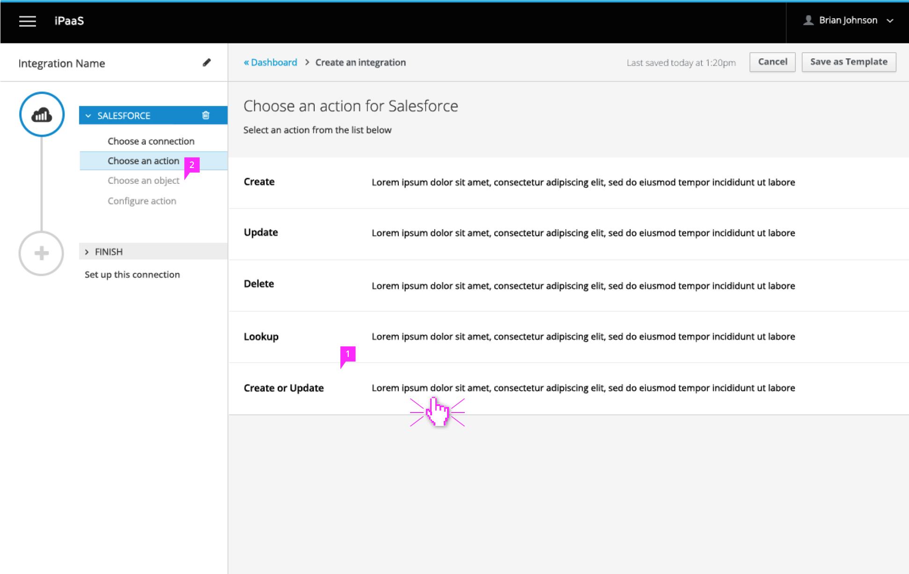
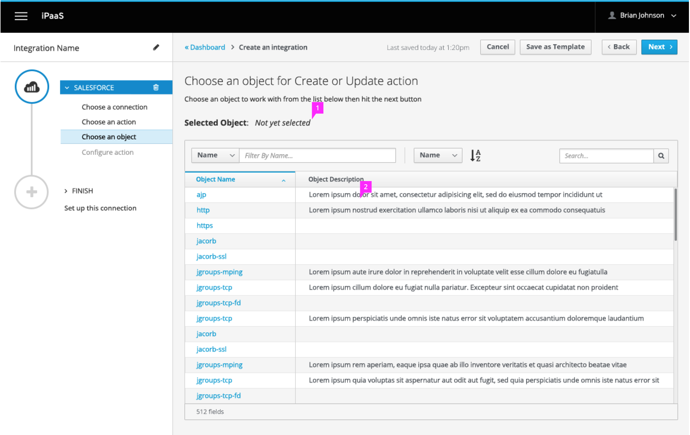
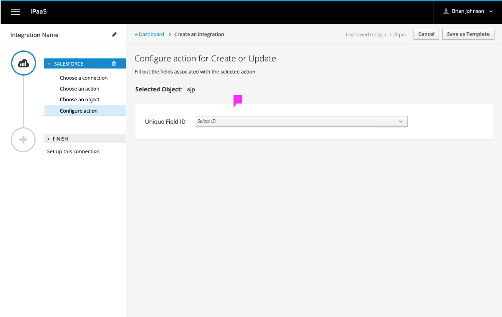
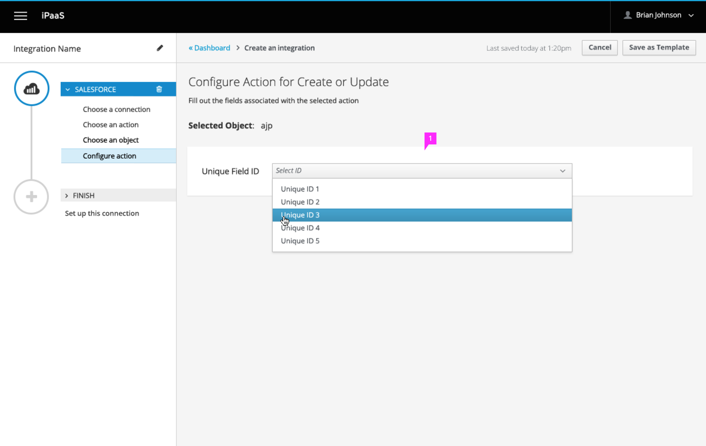

# Salesforce Dynamic Objects

## Choose Connection

In this case, user chooses Salesforce

## Choose Action

1. For the Saleforce connection, there are 5 actions OOTB
1. Since Salesforce was selected, an additional substep was added for choosing an object

## Choose Object

1. Once object is selected from the table, it will appear here so you can review before selecting the next button
1. Table to show list of all available objects. User can filter and search to find desired object. Can only choose one. Scrolling only within table, not page. List of total items shown at bottom of table as “#of items”

## Configure action

1. User must choose a unique ID. Choose Unique ID from Dropdown menu

1. Clicking on a desired item in the drop down menu would auto populate the text box with the chosen field.
