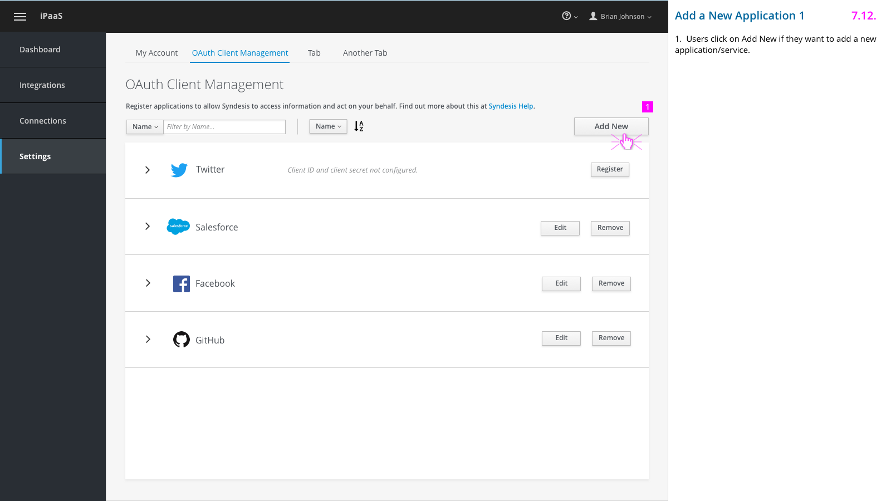

# Global Settings Page

## Global Settings Landing Page

1. Tab design for easy access of different sections on Global Settings Page.
2. Explain what users can do on this page and provide a link to help documentation.
3. Filter and sorting functionality.
4. Twitter and Salesforce are provided out-of-box. Users click on “Register” to complete registration.

## Register an Application

1. Salesforce row expanded for users to put in client ID and client secret.
2. Link to help documentation. Could possibly provide a video tutorial.
3. Input fields for client ID and client secret.

## Registration Successful Message

1. When the application/service is successfully registered, user will be presented with a confirmation message.
2. Provide a link to Create a Conection flow, letting users know that they can validate the values by creating a connection.

## Add a New Application 1

1. Users click on Add New if they want to add a new application/service.

## Add a New Application 2

1. Users fill out the form to add a new application.
2. Clicking on both Save and Cancel buttons will go back to the OAuth Client Management page.
