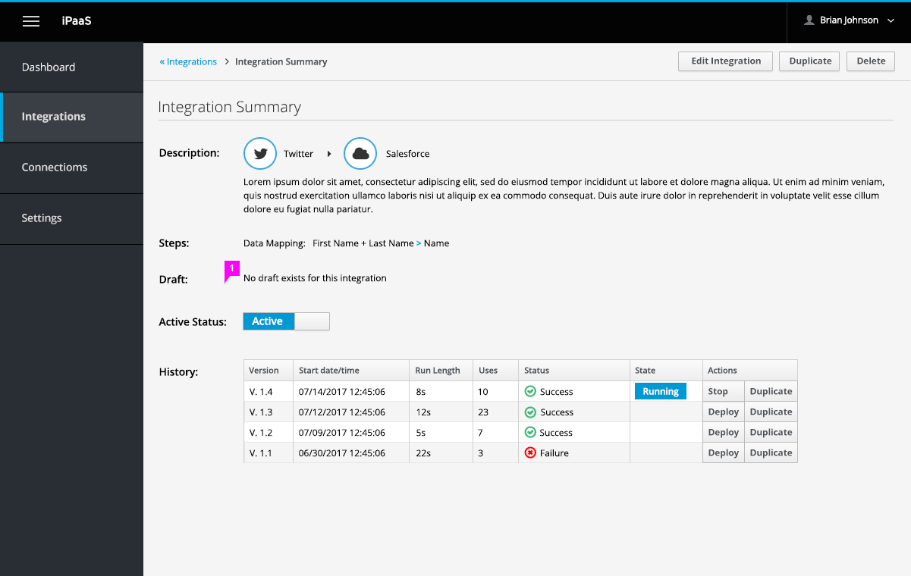
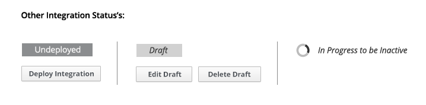

# Integration Summary Page

When a user creates an integration and deploys or saves it, user will be taken to this page to review summary of integration. User can also get back to this page by clicking on the specific integration from the Integration list page.

1. **Description**: Integration visual summary shown in horizontal orientation. Description shown in full.
1. Label showing status of integration. See below for other states. Active status has 2 actions user can take:
  - **Stop Integration**: This acts as a pause but pods will still run.
  - **Undeploy**: This stop pods from running.
1. If a draft exists, it will be shown at top of table with date it was last edited. Action button will be to Edit Draft.
1. **History**: shows the history of the integration and version details.
  - With each new deployment of an integration, a new version is created.
  - Only one version is running at a given time (shown in table).
  - User can also choose to deploy previous versions (but can't edit older versions).
  - User can also Duplicate versions to use as a blueprint.
  - For the version that is currently running, only Duplicate button will be available along with label showing which version is running.
1. Delete integration button can be found at the bottom. Will delete whole integration including all versions and a draft if it exists.

1. User can also choose to edit integration from action bar found at top of page. If no draft exists, selecting this button will create a new draft. If a draft exists, selecting this button will open existing draft.
1. If integration is inactive, there will be no label showing which version is running. User can choose to deploy any version.

1. **Undeployed**: Selecting the "Deploy Integration" button will deploy the latest integration version
1. **Draft**: If integration has yet to be deployed, then there will only be a draft mode. From here user can perform two actions:
  - Edit draft  
  - Delete draft
History will be empty in this state
1. **In progress**: When changing from active to inactive/undeployed and vice versa, change is not simultaneous, so need to show in progress message. Be sure to call out which state it is changing to.
