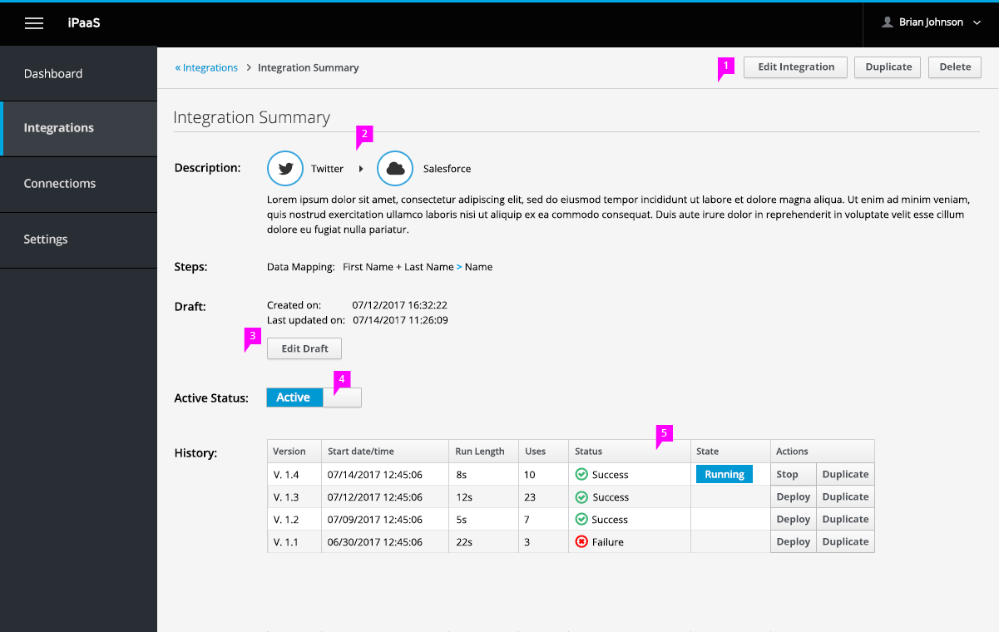

# Integration Summary Page

When a user create an integration and deploys or saves it, user will be taken to this page to review summary of integration. User can also get back to this page by clicking on integration from the Integration list page.

1. **Action Bar**: Actions include editing, deleting and duplicating.
1. Integration description shown in full along with Steps that were added to integration
1. If a draft exists, show details of when draft was created and last edited if applicable. Also have button to edit draft.
1. Toggle switch to show status of integration. User can changed status of integration here as well.
1. **History**: shows the history of the integration and version details.
  - With each new deployment of an integration, a new version is created.
  - Only one version is running at a given time (shown in table).
  - User can also choose to deploy previous versions (but can't edit older versions).
  - User can also Duplicate versions to use as a blueprint.

1. If no draft exists, then show this message instead
