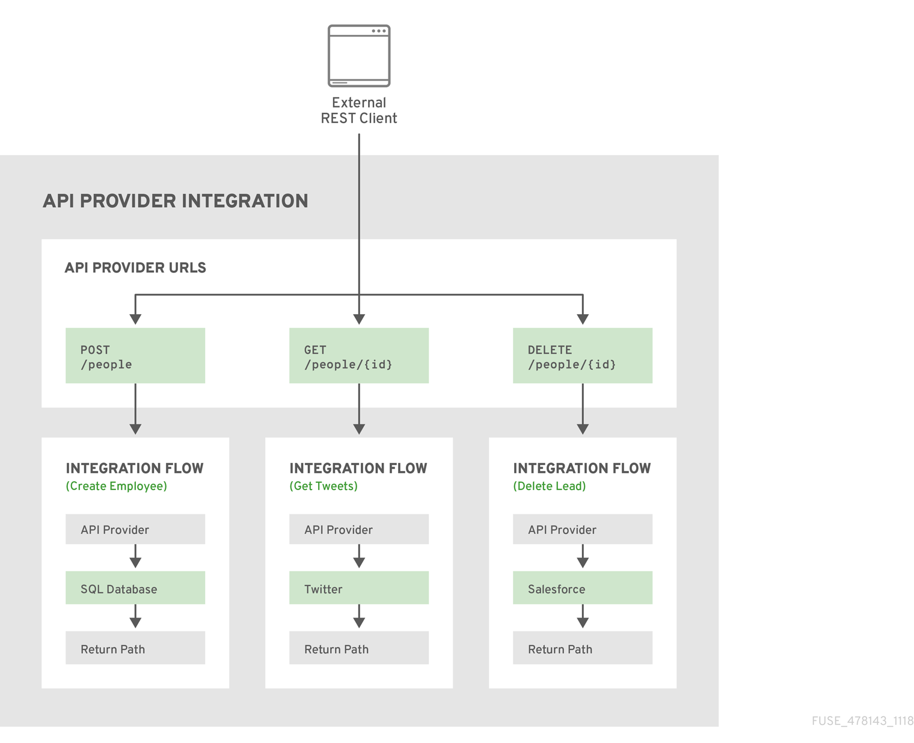

// Module included in the following assemblies:
// as_trigger-integrations-with-api-calls.adoc

[id='about-api-provider-urls_{context}']
= About API provider URLs

After you publish an API provider integration, {prodname} displays 
the external URL for your REST API
service. This is where {prodname} publishes your REST API service. This 
external URL is the base URL for calls from REST clients to your REST API 
service URLs. 
{prodname} displays this URL in the integration's summary page.
Examples of REST clients are the `curl` utility, a web browser, the Postman app, 
and other applications that make REST calls. 

In an integration, each operation that the OpenAPI schema defines has its own 
integration flow. Consequently, each operation can also have its own 
REST API service URL. Each URL is defined by the base URL 
and optionally by a subpath. REST API calls that trigger execution of a particular 
integration flow specify that operation's URL. 

Your OpenAPI schema determines which HTTP verbs (such as 
`GET`, `POST`, `DELETE` and so on) you can specify
in calls to your REST API service URLs. Examples of calls to 
API provider URLs are in the 
link:{LinkFuseOnlineIntegrationGuide}#try-api-provider-quickstart_api-provider[instructions for trying out the API provider quickstart].   

The following diagram shows an API provider integration that processes data
about people. An external REST API client invokes the REST API URLs that are 
deployed by the API provider integration. Invocation of a URL triggers
execution of the integration 
flow for one REST operation. This API provider integration has 3 flows. 
Each integration flow can use any connection or step that 
is available in {prodname}. The REST API along with its integration flows 
is one {prodname} integration, which is deployed in one OpenShift container/pod.

