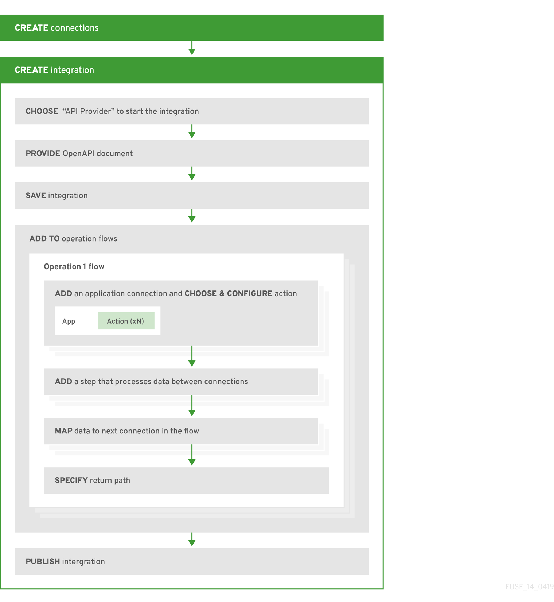

// Module included in the following assemblies:
// as_trigger-integrations-with-api-calls.adoc

[id='workflow-api-providers_{context}']
= General workflow for creating integrations that are triggered by API calls

The *general* workflow for creating an API provider integration is shown 
in the following diagram: 

When you publish the integration, 
{prodname} provides the URL where your REST API service is available.

To test the integration's flows, you can use the `curl` utility. 
For example, suppose that the following `curl` command triggers execution of the 
flow for the *Get Task by ID* operation. The HTTP `GET` command is the
default request so there is no requirement to specify `GET`. 
The last part of the URL specifies the ID of the task to get:

----
curl -k https://i-task-api-proj319352.6a63.fuse-ignite.openshiftapps.com/api/todo/1 
----
