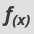

// This module is included in the following assemblies:
// as_mapping-data.adoc

[id='applying-conditions-to-mappings_{context}']
= Applying conditions to mappings

In some integrations, it is helpful to add conditional 
processing to a mapping. For example, suppose that you are 
mapping a source zip code field to a target zip code field. 
If the source zip code field is empty, you might want to fill 
the target field with `99999`. To do this, you would specify 
a Microsoft Excel expression that tests the zip code source
field to determine if it is empty, and if it is empty, 
inserts `99999` into the zip code target field. 

You can define zero or one condition for each mapping. 

The following procedure gets you started with applying 
conditions to mappings. As you work with mappings and 
conditions, you can perform the required steps in the 
order that is most convenient for you. 

.Prerequisites

* You are mapping fields in a *Data Mapper* step. 
* You are familiar with Microsoft Excel expressions or 
you have the conditional expression that you want to apply 
to a mapping. 

.Procedure

. If data types are not already visible, display them by clicking 
image:shared/images/EditorSettings.png[Editor settings] and then 
*Show Types*. 
+
While this is not a requirement for specifying a condition, it is
helpful to see the data types.

. If mapping preview fields are not already visible, display them 
by clicking image:shared/images/EditorSettings.png[Editor settings] and then 
*Show Mapping Preview*. 
+
Again, this is not a requirement, but it is helpful for checking
whether the expression you specify achieves the result that you want. 

. Create the mapping that you want to apply a condition to, or
ensure that the currently selected mapping is the mapping that you 
want to apply a condition to. 

. In the upper right, click
 to 
display the conditional expression input field. 
+
In the expression field, the data mapper automatically displays 
the name of the source field in the current mapping. 

. Specify a Microsoft Excel expression in the input field. 
+
As you specify the expression, you can: 
+
* Enter `@` to display a list of the fields in the 
current mapping. Select the field that you want to 
specify in the expression. 
* Drag a field from the mapping canvas into the expression field. 

+
For example, suppose that you are mapping a source zip code
field to a target zip code field and you specify this expression: 

+
----
if(ISEMPTY(zip), "99999")
----

+
If the source `zip` field is empty, the mapper inserts `99999` in 
the target field. 

. Optionally, apply transformations to the source or target fields. 

. Enter sample data in the source field(s) to ensure that the target field
gets the correct value. 

. Adjust the conditional expression as needed. 
