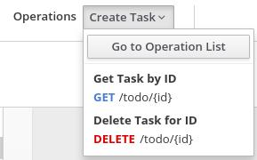

// Module included in the following assemblies:
// as_trigger-integrations-with-api-calls.adoc

[id='create-integration-operation-flows_{context}']
= Creating an API provider integration's operation flows

The OpenAPI document that defines your REST API service defines
the operations that the service can perform. After you create an API
provider integration, you can edit the flow for each operation. 

Each operation has exactly one flow. 
In an operation flow, you can add connections
to other applications and services, as well as steps that operate on data
between connections. 

As you add to operation flows, you might find that you need to update
the OpenAPI document that the API provider integration is based on. To do this, 
click *View/Edit API Definition* in the upper right of a page in which
you are editing your API provider integration. This displays your document
in the Apicurito editor. In your OpenAPI 
definition, as long as each operation has a unique `operationId` property, 
you can save your updates in Apicurito and {prodname} can synchronize the
API provider integration's flow definitions to have your updates. 

.Prerequisites

* You created an API provider integration, gave it a name, and saved it.
* You created a connection to each application or service that you want
an operation flow to connect to. For details, see the
link:{LinkFuseOnlineIntegrationGuide}#about-creating-connections_connections[information about creating connections].
* {prodname} is displaying the list of operations that the API defines. 

.Procedure

. In the *Operations* list page, click the entry for an operation
whose flow you want to edit. 

. In this operation flow, to connect to another application or service: 
.. In the flow visualization panel on the left, if this is the 
first step that you are adding, click the
plus sign. If this is not the first additional step, click the 
plus sign in the location where you want to add a connection. 
.. On the *Choose a Step* page, click the connection that you want 
to add to this flow. 
.. Click the action that you want this connection to perform.  
.. Configure the action. 
.. Click *Done*. 
.. In the upper right, click *Save*. 

+
For each connection that you want to add to this flow, repeat
this subset of instructions. Add all desired connections to the flow
before you continue. 

. In this operation flow, to process data between connections:
.. In the flow visualization panel on the left, click the
plus sign in the location where you want to add a step. 
.. On the *Choose a Step* page, click the step that you want to add. 
.. Configure the step. 
.. Click *Done*. 
.. In the upper right, click *Save*. 

+
For help, see
link:{LinkFuseOnlineIntegrationGuide}#about-adding-steps_create[Adding steps between connections].

+
Repeat this subset of instructions to add another step that processes
data between connections.

. In the flow visualization panel on the left, check for 
data type mismatch 
image:images/DataTypeMismatchWarning.png[data mismatch] icons, which
indicate that the connection cannot process the incoming data. You need
to add a data mapper step here. Go back to the previous 
subset of instructions. 
On the *Choose a Step* page, click *Data Mapper*, and define the
needed mappings. For help, see
link:{LinkFuseOnlineIntegrationGuide}#mapping-data_ug[Mapping integration data to fields in the next connection].

. In the flow visualization panel on the left, at the bottom, hover over the 
image:images/ApiProviderReturnIcon.png[Provided API Return Path] icon
to see that it is the *Provided API Return Path*. 
+
Every API provider integration finishes each operation flow by 
sending a response to the REST API caller that triggered execution of the 
operation flow. The response contains the return code that is 
specified here. 
+
In this release, whenever an API call triggers 
execution of this flow, the return code is the code that
is specified in this step. 
Error handling is expected to be supported in a future release. 
+
Accept the flow's default return code, *200 OK*, or specify another 
return code as follows:

.. Click the 
image:images/ApiProviderReturnIcon.png[Provided API Return Path] icon.
.. Click in the *Return Code* input field, which displays a list of 
possible return codes. 
.. Scroll to the return code that you want and click it. 
.. Click *Next*.

. When this flow has all needed 
connections and steps, do one of the following:
* *Publish* - To start running the integration, in the upper right, click *Publish*.
This builds the integration, deploys the REST API service to 
OpenShift, and makes the integration available to be executed. 
You can publish the integration each time that you
complete the creation of an operation's flow or each
time that you edit an operation's flow.
* *Edit another flow* - To edit the flow for another operation, select it from the 
*Operations* drop-down list, which is at the top of the page, 
and looks something like this: 
+
 
+
Or, select *Go to Operations List* to select another operation from there. 
Controls at the top of the operations list let you display
operations according to criteria that you choose. 
+
Repeat this procedure to edit another operation's 
flow.

.Next steps
When an API provider integration 
is running, you can use the `curl` utility to confirm that it is
working as expected. For examples of doing this, see 
link:{LinkFuseOnlineIntegrationGuide}#try-api-provider-quickstart_api-provider[the description of the API provider quickstart].
