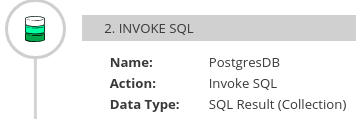
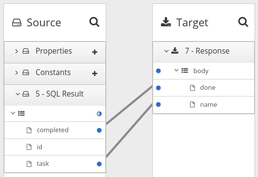

// This module is included in these assemblies:
// as_how-to-process-collection-in-a-flow.adoc
// as_mapping-data.adoc

[id='using-data-mapper-to-process-collections_{context}']
= Using the data mapper to process collections

In a flow, when a step outputs a collection and when the 
next connection expects a collection as the input, you can 
use the data mapper to specify how you want the flow to 
process the collection.  You just need to map fields in 
the source collection to fields in the target collection. 

When a step outputs a collection, the flow visualization panel 
displays *Collection* in the details about the step. For example: 

Add a data mapper step after the step that provides the collection and 
before the step that needs the mappings. Exactly where in the flow this 
data mapper step needs to be depends on the other steps in the flow. 
In the source and target panels, the data mapper displays 
image:images/collection-icon.png[this icon] to indicate
a collection. Expand the collection container to see the
fields that are in each element that is in the collection. 
When you map fields in a source collection to
fields in a target collection, when {prodname} executes
the flow, it iterates over the source collection to  
populate each element in the target collection 
according to how you mapped the fields. 

Mapping a source collection to a target collections looks
like this: 
. 

If you map fields in a source collection to a target that is 
not a collection, then when {prodname} executes the flow, 
it assigns values from only the first element in the source 
collection. Any other elements in the collection are ignored. 

In the data mapper, XML is always treated as one element and not a collection. 
