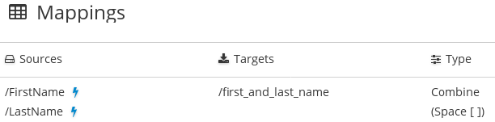

[id='combine-multiple-source-fields-into-one-target-field']
= Combining multiple source fields into one target field

To combine the content from multiple source fields into one target field:

. In the *Target* panel, click the field into which you want to map
more than one source field.
. In the *Mapping Details* panel, under *Action*, select *Combine*.
. In the *Mapping Details* panel, under *Source*, start to overtype
`*[None]*` with the name of the first source field that you want to map
into the target field.
. When the name of the first source field appears, click it. The
data mapper displays a line from the first source field to the target field.
. For each additional source field:
.. In the *Mapping Details* panel, click *Add Source*.
.. Start to overtype `Search` with the name of the next source field.
.. When the name of the next source field appears, click it. The data mapper
displays another line to the target field but this line is from this source
field.
. In the *Mapping Details* panel, in the *Separator* field, accept or
select the character that the data mapper inserts in the target field
between the source fields. The default is a space.

In the data mapper, blue lines indicates the current focus.

To confirm that the mapping is correctly defined, click
image:shared/images/grid.png[Grid] to display the mappings defined in
this step. A mapping that combines the values of more than one source field
into one target field looks like this:
. 
