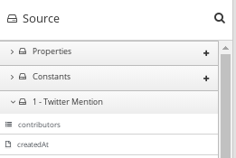

// This module is included in these assemblies:
// developing_extensions.adoc

[id='how-to-specify-data-shapes_{context}']
= How to specify data shapes in extensions

In the extension definition JSON file for a connector or for a custom
step, each `action` specification defines an input data shape
(`inputDataShape`) and an output data shape (`outputDataShape`). 
A data shape holds data type metadata that the data mapper
consumes to create internal documents. The data mapper then uses
these internal documents to display the source and target fields 
in the data mapper user interface. 

When you are developing an extension, it is important to specify data
shape properties that allow the data mapper to correctly handle and display the
source and target fields. The following data shape properties affect 
data mapper behavior: 

* `kind`
* `type`
* `specification`
* `name`
* `description`

The data shape `kind` property is represented by the `DataShapeKinds` enum. 
There are seven possible values for the `kind` property:

* `java` indicates that the data type is represented by a Java class. 
Follow the `"kind": "java"` declaration by specifying a fully qualified
class name for the `type` property. For example: 
+
----
"outputDataShape": {
     "kind": "java",
     "type": "org.apache.camel.component.telegram.model.IncomingMessage"
},
----
+
In {prodname}, a data shape whose `kind` property is `java` must have the Java 
inspection result in the data shape's `specification` property. 
If you are developing a custom step extension, then you can use 
`extension.maven.plugin` to generate the JSON extension definition file. 
When you do this, the plugin inserts the Java inspection result as 
the setting of the `specification` property. If you do not use 
`extension.maven.plugin` for a custom step extension or if you are 
developing a connector extension, then the setting of the `specification` 
property must be the actual result of the Java inspection. 

+
When the `kind` property is set to anything other than `java` then any 
setting for the `type` property is ignored.

* `json-schema` indicates that the data type is represented by a JSON schema. 
The data shape's `specification` property must contain an actual 
JSON schema document. The setting cannot be a reference to a document. 

* `json-instance` indicates that the data type is represented by a JSON instance. 
The data shape's `specification` property must contain an actual JSON 
instance document.  The setting cannot be a reference to a document. 

* `xml-schema` indicates that the data type is represented by an XML schema. 
The data shape's `specification` property must contain an actual XML schema 
document. The setting cannot be a reference to a document. 

* `xml-instance` indicates that the data type is represented by an XML instance. 
The data shape's `specification` property must contain an actual 
XML instance document. The setting cannot be a reference to a document. 

* `any` indicates that the data type is not structured. For example, it might
be a byte array or free format text. The data mapper ignores a data shape when
its `kind` property is set to `any`. 
In other words, the data does not appear in the data mapper and therefore 
you cannot map any fields to or from this data.  

* `none` indicates that there is no data type. For an input data shape,
this indicates that the connection or step does not read data. For an output data shape,
this indicates that the connection or step does not modify data. For example, when 
an input message body is being transferred to an output message body,
setting the `kind` property to `none` indicates that the data is only passing
through. The data mapper ignores data shapes when `kind` is set to `none`.
In other words, the data does not appear in the data mapper and therefore 
you cannot map any fields to or from this data. 

The data shape `name` property specifies a human readable name for the
data type. The data mapper displays this name in its user interface
as the label for the data fields. In the following image, 
*Twitter Mention* is an example of where you would see the value of
the `name` property.

This name also appears in data type indicators in the {prodname} 
integration visualization panel. 

The data shape `description` property specifies text that appears as a 
tooltip when the cursor hovers over the data type name in the data mapper
user interface. 
