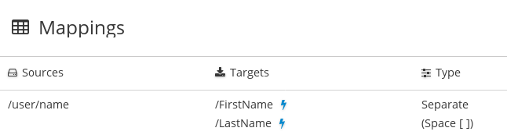

[id='separate-one-source-field-into-multiple-target-fields']
= Separating one source field into multiple target fields

To separate and map the content in one source field to multiple target fields:

. In the *Sources* panel, click the field you want to map.
. If the *Mapping Details* panel is not already visible to the right of the
*Target* panel, in the upper right, click the plus sign
to display it.
. In the *Mapping Details* panel, under *Action*, click
the down caret and select *Separate*.
. Below that, under *Targets*, click in `Search` and start to type
the name of the first target data field.
. When the name of the first target data field appears, click it.
The data mapper displays a line from the source field to the first
target field.
. For each additional target field:
.. In the lower right, click *Add Target*.
.. In the new target, click in `Search` and start to type
the name of the next target field.
.. When the name of the next target data field appears, click it.
The data mapper displays another line from the same source field,
but this time it goes to this target data field.
. In the *Mapping Details* panel, in the *Separator* field, accept or
select the character that indicates where to separate the source data
field value. The default is a space.

In the data mapper, blue lines indicates the current focus.

To confirm that the mapping is correctly defined, click
image:shared/images/grid.png[Grid] to display the mappings defined in
this step. A mapping that separates the value of a source field into
multiple target fields looks like this:
. 
