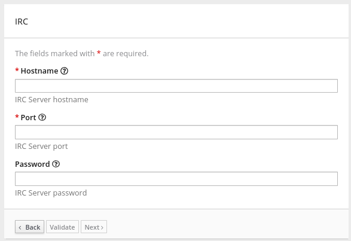

// This module is included in the following assembly:
// as_developing-extensions.adoc

[id='descriptions-of-user-interface-properties-in-extension-definitions_{context}']
= Descriptions of user interface properties 

In connector extensions and step extensions, specify user interface
properties in the extension definition JSON file or in Java class files.
The settings of these 
properties define the HTML form controls that {prodname} displays when a
{prodname} user creates a connection, configures a connection action, 
or configures a step that is provided by the extension. 

You must specify properties for each form control that you want to appear
in the extension's user interface in the {prodname} console. 
For each form control, specify some or all properties in any order.

.Example of user interface property specifications

In the JSON file that is part of the IRC connector, the top level 
`properties` object defines the HTML form controls that appear after 
a {prodname} user selects the IRC connector to create a connection. 
There are three sets of property definitions for three
form controls: `hostname`, `password`, and `port`: 

[source,json]
----
"properties": {
   "hostname": {
     "description": "IRC Server hostname",
     "displayName": "Hostname",
     "labelHint": "Hostname of the IRC server to connect to",
     "order": "1",
     "required": true,
     "secret": false,
     "type": "string"
   },
   "password": {
     "description": "IRC Server password",
     "displayName": "Password",
     "labelHint": "Required if IRC server requires it to join",
     "order": "3",
     "required": false,
     "secret": true,
     "type": "string"
   },
   "port": {
     "description": "IRC Server port",
     "displayName": "Port",
     "labelHint": "Port of the IRC server to connect to",
     "order": "2",
     "required": true,
     "secret": false,
     "tags": [],
     "type": "int"
   }
 },
----

Based on these property specifications, when a {prodname} user selects 
the IRC connector, {prodname} displays the following dialog. After 
the user enters values in the two required fields and clicks 
*Next*, {prodname} creates an IRC connection that is configured 
with the values that the {prodname} user enters. 

.About `properties` objects in extension definition JSON files

In a connector extension:

* The toplevel `properties` object controls 
what {prodname} displays when a {prodname} user selects the connector
to create a connection. This `properties` object contains a set 
of properties for each form control for creating a connection.

* In the `actions` object, there is a `properties` object for each 
action. In each of these `properties` objects, there is a set 
of properties for each form control for configuring that action. 

In a step extension, the `actions` object contains a `properties`
object. The `properties` object defines a set of properties for 
each form control for configuring the step. The JSON hierarchy
looks like this:

[source,json]

----
"actions": [
   {
      ...

      "propertyDefinitionSteps": [  
         {
            ...

            "properties": 
               {
                  "control-ONE": {
                     "type": "string",
                     "displayName": "Topic Name",
                     "order": "2",
                     ...,
                     }

                  "control-TWO": {
                     "type": "boolean",
                     "displayName": "Urgent",
                     "order": "3",
                     ...
                     }
 
                  "control-THREE": {
                     "type": "textarea",
                     "displayName": "Comment",
                     "order": "1",
                     ...,
                     }
 } } ]
----    

.About user interface properties in Java files

To define user interface form controls in Java files, import 
`io.syndesis.extension.api.annotations.ConfigurationProperty` in each class 
file that defines user configuration of a connection, action, or step. 
For each form control that you want the {prodname} console to display, 
specify the `@ConfigurationProperty` annotation, followed by a list of 
properties. For information about the properties that you can specify, 
see the user interface property reference table at the end of this section.  

The following code shows property definitions for one form control. 
This code is in the example of developing a Camel route with `RouteBuilder`: 

----
public class LogAction extends RouteBuilder {
    @ConfigurationProperty( 
        name = "prefix",
        description = "The Log body prefix message",
        displayName = "Log Prefix",
        type = "string")
----

The following code shows property definitions for two controls.
This code is from the example of using the Syndesis Step API: 

----
@Action(id = "split", name = "Split", description = "Split your exchange")
public class SplitAction implements Step {

    @ConfigurationProperty(
        name = "language",
        displayName = "Language",
        description = "The language used for the expression")
    private String language;

    @ConfigurationProperty(
        name = "expression",
        displayName = "Expression",
        description = "The expression used to split the exchange
     private String language;
----     
         
.Descriptions of control form input types

In the set of properties for each HTML form control, the `type`
property defines the input type of the form control that {prodname} displays. 
For details about HTML form input types, see 
link:https://www.w3schools.com/html/html_form_input_types.asp[https://www.w3schools.com/html/html_form_input_types.asp].

The following table lists the possible input types for {prodname} form
controls. In the set of properties for a control, if you specify a
`type` value that is unknown, {prodname} displays an input field that accepts
one line of text. That is, the default is `"type": "text"`.

[options="header"]
[cols="1,2,2"]
|===
|Value of `type` property
|HTML
|{prodname} displays

|`boolean` 
|`<input type="checkbox">`
|A checkbox that the user can select or not select. 

|`duration`	
2+|A custom control that lets the {prodname} user select a unit of time: 
milliseconds, seconds, minutes, hours, or days. The user also enters 
a number and {prodname} returns a number of milliseconds. For example: +
`"properties": { +
&nbsp;&nbsp;&nbsp;"period": { +
&nbsp;&nbsp;&nbsp;&nbsp;&nbsp;&nbsp;"type": "duration" +
&nbsp;&nbsp;&nbsp;&nbsp;&nbsp;&nbsp;"defaultValue": 60000, +
&nbsp;&nbsp;&nbsp;&nbsp;&nbsp;&nbsp;"description": "Period", +
&nbsp;&nbsp;&nbsp;&nbsp;&nbsp;&nbsp;"displayName": "Period", +
&nbsp;&nbsp;&nbsp;&nbsp;&nbsp;&nbsp;"labelHint": "Delay between integration executions.", +
&nbsp;&nbsp;&nbsp;&nbsp;&nbsp;&nbsp;"required": true, +
&nbsp;&nbsp;&nbsp;&nbsp;&nbsp;&nbsp;"secret": false, +
&nbsp;&nbsp;&nbsp;}  +
}`

|`hidden`	
|`<input type="hidden">`
|This field does not appear in the {prodname} console. You can use 
other properties to specify data that is associated with this field,
for example, textual data of some kind. 
While {prodname} users cannot see or modify this data, 
if a user selects 
*View Source* for a {prodname} page, hidden fields are visible 
in the source display. Therefore, do not use hidden fields for 
security purposes. 

|`int`, `integer`, `long`, `number`
|`<input type="number">`
|An input field that accepts a number. 

|`password`
|`<input type="password">`
|An input field in which {prodname} masks the characters 
that the user enters, typically with asterisks.

|`select`	
|A `<select>` element, for example: +
`<select name="targets"> +
&nbsp;&nbsp;<option value="queue">Queue</option> +
&nbsp;&nbsp;<option value="topic">Topic</option> +
</select>`

|A drop-down list with an entry for each label/value pair 
that you specify in the form control’s `enum` property. 

|`text`, `string`, or any unknown value	
|`<input type="text">``
|An input field that accepts one line of text. 

|`textarea`	
|`<input type="textarea"`
|A textarea element is used

|===

.Descriptions of control form user interface properties

In a connector or step extension, for each HTML form control that 
appears in the {prodname} console, you can specify one or more of the 
properties described in the following table. 
For details about HTML form input types, see 
link:https://www.w3schools.com/html/html_form_input_types.asp[https://www.w3schools.com/html/html_form_input_types.asp].

[options="header"]
[cols="1,1,2"]
|===
|Property name
|Type
|Description

|`type`
|string 
|Controls the kind of form control that {prodname} displays. See 
the previous table for details. 

|`cols`
|number
|If set for a `textarea` field, controls the number of columns initially 
displayed for the textarea control.

|`controlHint` or `controlTooltip`
|string
|If set, the value is mapped to the HTML `title` attribute of the form 
control element. Just like other elements that have a `title` attribute, 
when the cursor hovers over the control, a tooltip appears. The content 
of the tooltip comes from the value of the `controlHint` 
or `controlTooltip` property. 

|`dataList` 
|array
|If the value of the `type` property is `text`, {prodname} uses 
the value of the `dataList` property to add typeahead support. Specify  
an array of strings.

|`defaultValue`
|Varies according to the value of the `type` property. 
|{prodname} initially displays this value in the form field. 
The type of the setting of the `defaultValue` property should match the 
value of the `type` property. For example, when the `type` property is 
set to `number`, the `defaultValue` setting should be a number. 
If the user does not change this initial field value,  
{prodname} uses `defaultValue`.   

|`description`
|string
|If set, {prodname} displays this value below the form control. 
Typically, this is a short, useful message about the control. 

|`displayName`
|string
|{prodname} displays this value.

|`enum`
|array
|If set, {prodname} overrides any setting for the `type` property 
and implements a `select` control. Specify the array as a set of
`label` and `value` attributes. The `label` attribute appears 
in the user interface as the select item's label. The `value` 
attribute becomes the value for the corresponding select item. 

|`labelHint` or `labelTooltip` 
|string
|If set, a `?` icon appears next to the display name. When the 
{prodname} user clicks the `?` icon, the value of the `labelHint` 
property displays. 

|`max`
|number 
|If set for a `number` field, defines the highest acceptable value.

|`min`
|number
|If set for a `number` field, defines the lowest acceptable value.

|`multiple` 
|Boolean
|If set to `true` for a `select` field or for a field that has 
the `enum` property set, {prodname} displays a multi-select control 
instead of a select drop-down.

|`order`
|number
|Determines the order of controls in the {prodname} console.
{prodname} applies ascending order, that is, the control that 
has `"order": "1"` appears first.  
Without specification of the `order` property, {prodname} displays 
controls in the order in which the JSON file defines them. 

|`placeholder`
|string
|If set, {prodname} displays this value in a hazed font in an 
input field to help the user understand the expected input. 

|`required`
|Boolean
|Controls whether or not the `required` attribute is set on the control. 
If true, then the {prodname} user must enter a value for this control. 

|`rows`
|number
|If the value of the `type` property is `textarea`, 
the value of the `rows` property controls the number of rows 
initially displayed in the textarea control.

|`secret`
|Boolean
|If specified, {prodname} changes the setting of the control's `type` property 
to `password` if that is not already the setting. 

|===
