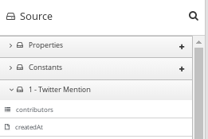

// This module is included in these assemblies:
// as_developing-extensions.adoc

[id='how-to-specify-data-shapes_{context}']
= How to specify data shapes in extensions

A data shape holds data type metadata for use by the data mapper. 
The data mapper transforms this metadata into internal documents that 
it uses to display the source and target data fields in the data mapper 
user interface. In an extension definition JSON file for a connector or 
for a custom step, each action specification defines an input 
data shape (`inputDataShape`) and an output data shape (`outputDataShape`).

When you are developing an extension, it is important to specify data
shape properties that allow the data mapper to correctly handle and display the
source and target fields. The following data shape properties affect 
data mapper behavior: 

* `kind`
* `type`
* `specification`
* `name`
* `description`

.About the `kind` property
The data shape `kind` property is represented by the `DataShapeKinds` enum. 
The possible values for the `kind` property are: 

* `java` indicates that the data type is represented by a Java class. 
Follow the `"kind": "java"` declaration by specifying a fully qualified
class name for the `type` property. For example: 
+
----
"outputDataShape": {
     "kind": "java",
     "type": "org.apache.camel.component.telegram.model.IncomingMessage"
},
----

* `json-schema` indicates that the data type is represented by a JSON schema. 
When `kind` is set to `json-schema`, specify a JSON schema as the value of
the data shape's `specification` property. For example:
+
----
"inputDataShape": {
  "description": "Person data",
  "kind": "json-schema",
  "name": "Person",
  "specification": "{\"$schema\":\"http://json-schema.org/draft-04/schema#\",\"title\":\"Person\",\"type\":\"object\",\"properties\":{\"firstName\":{...}}}"
}
----
+
The code for the SAP Concur connector contains 
link:https://github.com/syndesisio/syndesis/blob/master/app/connector/concur/src/main/resources/META-INF/syndesis/connector/concur-api.json[examples of data shapes that are specified by JSON schemas]. 

* `json-instance` indicates that the data type is represented by a JSON instance.  
When `kind` is set to `json-instance`, specify a JSON instance as the value of
the data shape's `specification` property. For example:
+
----
"inputDataShape": {
  "description": "Person data",
  "kind": "json-instance",
  "name": "Person",
  "specification": "{\"firstName\":\"John\",...}"
}
----

* `xml-schema` indicates that the data type is represented by an XML schema. 
When `kind` is set to `xml-schema`, specify an XML Schema as the value of
the data shape's `specification` property. For example:
+
----
"inputDataShape": {
  "description": "Person data",
  "kind": "xml-schema",
  "name": "Person",
  "specification": "<?xml version=\"1.0\" encoding=\"UTF-8\" ?><xs:schema xmlns:xs=\"http://www.w3.org/2001/XMLSchema\">...</xs:schema>"
}
----

* `xml-instance` indicates that the data type is represented by an XML instance. 
When `kind` is set to `xml-instance`, specify an XML instance as the value of
the data shape's `specification` property. For example:
+
----
"inputDataShape": {
  "description": "Person data",
  "kind": "xml-instance",
  "name": "Person",
  "specification": "<?xml version=\"1.0\" encoding=\"UTF-8\" ?><Person><firstName>Jane</firstName></Person>"
}
----

* `any` indicates that the data type is not structured. For example, it might
be a byte array or free format text. The data mapper ignores a data shape when
its `kind` property is set to `any`. 
In other words, the data does not appear in the data mapper and therefore 
you cannot map any fields to or from this data.  
+
However, for a custom connector, when its `kind` property is set to `any`, 
{prodname} prompts you to specify input and/or output data types when you 
configure a connection that you have created from the custom connector. 
This happens when you add a connection to an integration. 
You can specify the kind of the data shape’s schema, an appropriate 
document for the kind of schema that you specify, and a name for the data type. 

* `none` indicates that there is no data type. For an input data shape,
this indicates that the connection or step does not read data. For an output data shape,
this indicates that the connection or step does not modify data. For example, when 
an input message body is being transferred to an output message body,
setting the `kind` property to `none` indicates that the data is only passing
through. The data mapper ignores data shapes when `kind` is set to `none`.
In other words, the data does not appear in the data mapper and therefore 
you cannot map any fields to or from this data. 

.About the `type` property
When the value of the `kind` property is `java`, the `"kind": "java"` 
declaration is followed by a `type` declaration that specifies a fully qualified
Java class name. For example: 

----
"outputDataShape": {
     "kind": "java",
     "type": "org.apache.camel.component.telegram.model.IncomingMessage"
},
----

When the `kind` property is set to anything other than `java` then any 
setting for the `type` property is ignored.

.About the `specification` property

The setting of the `kind` property determines the setting of the 
`specification` property, as shown in the following table. 

[cols=2*,options="header"]
|===
|`kind` property setting
|`specification` property setting

|`java`
|Java inspection result. 

For each extension that you write in Java, use `extension-maven-plugin` 
to at least obtain the Java inspection result. The plugin inserts the Java 
inspection result in the JSON extension definition file as the setting 
of the `specification` property. This is the only way to obtain the Java 
inspection result, which is required for data mapping in {prodname}. 

As a reminder, for step extensions written in Java, `extension-maven-plugin` 
generates the JSON extension definition file and populates it with
required content. For connector extensions, while `extension-maven-plugin`
inserts the Java inspection result in the JSON extension definition file, 
you will need to manually 
add the required content that the plugin does not insert. 

|`json-schema`
|An actual JSON schema document. The setting cannot be a reference to a 
document and the JSON schema cannot point to other JSON schema documents 
by means of references. 

|`json-instance`
|An actual JSON document that contains example data. The data mapper 
derives the data types from the example data. The setting cannot be a 
reference to a document.

|`xml-schema`
|An actual XML schema document. The setting cannot be a reference to a 
document and the XML schema cannot point to other XML schema documents 
by means of references.

|`xml-instance`
|An actual 
XML instance document. The setting cannot be a reference to a document.

|`any`
|The `specification` property is not required. Any setting is ignored.

|`none`
|The `specification` property is not required. Any setting is ignored. 

|===

.About the `name` property

The data shape `name` property specifies a human readable name for the
data type. The data mapper displays this name in its user interface
as the label for the data fields. In the following image, 
*Twitter Mention* is an example of where you would see the value of
the `name` property.

This name also appears in data type indicators in the {prodname} 
flow visualization. 

.About the `description` property

The data shape `description` property specifies text that appears as a 
tooltip when the cursor hovers over the data type name in the data mapper
user interface. 
