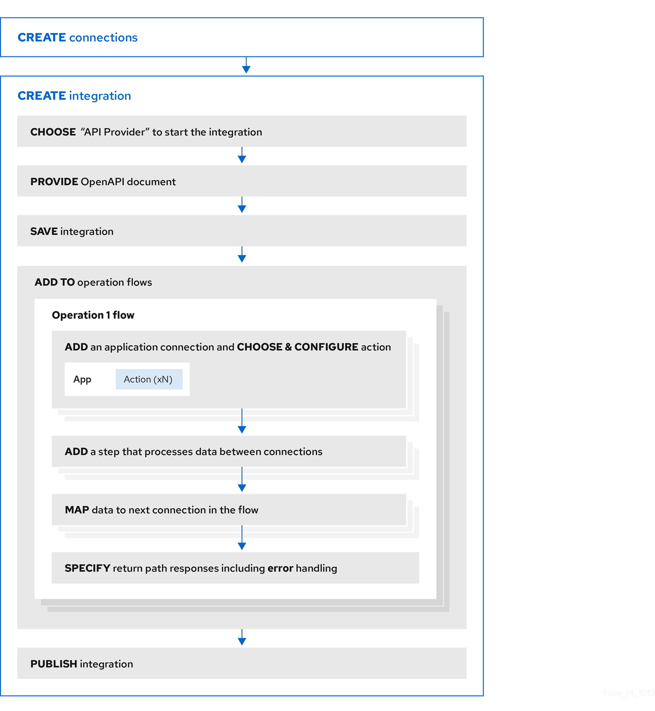

// Module included in the following assemblies:
// as_trigger-integrations-with-api-calls.adoc

[id='overview-benefit-api-provider-integrations_{context}']
= Benefit, overview, and workflow for creating API provider integrations

An API provider integration starts with a REST API service. 
This REST API service is defined by an OpenAPI 2.0
document that you provide when you create an API provider integration. 
After you publish an API provider integration,
{prodname} deploys the REST API service on OpenShift. 
The benefit of an API provider integration
is that REST API clients can invoke calls that trigger execution of the integration. 

.Multiple execution flows
An API provider integration has multiple execution paths, referred to as flows. 
Each operation that the OpenAPI document defines has its own flow.
In {prodname}, for each operation that the OpenAPI 
document defines, you add connections and other steps to the execution flow for that
operation. These steps process the data
as required for the particular operation. 

.Example execution flow
For example, consider a human 
resources application that calls a REST API service that {prodname} has 
made available. Suppose the call invokes the operation that adds a new
employee. The operation flow that handles this call could:

* Connect to an application that creates an expense report for new employee 
equipment.
* Connect to a SQL database to add an internal ticket for setting up new 
equipment.
* Connect to Google mail to send a message to the new employee that provides 
orientation information. 

.Ways to trigger execution
There are many ways to call the REST APIs that trigger integration execution, 
including: 

* A web browser page that takes data input and generates the call.
* An application that explicitly calls the REST APIs, such as the `curl` utility.
* Other APIs that call the REST API, for example, a webhook. 

.Ways to edit a flow
For each operation, you can edit its flow by:
   
* Adding connections to the applications that need to process the data.
* Adding steps between connections, including split, aggregate, and data mapping steps.
* Mapping connection error messages to return codes in the HTTP response that finishes the flow. The 
response goes to the application that invoked the call that triggered
execution of the integration. 

.Workflow for creating an API provider integration
The *general* workflow for creating an API provider integration is shown 
in the following diagram: 

.Publishing an API provider integration
After you publish an API provider integration, in the integration's
summary page, {prodname} displays the external URL for your REST API service.
This external URL is the base URL that clients use to 
call your REST API services.

.Testing an API provider integration
To test an API provider integration's flows, you can use the `curl` utility. 
For example, suppose that the following `curl` command triggers execution of the 
flow for the *Get Task by ID* operation. The HTTP `GET` command is the
default request so there is no requirement to specify `GET`. 
The last part of the URL specifies the ID of the task to get:

----
curl -k https://i-task-api-proj319352.6a63.fuse-ignite.openshiftapps.com/api/todo/1 
----
