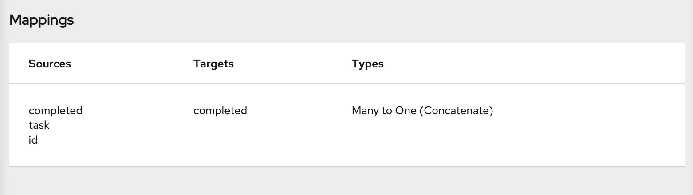

// This module is included in the following assemblies:
// as_mapping-data.adoc

[id='combine-multiple-source-fields-into-one-target-field_{context}']
= Combining multiple source fields into one target field

In a data mapper step, you can combine multiple source fields into one 
compound target field. For example, you can map the `FirstName` and `LastName` 
fields to the `CustomerName` field.

.Prerequisite
For the target field, you must know what type of content is in each
part of this compound field, the order and index of each part of the content, 
and the separator between parts, such as a space or comma. See
link:{LinkFuseOnlineIntegrationGuide}#example-missing-unwanted-data_map[Example of missing or unwanted data]. 

.Procedure

. In the *Target* panel, click the field into which you want to map more 
than one source field.

. In the *Sources* panel, if there is a field that contains the fields
that you want to map to the target field, then click that container field 
to map all contained fields to the target field. 
+
To individually select each source field, click the first field that 
you want to combine into the target field. For each of the other fields 
that you want to combine into the target field, hover over that field, and press 
*CTRL-Mouse1* (*CMD-Mouse1* on MacOS).
+
When you are done you should see a line from each of the source fields to
the target field. 
+
In the *Mapping Details* panel, under *Sources*, the data mapper 
displays the default multiplicity transformation, which is *Concatenate*.
This indicates that execution of the mapping applies the *Concatenate*
transformation to the values in the selected source fields and maps 
the concatenated value to the selected target field. 
+
[NOTE]
For information about other transformations that you can apply to 
multiple source values see 
link:{LinkFuseOnlineIntegrationGuide}#about-transformations-on-multiple-source-values_map[About transformations on multiple source values]
+
Also under *Sources*, there is an entry for each source field that 
you selected.

. In the *Mapping Details* panel, configure the mapping as follows: 

.. Under *Sources*, in the *Delimiter* field, accept or select 
the character that the data mapper inserts in the target field between 
the content from different source fields. The default is a space.

.. Optional. In each source field entry, you can click *Add Transformation* 
to apply a transformation to the source field value before it gets 
mapped to the target field. 

.. Under *Sources*, check the order of the entries for the source 
fields that you selected. The entries must be in the same order as 
the corresponding content in the compound target field.
+
If the entries are not in the correct order, drag and drop 
source field entries to achieve the same order. The data mapper 
automatically updates the index numbers to reflect the new order.
+
If you mapped a source field to each part of the compound target field, 
skip the next step.

.. For each source field entry that does not already have the same 
index as the corresponding data in the target field, edit the index 
to be the same. Each source field entry must have the same index 
as the corresponding data in the target field. The data mapper 
automatically adds padding fields as needed to indicate missing data.
+
If you accidentally create too many padding fields, click the 
trash-can icon on each extra padding field to delete it.

.. Optional. Under *Targets*, click *Add Transformation* to map 
the content into the target field and then apply a transformation.

. Optionally, preview the data mapping result: 
.. In the upper right of the data mapper, click 
image:../../images/tutorials/EditorSettings.png[Editor settings] and select 
*Show Mapping Preview* to display a text input field on each source
field for the currently selected mapping and a read-only result field 
on the target field of the currently selected mapping. 
.. In the source data input fields, enter text. Click outside the
text box to display the mapping result in the read-only field on the target field.
+
If you reorder the source fields or add a transformation to the mapping
then the result field on the target field reflects this. If the data mapper
detects any errors, it displays informative messages at the top of the 
*Mapping Details* panel. 

.. Hide the preview fields by clicking 
image:../../images/tutorials/EditorSettings.png[Editor settings] again and selecting
*Show Mapping Preview*. 
+
If you redisplay the preview fields, any data
that you entered in them is still there and it 
remains there until you exit the data mapper. 

. To confirm that the mapping is correctly defined, in the upper right, click
image:../../images/tutorials/grid.png[Grid] to display the mappings defined in
this step. A mapping that combines the values of more than one source field
into one target field looks like this:
. 
+
You can also preview mapping results in this view. Click 
image:../../images/tutorials/EditorSettings.png[Editor settings], select 
*Show Mapping Preview*, and enter text as described in the previous step.
Preview fields appear for only the selected mapping. Click another
mapping in the table to view preview fields for it. 

.Additional resource
Example of adding padding fields: 
link:{LinkFuseOnlineIntegrationGuide}#separate-one-source-field-into-multiple-target-fields_map[Separating one source field into multiple target field]. 

Although that example is for a one-to-many mapping, the principles are the same.
