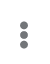

// This module is included in these assemblies:
// as_monitoring-integrations.adoc

[id='viewing-integration-history_{context}']
= Viewing integration history

{prodname} maintains each version of an integration. You can always view a list
of the versions of each integration. 

.Procedure

. In the left panel, click *Integrations* to display a list of the
integrations in your environment.
. At the right of the entry for the integration whose versions you want to see, 
click *View*. 

.Result 
In the page that appears, the *History* section lists the versions
of the integration. The
image:../../images/tutorials/GreenCircleCheckmark.png[Current Version] icon
identifies the current version, which is the most recently,
successfully running version.
For each version, you can also see the date on which it was last started.

To edit, start, or stop a particular version, click the
 to the right of the
version's entry. Select the operation that you want to perform.
