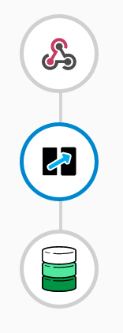
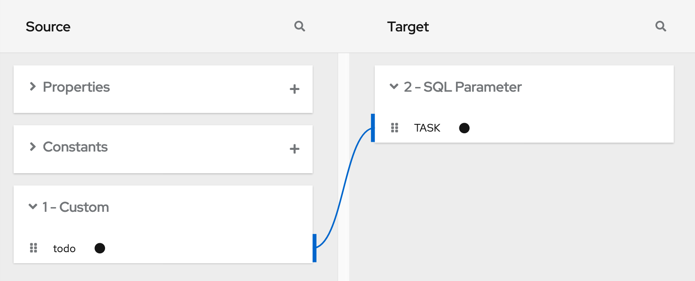
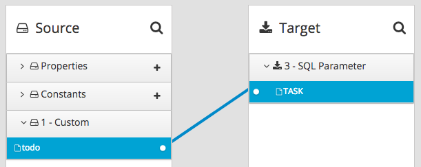
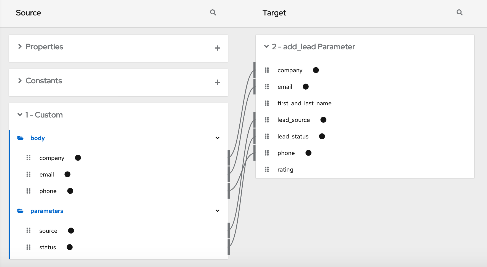

// This module is included in the following assemblies:
// as_triggering-integrations-with-http-requests.adoc

[id='how-to-specify-request_{context}']
= How to specify HTTP requests

The following examples show how to specify HTTP requests for the
{prodname} Webhook. 

.Webhook example of POST request with only HTTP body

Consider an integration that starts with a Webhook connection and then
creates a row in the *Todo* table of the {prodname}-provided database:

During creation of this integration, when you add the Webhook start
connection, you specify its output data type with a JSON instance that
has this content: `{"todo":"text"}`:

When you add the *PostgresDB* connection as the finish connection, you 
select the *Invoke SQL* action and specify this SQL statement:

`INSERT INTO TODO (TASK) VALUES (:#TASK)`

After you add the database connection, you add a mapping step: 

You save and publish the integration. When it is running, you can
copy the external URL that {prodname} provides: 

image:../../images/integrating-applications/ExternalURL.png[External URL]

To understand the parts of the external URL, consider this sample URL: 
 
`\https://i-webhook-to-db-myproject.192.168.64.4.nip.io/webhook/bvGvQdpq308BcHIQQYeysFOK4plFISmghNHkRyOOk3YppitvOd`

[options="header"]
[cols="1,3"]
|===
|Value 
|Description

|`i-`
|{prodname} always inserts this value at the beginning of the URL. 

|`webhook-to-db`
|The name of the integration.

|`myproject`
|The OpenShift namespace that contains the pod that is running the integration.

|`192.168.64.4.nip.io`
|The DNS domain that is configured for OpenShift. This indicates the
{prodname} environment that is providing the webhook.

|`webhook`
|Appears in each Webhook connection URL.

|`bvGvQdpq308BcHIQQYeysFOK4plFISmghNHkRyOOk3YppitvOd`
| Webhook connection token that {prodname} provides when you add
a Webhook connection to an integration. The token is a random string that 
provides security in that it makes the URL hard to discern, which prevents 
anyone else from sending a request. 

In a request, you can specify the token that {prodname} provides or you 
can define your own. If you define your own, ensure that it is hard to guess.

|===

As you can see in the external URL, {prodname} constructs the host 
name from the name of the integration, 
the name of the OpenShift namespace, and the OpenShift DNS domain.
{prodname} removes illegal characters and converts spaces to hyphens. 
In the sample external URL, this is the host name: 

`\https://i-webhook-to-db-myproject.192.168.64.4.nip.io`

To use `curl` to invoke the webhook, you would specify the command as follows:  

`curl -H 'Content-Type: application/json' -d '{"todo":"from webhook"}' \https://i-webhook-to-db-myproject.192.168.64.4.nip.io/webhook/bvGvQdpq308BcHIQQYeysFOK4plFISmghNHkRyOOk3YppitvOd`

* The `-H` option specifies the HTTP `Content-Type` header.
* The `-d` option sets the HTTP method to `POST` by default.

Execution of this command triggers the integration. The database
finish connection inserts a new task into the tasks table. To see this,
display the *Todo* app at, for example, `\https://todo-myproject.192.168.64.4.nip.io`,
Click *Update* and you should see `from webhook` as a new task. 

.Webhook example of POST request with query parameters

For this example, consider the same integration as in the previous 
example: 

But in this example, you define the Webhook connection output
data type by specifying a JSON schema with this content:

[source, json]
----
{
  "type": "object",
  "definitions": {},
  "$schema": "http://json-schema.org/draft-07/schema#",
  "id": "io:syndesis:webhook",
  "properties": {
    "parameters": {
      "type": "object",
      "properties": {
        "source": {
          "type": "string"
        },
        "status": {
          "type": "string"
        }
      }
    },
    "body": {
      "type": "object",
      "properties": {
        "company": {
          "type": "string"
        },
        "email": {
          "type": "string"
        },
        "phone": {
          "type": "string"
        }
      }
    }
  }
}
----

In this JSON schema: 

* The `id` must be set to `io.syndesis.webhook`.
* The `parameters` section must specify the HTTP query parameters.
* The `body` section must specify the body content and it can be
as complex as you need it to be. For example, it can define
nested properties as well as arrays. 

This provides the information that the Webhook connector needs
to prepare the content for the next step in the integration. 

To use `curl` to send an HTTP request, invoke a command such as the following: 

`curl -H 'Content-Type: application/json' -d '{"company":"Gadgets","email":"sales@gadgets.com","phone":"+1-202-555-0152"}'https://i-webhook-params-to-db-myproject.192.168.42.235.nip.io/webhook/ZYWrhaW7dVk097vNsLX3YJ1GyxUFMFRteLpw0z4O69MW7d2Kjg?source=web&status=new`

When the Webhook connection receives this request it creates a JSON
instance that looks like this:

[source,json]
----
{
  "parameters": {
    "source": "web",
    "status": "new"
  },
  "body": {
    "company": "Gadgets",
    "email": "sales@gadgets.com",
    "phone": "+1-202-555-0152"
  }
}

----

It is this internal JSON instance that enables the following mapping: 

.Webhook examples with GET

To trigger an integration with a `GET` request that does not provide input data, 
specify the Webhook connection output data shape as a JSON instance with the 
definition `'{}'`. You can then invoke the following `curl` command, which 
does not specify query parameters:  

`curl 'https://i-webhook-params-to-db-myproject.192.168.42.235.nip.io/webhook/ZYWrhaW7dVk097vNsLX3YJ1GyxUFMFRteLpw0z4O69MW7d2Kjg'`

You can change the previous `POST` example to 
send a `GET` request with query parameters but no body. You would 
specify the Webhook connection output data shape as a JSON schema with the
definition as shown below.

[source,json]
----
{
  "type": "object",
  "definitions": {},
  "$schema": "http://json-schema.org/draft-07/schema#",
  "id": "io:syndesis:webhook",
  "properties": {
    "parameters": {
      "type": "object",
      "properties": {
        "source": {
          "type": "string"
        },
        "status": {
          "type": "string"
        }
      }
    }
  }
}
----
Here is the `curl` command that sends the `GET` request:

`curl 'https://i-webhook-params-to-db-myproject.192.168.42.235.nip.io/webhook/ZYWrhaW7dVk097vNsLX3YJ1GyxUFMFRteLpw0z4O69MW7d2Kjg?source=web&status=new'``
