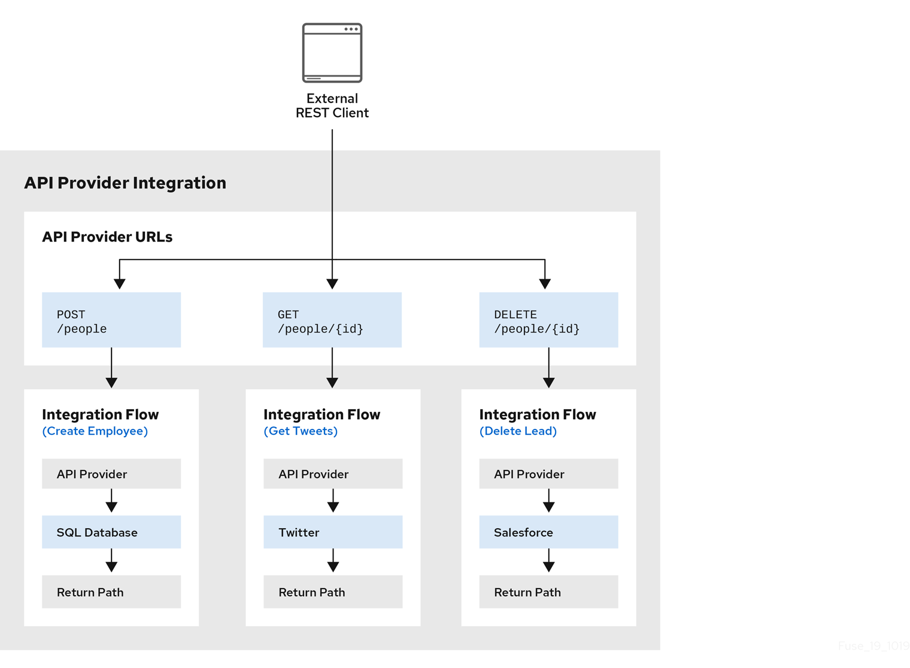

// Module included in the following assemblies:
// as_trigger-integrations-with-api-calls.adoc

[id='requirements-for-api-provider-integrations_{context}']
= How OpenAPI operations relate to API provider integration flows

An API provider integration's OpenAPI document defines the 
operations that REST API clients can call. 
Each OpenAPI operation has its own API provider integration flow. 
Consequently, each operation can also have its own 
REST API service URL. Each URL is defined by the API service's base URL 
and optionally by a subpath. REST API calls specify an operation's 
URL to trigger execution of the flow for that operation. 

Your OpenAPI document determines which HTTP verbs (such as 
`GET`, `POST`, `DELETE` and so on) you can specify
in calls to your REST API service URLs. Examples of calls to 
API provider URLs are in the 
link:{LinkFuseOnlineIntegrationGuide}#try-api-provider-quickstart_api-provider[instructions for trying out the API provider quickstart example].   

Your OpenAPI document also determines the possible HTTP status codes  
that an operation can return. An operation’s return path can handle 
only the responses that the OpenAPI document defines. 
For example, an operation that deletes an 
object based on its ID might define these possible responses: 

[source,json]
----
"responses": {
  "204": {
           "description": "Task deleted"
         },
  "404": {
           "description": "No Record found with this ID"
         },
  "500": {
            "description": "Server Error"
        }
}
----

.Illustration of an API provider integration example
The following diagram shows an API provider integration that processes data
about people. An external REST API client invokes the REST API URLs that are 
deployed by the API provider integration. Invocation of a URL triggers
execution of the  
flow for one REST operation. This API provider integration has 3 flows. 
Each flow can use any connection or step that 
is available in {prodname}. The REST API along with its flows 
is one {prodname} API provider integration, which is deployed in one OpenShift pod.

.Editing the OpenAPI document while creating an API provider integration

After you specify an OpenAPI 2.0 document for your API provider 
integration, you can update the document as needed while you define
the execution flows for the API operations. To do this, click
*View/Edit API Definition* in the upper right of a page in
which you are editing the API provider integration. This displays
your OpenAPI document in the API Designer editor. Edit and
save the document to make changes that are reflected in
{prodname}.

Considerations while editing the OpenAPI document:

* *`operationId` properties for synchronization*
+
Synchronization between the versions of the OpenAPI document in the API Designer 
editor and in the {prodname} integration editor depend on a unique `operationId` 
property that is assigned to each operation that is defined in the document. 
You can assign a specific `operationId` property value to each operation, 
or use the one that {prodname} generates automatically.

* *Request and response definitions*
+
In each operation's definition, you can supply a JSON schema that
defines the operation's request and response. 
{prodname} uses the JSON schema:

** As the basis for the operation's input and output data shapes
** To display operation fields in the data mapper

* *No cyclic schema references*
+
A JSON schema for an API provider integration operation cannot have cyclic 
schema references. 
For example, a JSON schema that specifies a request or response 
body cannot reference itself as a whole nor reference any part 
of itself through intermediate JSON schemas.
