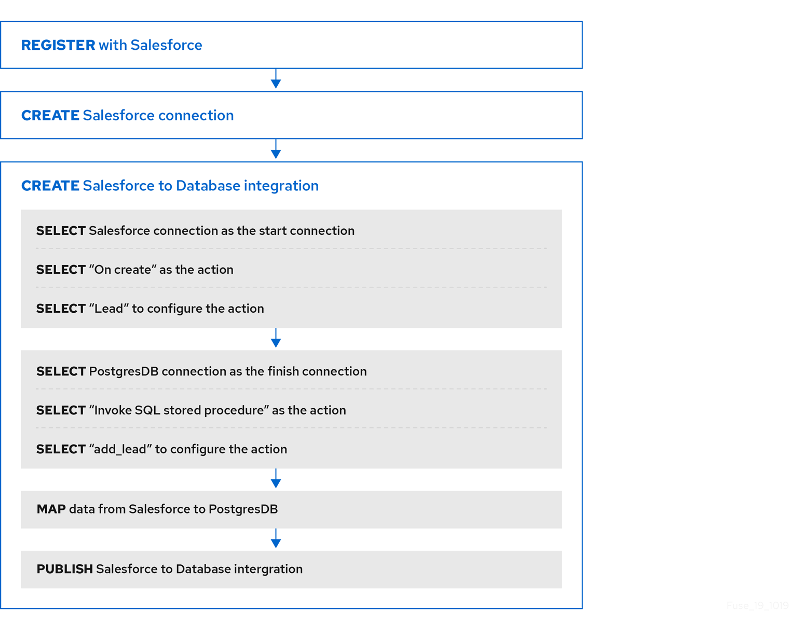

// This module is included in the following assemblies:
// as_how-to-get-ready.adoc

[id='workflow-example_{context}']
= Example workflow for creating a Salesforce to database simple integration

The best way to understand the workflow for using {prodname} 
to create a simple integration is to 
create the sample integrations by following the instructions in the
link:{LinkFuseOnlineTutorials}[sample integration tutorials].  

The following diagram shows the workflow for creating the sample
Salesforce to Database integration. 

After you publish an integration, the {prodname} dashboard
displays *Running* next to the integration name when the integration
is ready to be executed.

.Additional resource
link:{LinkFuseOnlineIntegrationGuide}#configure-publish-api-provider-quickstart_api-provider[Configuring and publishing an API provider quickstart integration].
