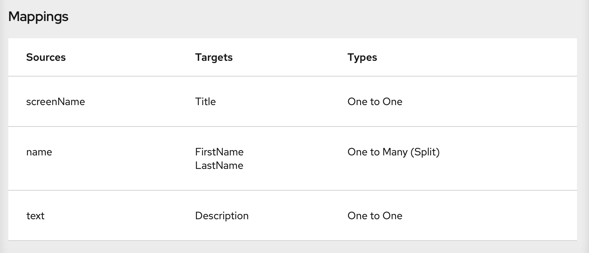

// Module included in the following assemblies:
// as_t2sf-create-integration.adoc

[id='t2sf-add-data-mapping-step_{context}']
= Adding a data mapping step

To continue creating the Twitter to Salesforce sample integration,
add a data mapping step that correlates Twitter mention fields to
Salesforce contact fields. 

.Prerequisites
* The integration's start connection is to Twitter.
* The integration's finish connection is to Salesforce. 
* You just added the filter step between the two connections. 

.Procedure

. In {prodname}, in the integration visualization, click the plus sign that is between the filter
step and the finish connection.
. Click *Data Mapper* and wait a few moments. When the data fields
appear, the *Sources* panel on the left displays the Twitter fields
and the *Target* panel on the right displays the Salesforce fields.
. Map the Twitter `name` field to the Salesforce
`FirstName` and `LastName` fields:
.. In the *Sources* panel, click the magnifying
glass image:../../images/tutorials/magnifying-glass.png[title="Magnifying Glass"]
to display the search field and enter `*name*`.
.. Under the `user` folder, click the `name` field.
.. In the *Target* panel, scroll down and click *FirstName*. The
data mapper displays a line from the source *name* field to the
target *FirstName* field. 
.. In the *Target* panel, scroll down, hover over *LastName*, press 
*CTRL-Mouse1* (*CMD-Mouse1* on MacOS) and select *LastName*. 
The data mapper displays another line from the Twitter
*name* field, but this time it goes to the Salesforce *LastName* field.
The blue lines indicate the current focus.

+
[NOTE]
====
If you accidentally map the wrong fields then delete the incorrect mapping by 
selecting one of its fields to make it the current
mapping. Then click the trash can icon in the top right of the data mapper's 
*Mapping Details* panel. 
====

. Map the Twitter `screenName` field to the Salesforce
`Title` field:
.. In the *Sources* panel, click
the *screenName* field.
.. On the right, at the top of the *Target* panel,
click the magnifying
glass image:../../images/tutorials/magnifying-glass.png[title="Magnifying Glass"]
to display the search field and enter `*Title*`.
.. Click the *Title* field. The data mapper displays a line
from the Twitter *screenName* field to the Salesforce *Title* field.
. Map the Twitter `text` field to the Salesforce
`Description` field:
.. In the *Sources* search field, enter `*text*` and click the
 *text* field.
 Be sure to click the toplevel *text* field. Do not click one of 
 the *text* fields that is contained in the *user* field.
.. In the *Target* search field, enter `*description*`.
.. Click the
Salesforce *Description* field to create the mapping.
. In the upper right, click
the grid icon image:../../images/tutorials/grid.png[title="Grid"] to
display the list of mappings, which should look like this:

. In the upper right, click *Done*.
