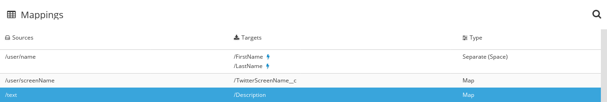

[id='t2sf-add-data-mapping-step']
= Add a data mapping step

Add a data mapping step that correlates Twitter mention fields to
Salesforce contact fields:

. In the left panel, hover over the plus sign between the filter
step and the finish connection to display a pop-up in which
you click *Add a Step*.
. Click *Data Mapper* and wait a few moments. When the data fields
appear, the *Sources* panel on the left displays the Twitter fields
and the *Target* panel on the right displays the Salesforce fields.
. Map the Twitter `name` field to the Salesforce
`FirstName` and `LastName` fields:
.. In the *Sources* panel, click the magnifying
glass image:shared/images/magnifying-glass.png[title="Magnifying Glass"]
to display the search field and enter `*name*`.
.. Under the `user` folder, click the `name` field.
.. In the *Mapping Details* panel, under *Action*, click
the down caret and select *Separate*.
.. Below that, under *Targets*, in the input field, start to type
`*FirstName*`. When */FirstName* appears below the field, click it.
The data mapper displays a line from the Twitter *name* field to the
Salesforce *FirstName* field.
.. In the lower right, click *Add Target*.
.. In the new target, in the input field, start to type
`*LastName*`. When */LastName* appears below the field, click it.
The data mapper displays another line from the Twitter
*name* field, but this time it goes to the Salesforce *LastName* field.
The blue lines indicate the current focus.
. Map the Twitter `screenName` field to the Salesforce
`Title` field:
.. In the *Sources* panel, scroll down to click
the *screenName* field.
.. On the right, at the top of the *Target* panel,
click the magnifying
glass image:shared/images/magnifying-glass.png[title="Magnifying Glass"]
to display the search field and enter `*Title*`.
.. Click the *Title* field. The data mapper displays a line
from the Twitter *screenName* field to the Salesforce *Title* field.
. Map the Twitter `text` field to the Salesforce
`Description` field:
.. In the *Sources* search field, enter `*text*` and under
*Status*, click the *text* field.
.. In the *Target* search field, enter `*description*` and then click the
Salesforce *Description* field to create the mapping.
.. In the upper right, click
the grid icon image:shared/images/grid.png[title="Grid"] to
display the list of mappings, which should look like this:

. In the upper right, click *Done*.
