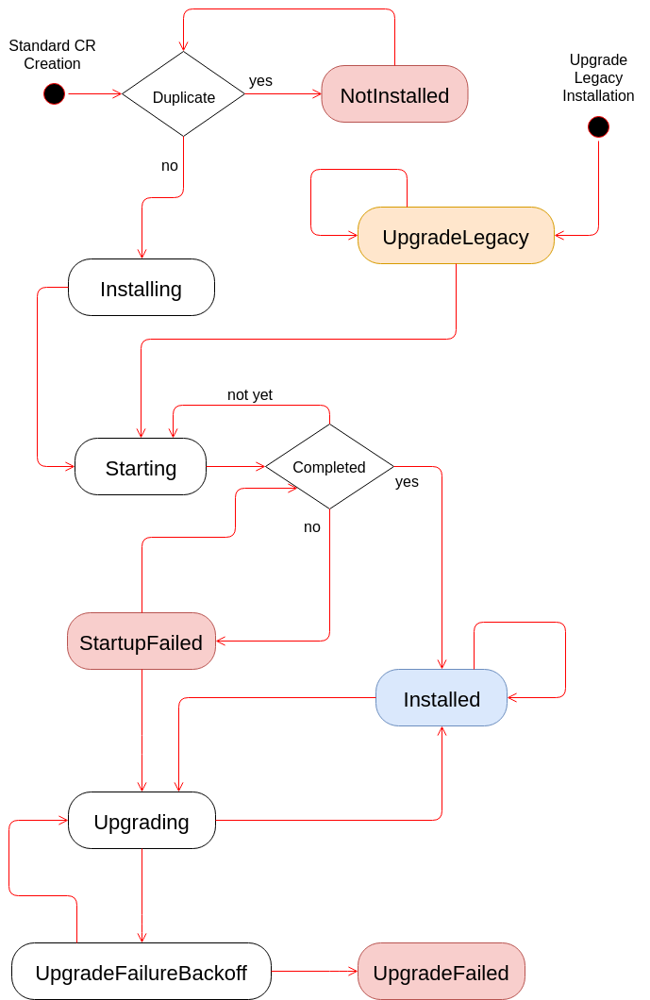

# Syndesis Infrastructure Operator

An operator for installing and updating [Syndesis](https://github.com/syndesisio/syndesis).

# States

The operator follows the following state diagram:



A summary of the states:

* **NotInstalled**: Syndesis resources that cannot be installed (e.g. two resources on the same namespace) are put into this state
* **Installing**: Syndesis installation started, resources are being created
* **Starting**: Creation of resources is completed, waiting for all deployments to be ready
* **StartupFailed**: Some deployments could not be started after all possible attempts. The state moves away from here if something is changed manually
* **Installed**: Everything is installed and the application is ready to be used
* **Upgrading**: The operator has detected that there's a new version and it has already started the upgrade process
* **UpgradeFailureBackoff**: A problem has occurred during the upgrade. Everything should have been restored and the upgrade process will be retried with a exponential delay (up to a maximum number of times)
* **UpgradeFailed**: After the maximum amount of failed upgrades, the upgrade will not be tried anymore. The CR needs a manual action to move away from here
* **UpgradingLegacy**: The CR can go into this state only if the operator has detected that there's a legacy installation of Syndesis in the watched namespace and there's no Syndesis resource that can own it in the same namespace. The operator then creates a Syndesis resource using a configuration inferred from the legacy environment variables


## Building

Just run:

````bash
$ ./build.sh
````

By default it tries to build the operator executable and container image using
the following tools in this order:

 1. go and oc
 2. go and docker
 3. docker and oc
 4. just docker


So at a minimum you should have one of those of tools installed.
   
    usage: ./build.sh [options]
    
    where options are:
      --help                             display this help messages
      --operator-build <auto|docker|go>  how to build the operator executable (default: auto)
      --image-build <auto|docker|s2i>    how to build the image (default: auto)
      --image-name <name>                docker image name (default: syndesis/syndesis-operator)
      --s2i-stream-name <name>           s2i image stream name (default: syndesis-operator)

## Testing
Integration tests are located undet `tests/e2e/` with some instructions on how to run.

## Syndesis Custom Resource
### What is the syndesis CR
The syndesis operator manages all syndesis resources and makes sure they remain in a desired state. The Custom Resouce(CR) is the interface to comunicate with the Operator and set properties for some of the resources.

If you need to specify any of the following values, the best is to edit the CR yaml before applying it. You could also edit an existing CR by running:
```bash
oc edit syndesis cr_name # replace cr_name with the name of the syndesis CR in openshift
```
### Available fields
These are the fields available. Only fields of type string or bool can be edited, the rest are just containers for other fields.
##### Spec
|Property path|Type|Description|
|------------ |----|-----------|
|Spec|SyndesisSpec|Spec is the root of the editable part of the custom resources |
|Spec.RouteHostname|string|Route for the syndesis project|
|Spec.DemoData|bool|Whether demo data should be installed or not|
|Spec.DeployIntegrations|bool||
|Spec.TestSupport|bool|Install with test support|
|Spec.ImageStreamNamespace|string|Namespace where ImageStreams are located, default to the same namespace syndesis is installed|
|Spec.Registry|string|registry to pull all syndesis components from|
|Spec.OpenShiftMaster|string||
|Spec.OpenShiftConsoleUrl|string||
|Spec.SarNamespace|string||
|Spec.DevSupport|bool|Install with DevSupport|
|Spec.Addons|[AddonsSpec](#addons)||
|Spec.Components|[ComponentsSpec](#components)||
|Spec.Integration|IntegrationSpec||

##### <a name="addons"></a>Spec.Addons
|Property path|Type|Description|
|------------ |----|-----------|
|Spec.Addons|AddonsSpec|Addons is the place for all addons, for example `todo`. Each addon can have a different set of properties. Enabling addons might require 3rd party CRDs to be installed|
|Spec.Addons.camelk|hash[string,string]|Camel K|
|Spec.Addons.camelk.enabled|string|Whether the addons is enabled or disabled|
|Spec.Addons.jaeger|hash[string,string]|Jaeger|
|Spec.Addons.jaeger.enabled|string|Whether the addons is enabled or disabled|
|Spec.Addons.komodo|hash[string,string]|Komodo|
|Spec.Addons.komodo.enabled|string|Whether the addons is enabled or disabled|
|Spec.Addons.legacyui|hash[string,string]|Legacy UI|
|Spec.Addons.legacyui.enabled|string|Whether the addons is enabled or disabled|
|Spec.Addons.ops|hash[string,string]|Monitoring resources|
|Spec.Addons.ops.enabled|string|Whether the addons is enabled or disabled|
|Spec.Addons.todo|hash[string,string]|Todo App, enabled by default|
|Spec.Addons.todo.enabled|string|Whether the addons is enabled or disabled|

##### <a name="components"></a>Spec.Components
|Property path|Type|Description|
|------------ |----|-----------|
|Spec.Components|ComponentsSpec|Fine grained settings for all syndesis components|
|Spec.Components.Scheduled|bool| Sets the value of `importPolicy.scheduled` for some ImageStreams: syndesis-meta, syndesis-s2i, syndesis-prometheus, syndesis-server and syndesis-db-metrics|
|Spec.Components.ImagePrefix|string| Prefix for `ImageStreams` for syndesis components|
|Spec.Components.Server|ServerConfiguration|syndesis server configurations|
|Spec.Components.Server.Tag|string|tag used for the syndesis-server `ImageStream`|
|Spec.Components.Server.Registry|string|registry used for the syndesis-server `ImageStream`|
|Spec.Components.Server.ImagePrefix|string|prefix used for the syndesis-server `ImageStream`|
|Spec.Components.Server.Resources|Resources|Contains resource limits for the pod|
|Spec.Components.Server.Resources.Limits.Memory|string|Memory limits|
|Spec.Components.Server.Features|ServerFeatures|Features|
|Spec.Components.Server.Features.ManagementUrlFor3scale|string|
|Spec.Components.Meta|MetaConfiguration|syndesis meta configurations|
|Spec.Components.Meta.Registry|string|registry used for the syndesis-meta `ImageStream`|
|Spec.Components.Meta.ImagePrefix|string|prefix used for the syndesis-meta `ImageStream`|
|Spec.Components.Meta.Tag|string|tag used for the syndesis-meta `ImageStream`|
|Spec.Components.Meta.Resources|Resources|Contains resource limits for the pod|
|Spec.Components.Meta.Resources.Limits.Memory|string|Memory limits|
|Spec.Components.UI|UIConfiguration|syndesis UI configurations|
|Spec.Components.UI.Tag|string|tag used for the syndesis-ui `ImageStream`|
|Spec.Components.UI.Registry|string|registry used for the syndesis-ui `ImageStream`|
|Spec.Components.UI.ImagePrefix|string|prefix used for the syndesis-ui `ImageStream`|
|Spec.Components.S2I|S2IConfiguration|syndesis S2I configurations|
|Spec.Components.S2I.Tag|string|tag used for the syndesis-S2I `ImageStream`|
|Spec.Components.S2I.Registry|string|registry used for the syndesis-S2I `ImageStream`|
|Spec.Components.S2I.ImagePrefix|string|prefix used for the syndesis-S2I `ImageStream`|
|Spec.Components.Oauth|OauthConfiguration|syndesis Oauth configurations|
|Spec.Components.Oauth.Tag|string|tag used for the syndesis-oauth `ImageStream`|
|Spec.Components.PostgresExporter|PostgresExporterConfiguration|posgress exporter configurations|
|Spec.Components.PostgresExporter.Tag|string|tag used for the postgres_exporter `ImageStream`|
|Spec.Components.PostgresExporter.Registry|string|registry used for the postgres_exporter `ImageStream`|
|Spec.Components.PostgresExporter.ImagePrefix|string|prefix used for the postgres_exporter `ImageStream`|
|Spec.Components.Db|DbConfiguration|syndesis Db configurations|
|Spec.Components.Db.Tag|string|tag used for the syndesis-db `ImageStream`|
|Spec.Components.Db.User|string|syndesis user|
|Spec.Components.Db.Password|string|syndesis password|
|Spec.Components.Db.Database|string|syndesis database|
|Spec.Components.Db.Resources|Resources|Contains resource limits for the pod|
|Spec.Components.Db.Resources.Limits.Memory|string|Memory limits|
|Spec.Components.Prometheus|PrometheusConfiguration|syndesis prometheus configurations|
|Spec.Components.Prometheus.Tag|string|tag used for the prometheus `ImageStream`|
|Spec.Components.Prometheus.Resources|Resources|Contains resource limits for the pod|
|Spec.Components.Prometheus.Resources.Limits.Memory|string|Memory limits|
|Spec.Components.Grafana|GrafanaConfiguration|syndesis grafana configurations|
|Spec.Components.Grafana.Resources|Resources|Contains resource limits for the pod|
|Spec.Components.Grafana.Resources.Limits.Memory|string|Memory limits|
|Spec.Components.Komodo|KomodoConfiguration|syndesis komodo configurations|
|Spec.Components.Komodo.Tag|string|tag used for the syndesis-dv `ImageStream`|
|Spec.Components.Komodo.Registry|string|registry used for the syndesis-dv `ImageStream`|
|Spec.Components.Komodo.ImagePrefix|string|prefix used for the syndesis-dv `ImageStream`|
|Spec.Components.Komodo.Resources|Resources|Contains resource limits for the pod|
|Spec.Components.Komodo.Resources.Limits.Memory|string|Memory limits|
|Spec.Components.Upgrade|UpgradeConfiguration|syndesis upgrade configurations|
|Spec.Components.Upgrade.Resources|Resources|Contains resource limits for the pod|
|Spec.Components.Upgrade.Resources.Limits.Memory|string|Memory limits|
|Spec.Components.Upgrade.Tag|string|tag used for the upgrade pod|
|Spec.Components.Upgrade.Registry|string|registry used for the upgrade pod|
|Spec.Components.Upgrade.ImagePrefix|string|prefix used for the upgrade pod|
