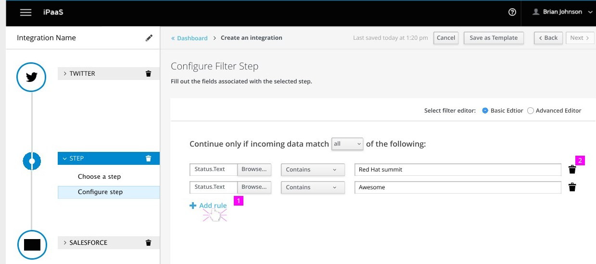

## Filter data in integration flow

* Issue: https://github.com/syndesisio/syndesis-project/issues/2
* Sprint: 13
* Affected Repos:
  - syndesis-rest
  - syndesis-ui

### User Story

As a citizen user, I would like to restrict the data that flows through an integration to match a specific set of criteria.  For example, I may have an integration that is triggered every time a tweet mentions my account, but I only want to process tweets that contain the text "Syndesis".

I have two initial requirements for filtering data in an integration:
* Based on content in the body.
* Based on content in a message header.

In both cases, I expect to be able to apply basic string operations to the data to form a filter expression (e.g. contains, does not contain, starts with ...).  For the full list of supported operators, see the Operator Support section here:
http://camel.apache.org/simple.html

Similar to logging, the UI should help in creating filter expressions for new/inexperienced users (like through clickable examples or typed form inputs).  The interface should also allow for advanced users to enter free form expressions.

### Domain

#### UI defined filter (typed)

For the typed definition of a filter, a **filter step** contains one or more **filter rules** which are all combined either _and_ or _or_

A `FilterStep` is a regular `Step` of type "filter". It has the following structure:

```java
// A step used as filter
class FilterStep extends Step {
  // Descriptive name used for labeling in the UI
  String name;

  // Type of filter, which is either "RULE" or "TEXT"
  FilterType type;

  // Predicate can be either "AND" (every) or "OR" (any)
  FilterPredicate predicate;

  // List of rules to combine. null when type is "SIMPLE"
  List<FilterRule> rules;

  // Filter in the simple expression language. It is either the provided
  // freeform expression when type it "TEXT" or the calculated
  // filter text when type is "RULE" (but can be initially null)
  String simple;
}
```

```java
// Whether it is a basic or advanced filter
enum FilterType {
    // Rule based filter which consists of a list of rules
    RULE,

    // Freeform filter using the simple expression language
    TEXT
}
```

```java
// Type how FilterRules are to be combined
enum FilterPredicate {
  // Every rule must match for the filter to pass
  ANY,

  // Any rule must match for the filter to pass
  OR;
}
```

```java
// Single rule used in FilterStep
class FilterRule {
  // Path expression within the message on which to filter. Can be part of header, body, properties
  // The path must match the syntax used by the datamapper
  String path;

  // Operator to use for the filter. The value comes from meta dara obtained by the UI in
  // a separate call. Example: "contains"
  String op;

  // Value used by operator to decide whether the filter applies
  String value;
}
```

For example, the following configuration

```yaml
- name: "Filter on random data"
  type: "AND"
  rules:
  - path: "body.text"
    op: "contains"
    value: "antman"
  - path: "header.region"  
    op: "=~"
    value: "asia"
  - path: "body.text"
    op: "regex"
    value: "bat(wo)?man"
  - path: "header.publisher"
    op: "=~"
    value: "DC Comics"
```

would be stored as a property "filter" on the integration step. It translates later to simple lang expression

```
${body} contains "antman" && ${in.header.region} =~ "asia" || ${body} regex "bat(wo)?man" && ${in.header.publisher} =~ "DC Comics"
```

The simple expression language [does not support parentheses](http://camel.apache.org/simple.html) nor precedence of operators so the expression is always evaluated from left to right. That is the reason why only "AND" or "OR" is allowed to combine all rules (since this can be savely evaluated from left to right).

##### Fixed background data

For the `path` as well as for the possible `operators` the UI needs a list of values which can be chosen. The list of operators should be fixed, whereas it should be possible to add a freeform path (but with suggestion of a set of given paths).

This background data can be obtained by a dedicated API call to an endpoint `/api/{version}/integrations/filter/options` which takes an existing integration ID (if the integration has already been created, otherwise the ids of all connections before this filter step need to be send to the API server) as parameter.

It returns all data required to build the form:

```json
{
  "paths" : [ "path1", "path2", .... ],
  "op" : [
    { "label": "contains (ignore case)",  "operator": "~~"},
    { "label": "contains", "operator": "contains"},
    { "label": "matches", "operatos": "regex"},
    ......
  ]
}
```

It's up to the server how to determine this data set. Ideally the connector themselves provide this meta information (which could be done also by e.g. reflection on the body type).

#### Text based filter (freeform)

It should be possible to add a simple expression directly as text. Ideally there should be some sort of intellisense, but in the first step its a plain text input. However the expression needs to be validated before its stored in the DB. In the examples above the simple expression would be added directly.

### Persistence

Currently the configuration of a step is a plain properties map object in JSON. Each FilterStep supports the following properties:

* **type** : Either "rule" or "text" for the two modes described above.
* **simple** : The simple filter expression to apply.
* **rules** : The rules as defined above for a "form" typed integration.

In the case of a "form" filter, the "simple" expression is calculated when the step is persisted.

Example for a persistent integration step:

```json
[{
  "id": "1",
  "stepKind": "filter",
  "configuredProperties": {
    "type": "rule",
    "predicate": "AND",
    "simple" : "${body} contains \"antman\" || ${in.header.publisher} =~ \"DC Comics\"",
    "rules" : [
       {
         "path": "body.text",
         "value": "antman"
       },
       {
         "path": "header.kind",
         "op": "=~",
         "value": "DC Comics",
       }
    ]
  }
},
{
  "id": "2",
  "stepKind": "filter",
  "configuredProperties": {
    "type": "text",
    "simple": "${in.header.region} contains \"asia\" || ${body} regex \"bat(wo)?man\""
  }
}]
```

The example is simplified in so far as the value to the "rules" field for step with id "1" must be entered as a single line string with newlines replaced by "\n" since the value of a property is currently only allowed to be a string.

If switching to JPA it is recommended to use a more typed approach which `FilterStep` being a subclass of `Step` and having the relation to "filter rules" in a separate table, which are linked together.

### API

To interact with the filter API:

| HTTP Verb | Path | Description |
| --------- | ---- | ----------- |
| GET | /api/{version}/integrations/filters/options | Get the filter background dara to populate the step form |

The defined filters are added to integrations like as other steps.

### UI

An initial design suggestion can be found [here](https://redhat.invisionapp.com/share/9BC79TYHZ) and the final design is in [002-filter-step.pdf](../design/002-filter-step.pdf)
and the comments on this are collected in https://github.com/syndesisio/syndesis-ui/issues/569

The meta data for the list of header, body, property keys (e.g. for the possible value for 'key' for all possible 'types' should be obtainable via a rest call). The 'paths' themselves are freely typable because it is assumed that not all possible keys can be predicted during design time. It is recommended to use textfield with autosuggestions while typing. How to obtain this meta data is described above in "Fixed background data".



### Misc / Open Points

* How to add the filter step to funktion.yml when deploying the integration
* Define proper REST API based on the domain model provided above
* Evaluate connection to logging (i.e. should dropped message be logged ?)
* How to obtain the meta data to present in the dropdown boxes (or intellisense completion) for the header / property keys ?

### Remarks

* The current domain object `IntegrationConnectionStep` seems to be superfluous and should be deleted then.
