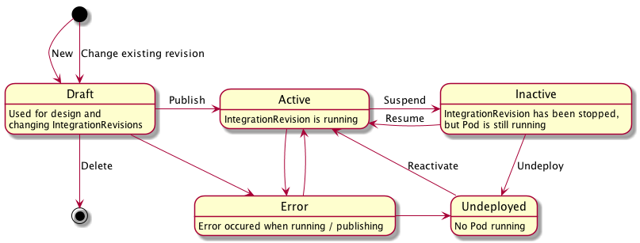

## Integration Model

* Issue: https://github.com/syndesisio/syndesis-project/issues/22
* Sprint: 14
* Affected Repos:
  - syndesis-rest
  - syndesis-ui

## Objective

Currently integrations that are deployed are completely disconnected from the Syndesis DB afterwards. There is no way yet to update a running integration nor to see the state of the currently running integration.

The purpose of this document is to suggest a concise state model for `Integration` as well as define the interaction between the integrations created in  _syndesis-ui_ with the integrations running in the OpenShift which are created by a deployment operation.

When rethinking the integration and the state model, the following points are considered:

* Multiple `IntegrationDeployments` for an `Integration`
* Exactly one of these IntegrationDeployments can be active.
* Users can switch `IntegrationDeployments` versions from the UI
* `IntegrationDeployments` can be inspected from a history page.
* An old `IntegrationDeployment` can't be changed but can be used as a blueprint for new `IntegrationDeployment`.
* As soon as an integration is changed, a new `IntegrationDeployment` is created. All changes go to this new revision until it is deployed by the user. After this, the revision gets a fixed version and cannot be changed anymore (i.e. its immutable)
* The user must always be able to see and examine the currently active `IntegrationDeployment` along with its version number.

## IntegrationDeployment state model

An `Integration` is the domain object describing Camel Routes used for performing integration tasks.
Each `Integration` has properties which can be changed by a user from the UI like its name, so its mutable.

The actual logic like the used connectors used and the configuration is encapsulated in an `IntegrationDeployment`.
Multiple `IntegrationDeployment`s can be connected to a single `Integration`.
Each `IntegrationDeployment` represents a certain version of the defined integration and can be in different states.

Both objects are managed by `syndesis-rest` and `syndesis-ui`.

This runnable artefact consists OpenShift build and resource configuration which transforms this code into running application pods.
The process of building and managing the the lifecylce of the application pods for that given version of the integration is tracked using an `IntegrationDeployment` object.  

A running `IntegrationDeployment`s can be suspended and resumed without destroying the built openshift resources and runnable artefacts.

An `IntegrationDeployment` can be in one of the following current states:



| State       | Description |
| ----------- |------------ |
| Undeployed | An `IntegrationDeployment` has been undeployed |
| Active | `IntegrationDeployment` is deployed and running |
| Inactive | `IntegrationDeployment` is deployed but is not running|
| Error | The `IntegrationDeployment` is deployed but in an error state |

### Undeployed

Right after an `IntegrationDeployment` is created it enters the _Undeployed_ state. This means
the `IntegrationDeployment` is not yet built and deployed.

### Inactive

An _Inactive_ `IntegrationDeployment` is an integration that has been built and deployed but does not have a running pod associated with it.  

### Active

An _Active_ integration revision is a running integration. This state can be either created from a _Undeployed_ state when the deployment gets published or from an _Inactive_ state when a suspended deployment is started again.

### Error

The error state indicates that the integration revision is not running. This state can no be entered via UI but only as a side effect in the backends.
An integration revision can enter the error state any time.
The `targetState` stays untouched (as is `== currentState` when being in equilibrium) so that the controlled know which state to reconcile again to get out of the error state (which might not be possible in every case).

## Operations

The following operations change the `targetState`. The `targetState` could be updated by simply changing the `IntegrationDeployment`'s field, but it is recommended to use a more semantic rich Rest API call for performing this actions (i.e. having specific endpoint which can be used by the UI to trigger the targetState change).

* **Publish** sets the target state to _Active_. This operation can be called from the states:
  - _Undeployed_ when the integration revision should be published for the first time
  - _Inactive_ when the integration revision has been stopped
  - _Error_ when an integration revision should be re-deployed in case of an error to trigger a retry

* **Suspend** sets the target state to _Inactive_. This operation should be only be possible if the `currentState` is _Active_.

* **Resume** is an operation which can be used when the `currentState` is _Inactive_ and the revision should be re-activated. This sets the `targetState` to _Active_.

* **Undeploy** marks an integration revision's targetState as _Undeployed_.   This operation can be called when the Deployment is not in the _Undeployed_ state.

The `syndesis-rest` backend in this case will simply validate the context (i.e. whether the operation is allowed), updates the `targetState` and then returns to `syndesis-ui`.  A background controller detects the state change and performs the proper actions to reach the target state.

Creating a new `IntegrationDeployment` will _Undeploy_ all older `IntegrationDeployment`s associated with the integration.

## Versioning

When a user creates an integration, an overall `Integration` object is created and starts at version 1.  A change to the integration in this state has no runtime artefact attached and can be freely changed and saved by an user to the database. This is typically done automatically during the UI process of creating an integration.  Every time the integration is updated the version associated with the integration is incremented.

A "Publish" UI operation will copy the integration into a new `IntegrationDeployment`. The `IntegrationDeployment` integration and configuration is **immutable** and can not be changed.  An integration will have a an associated IntegrationDeployment's for each time the "Publish" UI operation is used.  

An integration is/has a _Draft_ when there are no `IntegrationDeployment` for that integration or when the version of the integration in the latest `IntegrationDeployment` does not match the integration's current version.

A 'Restore' operation on a `IntegrationDeployment` will copy the older version of the integration associated with the `IntegrationDeployment` to current `Integration` but still increments the version.  Since this increments the version, this resored integration will be considered to be a _Draft_.

## State reconciliation

`IntegrationDeployment` follows a declarative reconciliation paradigm.
An `IntegrationDeployment` is always in a _currentState_.
As consequence of an operation (see below) a new _targetState_ can be set.
It is now the duty of the Syndesis backend to reconcile the _currentState_ to become the _targetState_.
This is modelled closely after the Kubernetes state model itself.

Reconciliation itself can be in one of two states:

* _Pending_ when `currentState != targetState`
* _Ok_ when `currentState == targetState`

This state is modelled implicitly by comparing both state variables.

`Error` can never be set to a `targetState` by the user, but could be set by the backend to mark an integration revision as erroneous.
The error state is typically part of a `currentState`.
The backend controllers try to get out of the error state by might give up at some point.

Every state change (current or target) should be tracked as event in an event list for auditing purposes.

## Data model

The following data model only highlights the parts which are specific to the lifecycle model. It omits any other global or revision specific properties.

The state itself is modelled with a simple enum:

```java
enum IntegrationState {

    // Undeployed (application not built/provisioned)
    Undeployed,

    // Deployed and running
    Active,

    // Deployed and suspended (no running pods)
    Inactive,  

    // Error occured
    Error;
}
```

The `Integration` holds all global properties, which can be mutated (like the name or description);


```java
public class Integration {

    // Name of the integration
    String name;

    int version;


    List<IntegrationDeployment> getDeployments() {

    }

    boolean isDraft() {
        if( getDeployments().isEmpty() ) {
            true;
        }
        return getDeployments().get(0).integration.version == version;
    }
}
```

```java
public class IntegrationDeployment {

    // The actual deployment id.
    String id;

    // Reference to the id of an Integration.
    String integratioId;

    // The actual version of the deployment.
    int version;

    // Current state of this revision
    IntegrationState currentState;

    // Target state of the revision
    IntegrationState targetState;

    // Message describing the currentState further (e.g. error message)
    String currentMessage;

    // Message which should become the currentMessage after reconciliation
    String targetMessage;

    // Whether this integration has converged to its target state
    boolean isPending() {
        return currentState != targetState;
    }

    // All other props specific for a version of an integration revision.
    // These properties are immutable after the Active state has ben reached
    // for the first time
    // ....
}
```

```java
public class IntegrationHistory {
  List<IntegrationDeployment> deployments;
  List<String> messages;
}
```

### REST API

* You can get an `Integration` by doing an HTTP on `GET /api/v1/integrations/{integration-id}`.
* You can get the `IntegrationHistory` and it's associated `IntegrationDeployment` objects by doing an HTTP on `GET /api/v1/integrations/{integration-id}/history`.

To keep the `Integration` objects smaller, the actual copy of the integration deployment can be accessed by doing a `GET /api/v1/integrations/{integration-revision-id}/deployments/{version}`.  This returns an `IntegrationDeployment` object.  

## Use cases

The following section describe some of the common use cases and how they are implemented within this new state model.

## Publishing and Integration

Publishing happens when you create an `IntgrationDeployment` with `targetState = Active`.
Several actions will be performed by the controller who detects this transition:

* All older `IntgrationDeployment`s get updated so that `targetState = Undeployed`
* A new OpenShift build is created which in turns triggers a redeployment.
* The OpenShift deployment triggers the reconciliation of the currentState for the new, just deployed, revision and the undeployed old revision.

> Question: It would be awesome if we could change the state for an _Active_ integration to _Undeployed_ by watching OpenShift for update deployments so that we can mark the old integration as _Undeployed_ and the new as _Active_.
> Is this possible with OpenShift ? How to correlate OpenShift deployments with integration versions ?

## UI changes and updates

Within the UI the state of an integration should be visualized.

It is suggested that when the reconciliation state is `Ok` the _currentState_ should be shown and when the reconciliation state is `Pending` then "Pending" should be shown (possibly with the `targetState` as a tool tip info). Alternatively, when a reconciliation process the label could be more specific about the action just performing ("Deploying", "Suspending", "Resuming", "Undeploying") which can be inferred from `currentState` and `targetState`

| `currentState` | `targetState` | Label |
| -------------- | ------------- | ----- |
| Draft | Active | Deploying |
| Active | Inactive | Suspending |
| Inactive | Active | Resuming |
| Inactive | Undeployed | Undeploying |
