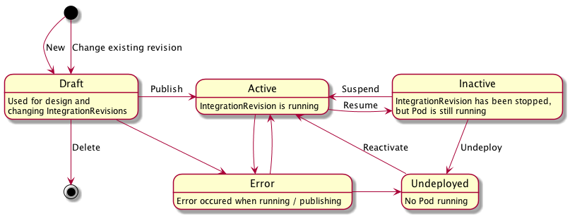

## Integration Model

* Issue: https://github.com/syndesisio/syndesis-project/issues/22
* Sprint: 14
* Affected Repos:
  - syndesis-rest
  - syndesis-ui

## Objective

Currently integrations that are deployed are completely disconnected from the Syndesis DB afterwards. There is no way yet to update a running integration nor to see the state of the currently running integration.

When rethinking the integration and the state model, the following points should be considered:

* Multiple versions of an Integration must be able to exist.
* Exactly one of these integrations can be active.
* Each deployment of an Integration creates a new version.
* Users can switch integration versions from the UI
* Versioned Integrations can be inspected from a history page.
* Old integrations can't be changed but can be used as a blueprint for new integrations.
* As soon as an integration is changed, a new version of an integration is created. All changes go to this new integration until it is deployed by the user. After this, its gets a fixed version and cannot be changed anymore.
* The user must always be able to see and examine the currently active integration along with its version number.

_Attention: THIS IS WORK-IN-PROGRESS. The current draft below does **not** consider redeployments and versioning yet. The propsoal is PRed early to collect early feedback_

## Integration state model

| State       | Description |
| ----------- |------------ |
| Draft | Initial state of an integration |
| Active | Integration is running |
| Inactive | Integration has been stopped|
| Deleted | An integration has been disposed | 
| Error | The integration is an error state |

### Draft

Right after an integration is created it enters the _Draft_ state. This means 
the integration is not yet deployed. An integration leaves the draft state either by being published or deleted (in which case the whole integration is removed)

After an activation there is no way back to the _Draft_ state.

### Active

An _active_ integration is a running integration. This state can be either created from a _Draft_ state when the integration gets published of from an _Inactive_ state when a stopped integration is started again.

### Inactive

An _inactive_ integration is an integration which was previously active and has been stopped by some action. An _inactive_ integration can be restarted or marked as deleted.

### Deleted

An integration which was published is never deleted but marked as deleted. A deleted integration can't be reactivated but might possibly serve as a blueprint for a new integration.

### Error

The error state indicates that the integration is not running. This state can be entered consciously but only as a side effect. An integration can enter the error state any time. 

## State reconciliation 

Integrations follow a declarative reconciliation paradigm. An integration is always in a _currentState_. As consequence of an _action_ (see below) a new _targeState_ can be set. It is now the duty of the Syndesis backend to reconcile the _currentState_ to become the _targetState_.
This modelled is closely to the Kubernetes state model itself.

Reconciliation itself can be in one of two states:

* _Pending_ when `currentState != targetState`
* _Ok_ when `currentState == targetState`

This state is modelled implicitely by looking at both state variables. 

`Error` can never be a `targetState` but it can be a `currentState`. The backend controllers try to get out of the error state but might give up at some point. 

Every state change (current or target) should be tracked. 

## Actions

Several actions triggers state changes. 
These actions map directly to rest calls which are called by the Syndesis UI

* **Publish** sets the target state to _Active_. This action can be called from the states:
  - _Draft_ when the integration should be published for the first time
  - _Inactive_ when the integration has been stopped
  - _Error_ when an integration should be re-deployed in case of an error to trigger a retry

* **Stop** set the target statie to _Inactive_. This action should be only be possible if the `currentState` is _Active_.

* **Start** is an action which can be used when the `currentState` is _Inactive_ and the integration should be re-activated.

* **Unpublish** marks an integration target state as _Deleted_. An integration should be _Inactive_ before the _Deleted_ state can be reached.

* **Delete** is the action which removes an integration in an _Draft_ state.  

## Declarative specification

## UI changes and updates
