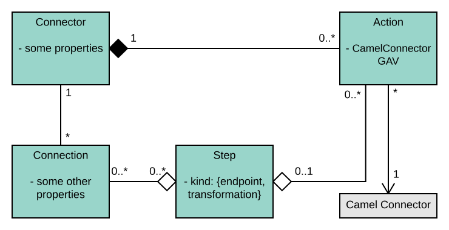

# Integration Design

This is going to be a technical description of the idea concept of **Integration** and how its logical model is implemented.  
It's not a comprehensive definition of how Syndesis work. We are not going to describe system pods and their respective responsibilities.

## Data Model

Be aware that we currently don't have the logical model defined in any document or UML diagram. There is actually an ER Diagram [here](https://github.com/syndesisio/syndesis-rest/blob/master/docs/design/ui-domain-object-map.adoc), but it's not reflecting entirely the current status of the information architecture.

The entry point for out model is the `Integration` [entity](https://github.com/syndesisio/syndesis/blob/master/rest/model/src/main/java/io/syndesis/model/integration/Integration.java), that represents an interaction between systems.

This object incapsulates 2 aspects:
1. information about the **definition** of an `Integration`, i.e. *what it has to do*
2. **runtime information** about a specific Integration instance, for example `getStatus()` that tells you if the Integration is *currently deployed and running*

The real definition of what an `Integration` does, is delegated to the following composing entities:

- `Connector`
- `Connection`
- `Action`
- `Step`

##### Connector
Is used to define a set of common properties the user can define on a `Connection` entity coupled with this `Connector`.  
Think of `Connector` as a **configurable schema**, used to define the shape of a corresponding `Connection` entity.  
Another responsibility of the `Connector` is to aggregate a list of `Actions`, that are "operations" available to the user.  
An example of `Connector` could be a **Twitter** `Connector`, where you define some of the properties that are **required by all** the operations it will provide.  
Properties could be for example `user`, `password`, `token` and so on. Just understand that **you are not setting the values for these keys** here. You are just declaring what are the fields that a specific instance of this item will ask to fill!  
`Connector` is associated with set of Maven GAV coordinates, to being referred to.

##### Connection
It can be seen as a specific instance of `Connector`.  
On the `Connector` entity you were just declaring the fields that the specific `Connector` supported, here you are passing the corresponding values for those fields.
For example it's here that you specify that the value for the field `user` is `scott` and the value for the `password` field is `tiger`.

##### Action
`Action` represents a specific operation within the scope of a `Connector`.  
In the Twitter example, an operation might be `postMessage()`.  
An `Action` has its own set of of properties.  
In the Twitter example, a property for an action might be `salute`, that a user might fill in with a value like `hello` or `good bye`.    
Role of an `Action` is also to define the link with physical java code library that will provide connectivity with a specific system/technology:  
`CamelConnectorGAV`. In this field, you specify the coordinates of the `Camel Connector` component that this `Action` delegates its logical operations to.

##### Step
`Step` is a **generic entity**, that represents a pipeline operation in your `Integration`. It might be a transformation, a logging call or anything else.
Due to all this flexibility `Step` is actually a semantically poor entity. Everything but its type is optional: it can have references to an `Action` or a `Connection` but it doesn't have to. That fact that it needs them or not depends on its `type`, that is its most important information.
An important type of `Step` is `Endpoint`. Unluckily, an enum that lists these kinds does not exist; So the relationship is weak. You have to take care to use a type that the framework is able to understand, because there is no preemptive way to validate your choice.
Steps are declared within an `Integration`.

The overall idea is that your `Integration` define 2 kind of information:
1. a catalog of technologies and allowed operations (`Connectors`,  `Actions`)
2. a pipeline of customized components(`Connection`) and operations you need to perform(`Step`), using the building blocks defined at 1).

To reinforce the idea you can see it as if:

You define some (technology)`Connector`, where you declare all the properties you allow the developer to give a value to in a corresponding set of `Connection`s. You also link this `Connector` with a series of operations that are tied to this technology, represented by `Action`. In each `Action` you declare also eventual additional properties.  
At last, you detail how the data will flow across `Connections`, and with which eventual tranformation, specifying a list of `Steps`.

Notice that despite you define an ordered list of `Steps` to define the business behavior of your `Integration` there is no type checking of any sort, between those steps. It's up to you be sure that the output of a `Step` is coherent with the output of the following one.

## Integration creation workflow

The entities described and linked above are indeed what the code implementation will use to implement the required behavior. But the idea is that those elements are protected behind some layer of abstraction that allows you not to manipulate them directly.

From a UX point of view, the user is exposed to a graphical UI, dynamically built base on the above models.
Interacting with a set of forms and UI elements, a user completes the definition of a logical integration.

When she's done, the UI application produces a `.json` files that corresponds to the user activity and that will be used as the input to generate code on his behalf.

The component responsible of consuming this `.json` is the [`ActivateHandler`](https://github.com/syndesisio/syndesis/blob/master/rest/controllers/src/main/java/io/syndesis/controllers/integration/online/ActivateHandler.java), that at runtime, lives in the `syndesis-rest` pod.  

This component is responsible of 3 main activities:  
1. produce **deplyoment data**
1. **build** the project related to our `Integration`
1. **deploy** an instance of our `Integration`

##### Build
**Building** is actually delegated to an implementation of [`ProjectGenerator`](https://github.com/syndesisio/syndesis/blob/master/rest/project-generator/src/main/java/io/syndesis/project/converter/DefaultProjectGenerator.java) that is responsible of **build time code generation**.  
With some introspection and templating, a full Java based Apache Maven project is generated. The idea is that this artifact could be built succesfully even outside Syndesis runtime platform, being a fully consistent project.  
The `ActivateHandler`, uses the physical bytes generated by the `ProjectGenerator` to trigger a **build** invocation at **Openshift** level.  
This means that we leverage **Openshift** "source to image (s2i)" capability, that accepts a reference to a source code project location, to build the project at source code level and produce also a corresponding **Docker** image including everything needed to spawn a runtime instance of our `Integration`.

##### Deploy
**Deploying**, as another responsibility of `ActivateHandler`. After a source code project corresponding to an `Integration` has been generated, built and shared to the interal repository, it still needs to be deployed to run and be available.
This phase does just that: instructs **Openshift** platform to deploy a live incarnation of our logical `Integration`

##### Deployment Data
This phase actually occur before the `build` one, but it's better understood after what happens in the building phase has been made clearer.  
We have seen that the building phase is all about code generation, to produce an output that will then pass further to a step of code compilation.  
Before the code generation phase, actually some further manipulation happens.  
The idea is to extract externalize from the code itself references to sensible information, like passwords, and externalized properties.  
Secrets and properties will be turned into **Openshift** level handled resources, allowing them to follow a different lifecycle and letting a platform administrator  manage them.  
These resources will be seen by the application as plain files; but in reality they are a logical resource, that **Openshift** re-exposes as a physical file for easier access.

### Generated project details
The project generated in the `build` phase is an **Apache Camel SpringBoot** based project, packed following an Apache Maven structure.  
The Camel DSL used to define Camel Routes is a custom one, based initially on the `Funktion` project.  
It uses a `.yaml` syntax.  
A benefit from using this custom `.yaml` syntax, compared to the already present XML DSL is that it's easier to extend, from a development point of view. For example if you add a new `Step` kind.

An important concept here is that the `.yaml` generated from the `Integration` might show a tree shape **similar but not necessarily identical** to the `.json` file that had been produced from the **Integration** conceptual model.  
This is because some functionality, like for example **Technical Extensions** might need to create multiple **Steps** from a single definition, thus leading to a structure with a slightly different topology.

If you are familiar with Camel framework you can find a correspondence between the following entitites:

Flow --> Camel Route Builder
Step --> Camel Route

The component responsible to interpret, at Camel start time, the `.yaml` file is read by [`SyndesisRouteBuilder`](https://github.com/syndesisio/syndesis/blob/master/runtime/runtime/src/main/java/io/syndesis/integration/runtime/SyndesisRouteBuilder.java)

## Technical Extension

**Technical Extension** is the feature, in Syndesis, that allows invoking custom code from within your `Integration`.  
The idea is to enable a technical user to augment his `Integration` in a pluggable way, letting the system invoke arbitrary precompiled code that is published to the environment.

From a UX proint of view, this happens letting a user uploading a `.jar` file containing classes and dependencies required to run.

This `.jar`, despite not not having any requirement from code point of view, has to be built, using a Maven Plugin we made available, called `syndesis-maven-plugin`, that creates the correct metadata to be loaded by the runtime and removes references to libraries that might have been already provided.
