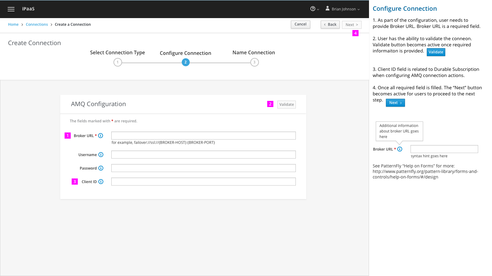
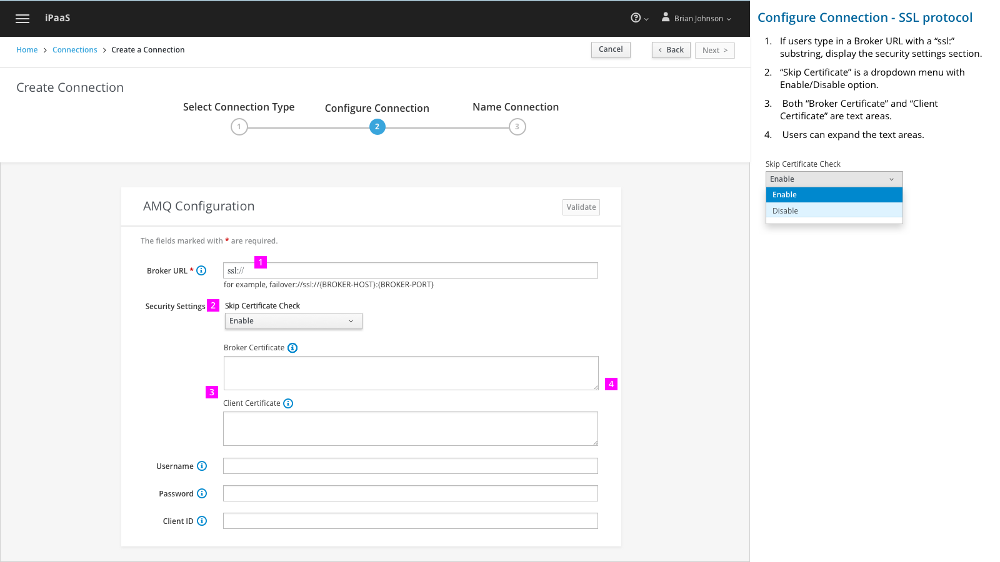
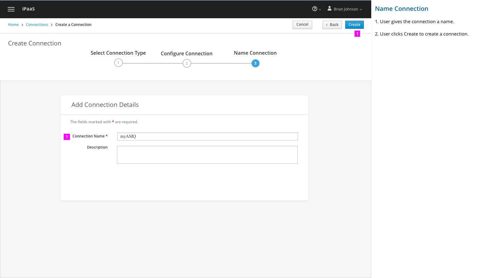
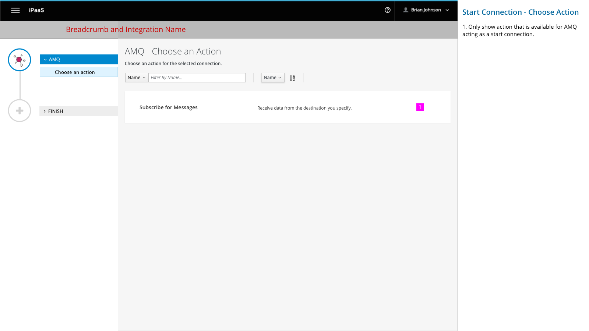
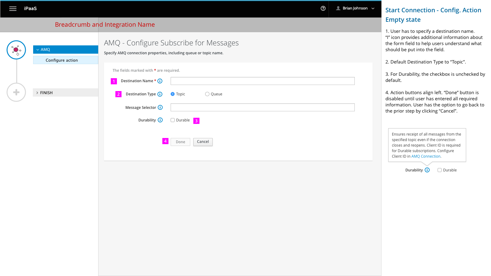
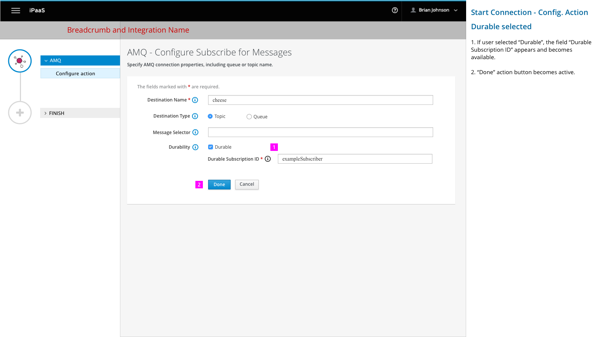
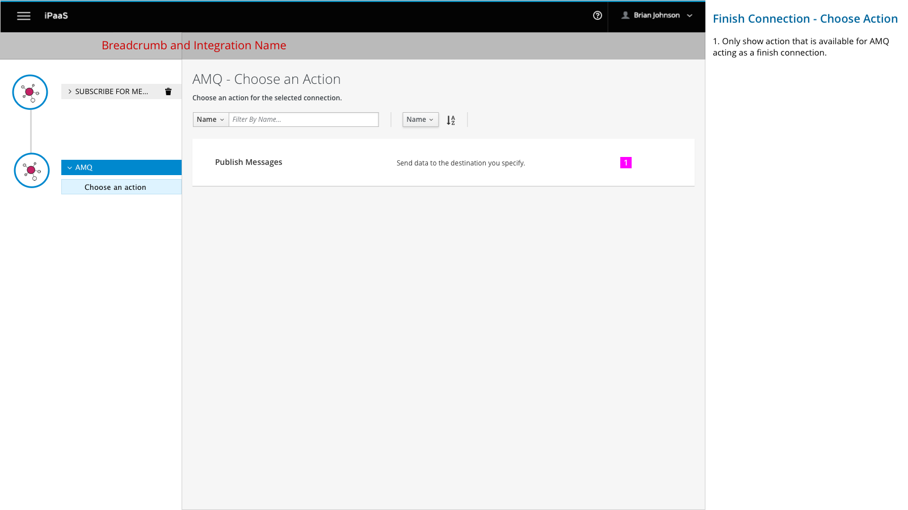
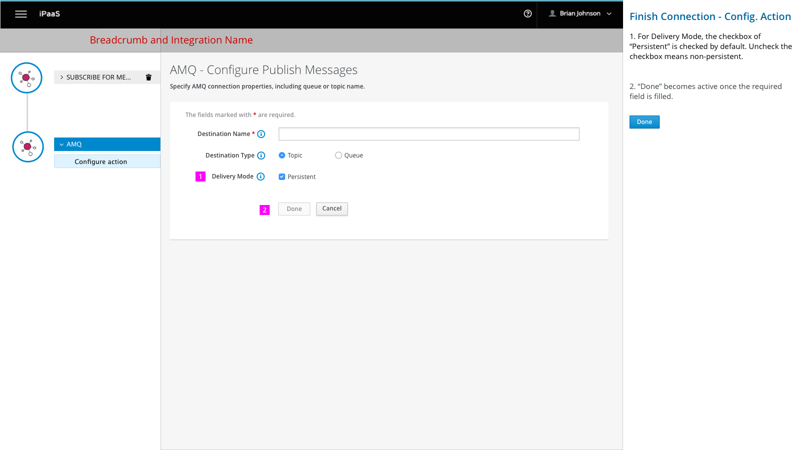
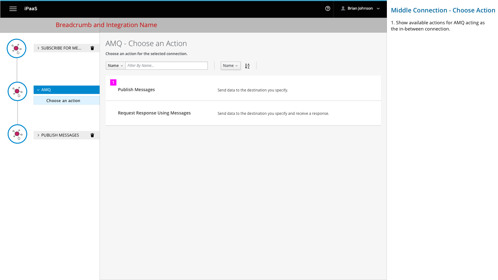
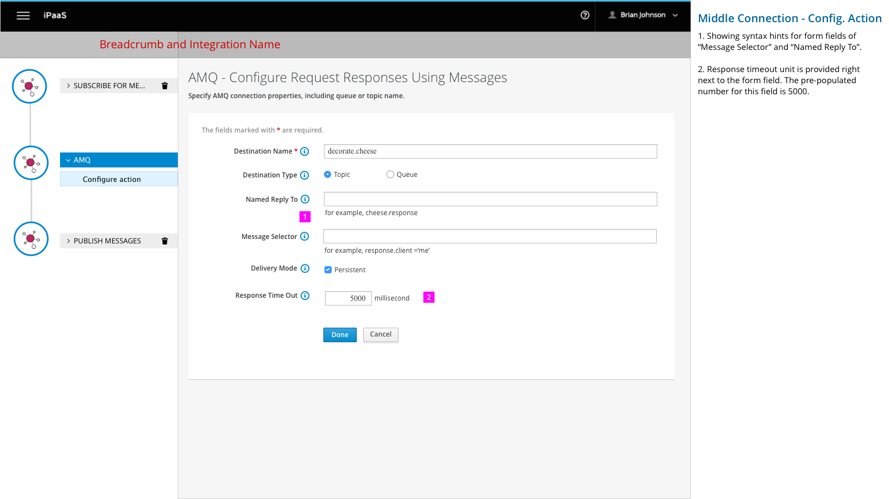

# AMQ Connection

This design covers the following workflows:
- Create a connection with AMQ connector
- Create integration with AMQ as start connection
- Create integration with AMQ as finish connection
- Create integration with AMQ as middle connection

## Create a connection with AMQ connector

1. Select the AMQ connector to create a connection.

1.  As part of the configuration, user needs to provide Broker URL. Broker URL is a required field.

2. User has the ability to validate the conneon. Validate button becomes active once required informaiton is provided.

3. Client ID field is related to Durable Subscription when configuring AMQ connection actions.

4. Once all required field is filled. The “Next” button becomes active for users to proceed to the next step.

    See PatternFly “Help on Forms” for more:
    http://www.patternfly.org/pattern-library/forms-and-controls/help-on-forms/#/design

1.	If users check "Use SSL" option, display the security settings section.

2.	“Skip Certificate Check” is a dropdown menu with Enable/Disable option.

3.	 Both “Broker Certificate” and “Client Certificate” are text areas.

4.	 Users can expand the text areas.

1. User gives the connection a name.

2. User clicks Create to create a connection.

## Create integration with AMQ as start connection

User select AMQ connection as the start connection.

1. Only show action that is available for AMQ acting as a start connection.

1. User has to specify a destination name.
“I” icon provides additional information about the form field to help users understand what should be put into the field.

2. Default Destination Type to “Topic”.  

3. Provide durable subscription ID.

4. Action buttons align left. “Done” button is disabled until user has entered all required information. User has the option to go back to the prior step by clicking “Cancel”.

1. Users fill in Durable Subscription ID.

2. “Done” action button becomes active.  

## Create integration with AMQ as finish connection

1. Only show action that is available for AMQ acting as a finish connection.

1. For Delivery Mode, the checkbox of “Persistent” is checked by default. Uncheck the checkbox means non-persistent.

2. “Done” becomes active once the required field is filled.

## Create integration with AMQ as middle connection

1. Show available actions for AMQ acting as the in-between connection.

1. Showing syntax hints for form fields of “Message Selector” and “Named Reply To”.

2. Response timeout unit is provided right next to the form field. The pre-populated number for this field is 5000.
