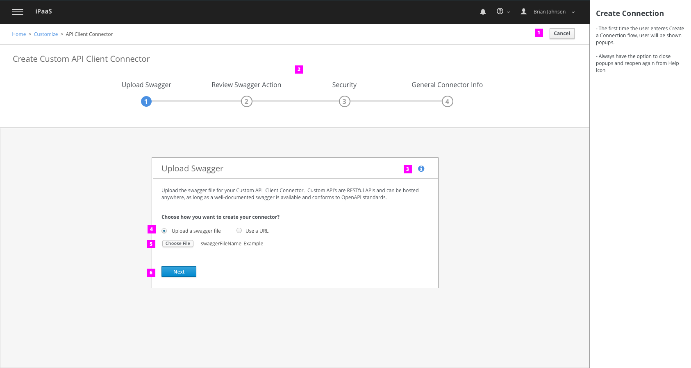
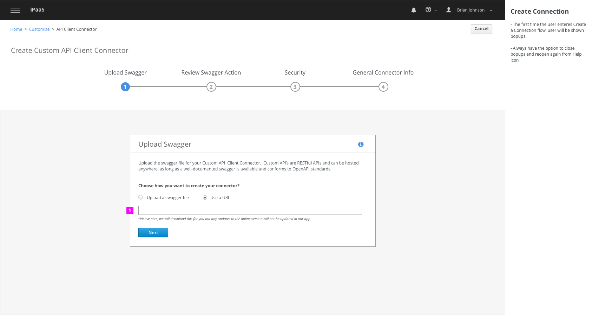
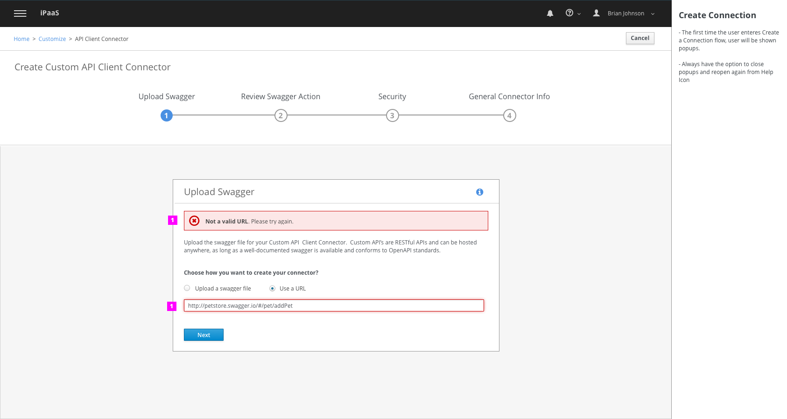
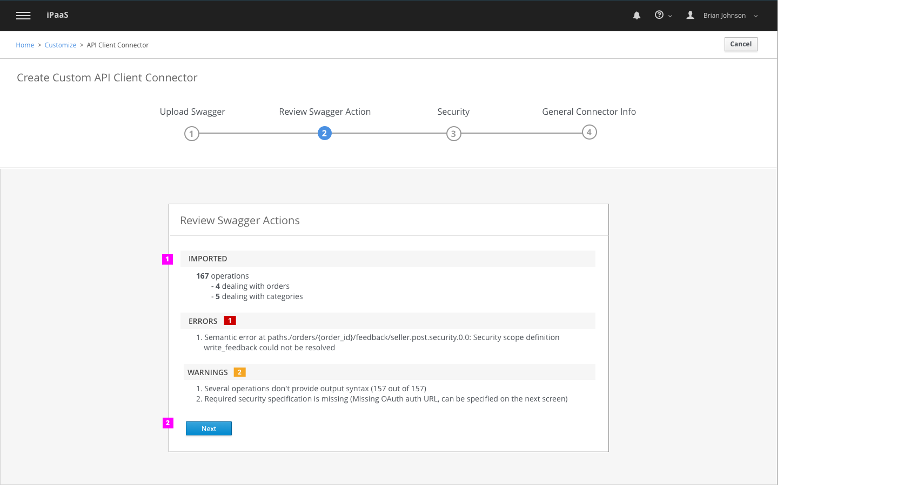
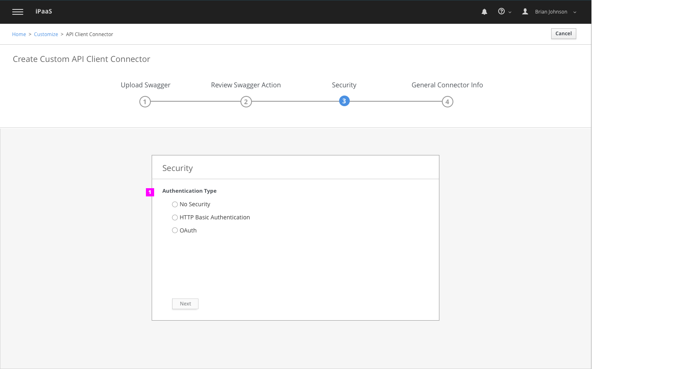
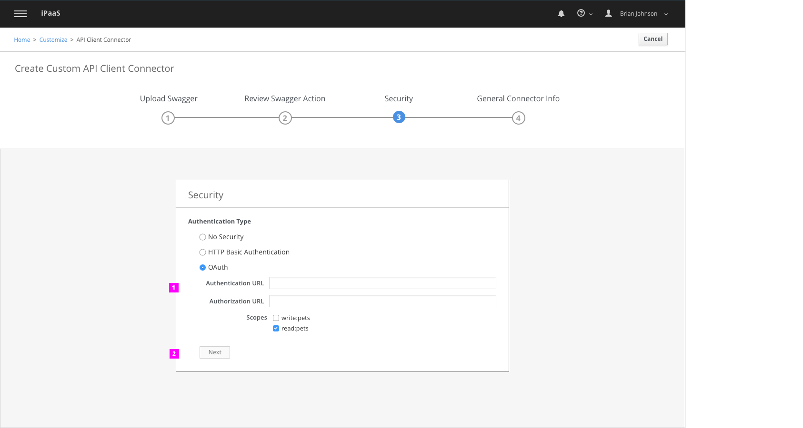
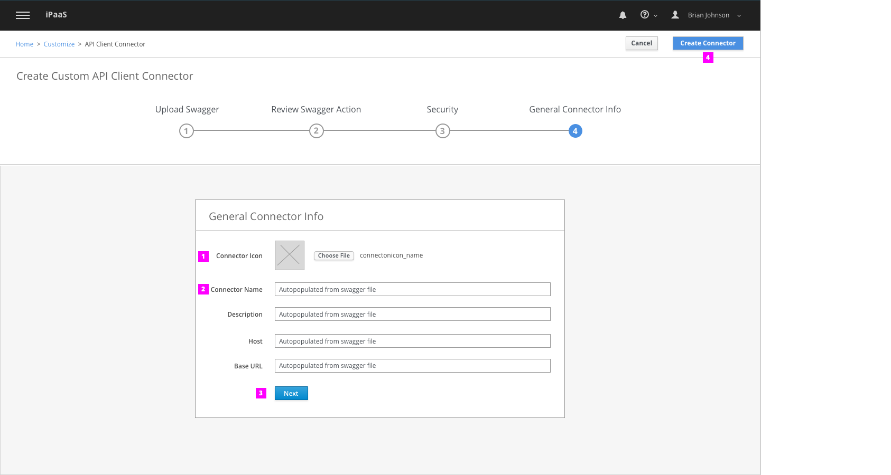
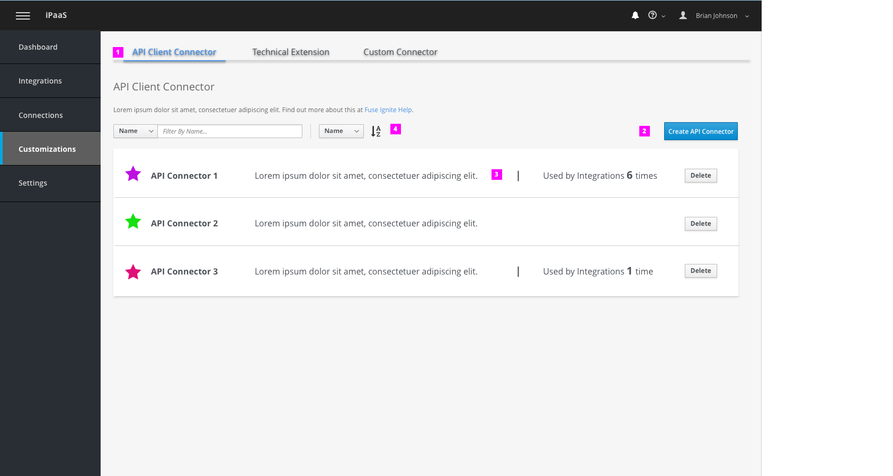
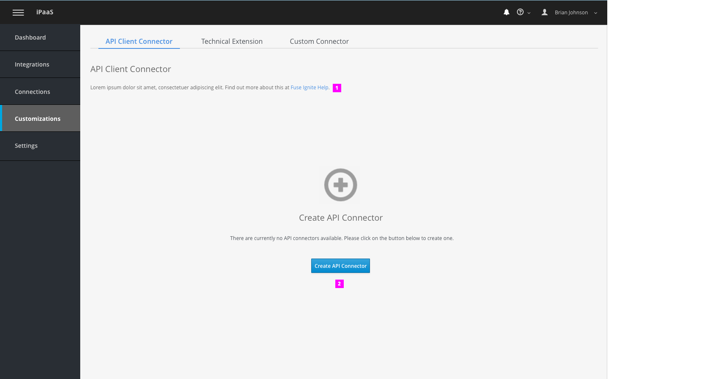
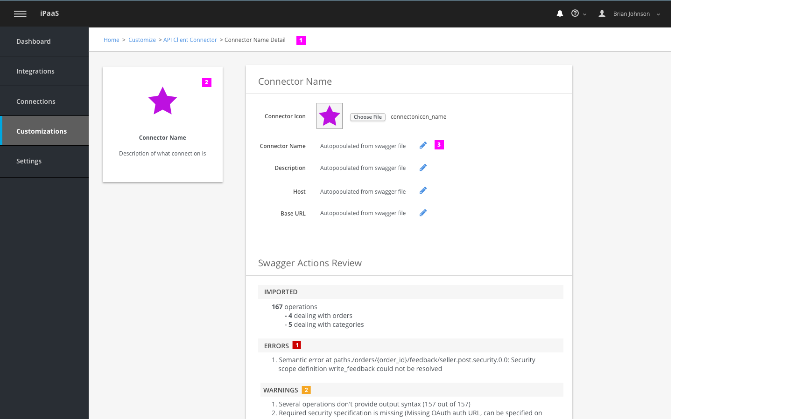

# API Client Connector

## Upload Swagger

First step is for user to upload a swagger file either via url or file upload.

1. At anytime, the user can cancel this workflow by selecting "cancel" button in toolbar.
1. The main steps of the workflow are shown in the bar along the top of the screen. User can always see all of the primary steps in the flow at all times.
1. User can click on info icon if they aren't sure how to upload a swagger/need more info on swagger files. Content to show upon click is still TBD. Either link to a new page or popover - depends on length of content.
1. User can upload a file via 2 different ways - either by inputting the URL of file or by uploading a swagger file
1. If uploading, user selects file via "choose file" button
1. Select next to move onto next step. Will be disabled until a file is uploaded.

1. If user selects URL option, user must input the url for the swagger file via the input field. "Next" button will also be disabled until a url in inserted.

1. **Validation Error**: If url or file uploaded isn't a supported swagger type, then user will get an error message in form on inline notification. Won't be triggered until user selects "next" button.
1. Input field will be highlighted in red if error occurs.

## Review Swagger Actions

1. User can review a summary of the actions associated with the swagger file in this step.
1. Select 'Next" button to move onto next step.

## Security

**Please Note:** This step is still TBD and is a placeholder until more research is done on security of an API client connector.

1. User selects authentication type via a list of options

1. When selecting a radio button, progressive disclosure will review appropriate fields user needs to fill out for each authentication type.
1. Select "next" button when done. Will be disabled until fields are filled in.

## General Connector Info

The last step is for user to review general info of swagger file.

1. User must upload an icon for connector. If no icon is uploaded, will use a default icon.
1. General info will be auto-populated from swagger file. User can update info if they wish.
1. Select "next" to move to next step
1. At this step the user can complete the workflow and select "create connector" in toolbar.

## API Connector List

User can view all API client connectors created within the Customizations section.

1. API client Connector is a section found within Customizations. User can get here by selecting the tab at top of page.
1. To create a new API connector, user clicks on button to go through workflow.
1. API connectors shown in a list view. Info shown includes name, short description, and number of times the connector is used in an integration.
  - User also has ability to delete a connector from the list.
  - If a connector is in use when a user deletes it, a popup will appear stating it's in use and user has to confirm deletion.
  - Clicking on a connector list item will take user to the details page.
1. User can use the filter tool to quickly find a specific connector

## Empty State

First time user comes to this page, there will be no API client connectors, so must show an empty state

1. User can click on link for help docs
1. User selects button to create an API client connector. Will launch workflow

## API Connector Details

Upon clicking on a connector item within the list on API client connector page, user will be taken to a details page of that specific connector.

1. Breadcrumbs for user to navigate back to previous pages.
1. Preview tile of connector.
1. User can inline edit general info. Triggered by selecting pencil icon.

**Please Note:** This page isn't final. Will work closely with Stan to make sure all details page throughout app are consistent.
