# Extension

This design covers the following workflows:
- Overview (Empty State, List View, and Details View)
- Import new extension
- Update an existing extension
- Delete a extension

## Overview

### Empty State

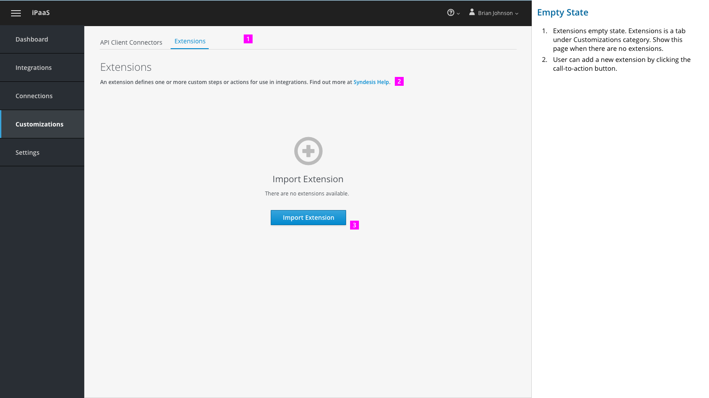

1. 	Extensions empty state. Extensions is a tab under Customizations category. Show this page when there are no extensions.

2. 	User can add a new extension by clicking the call-to-action button.

### Extension List

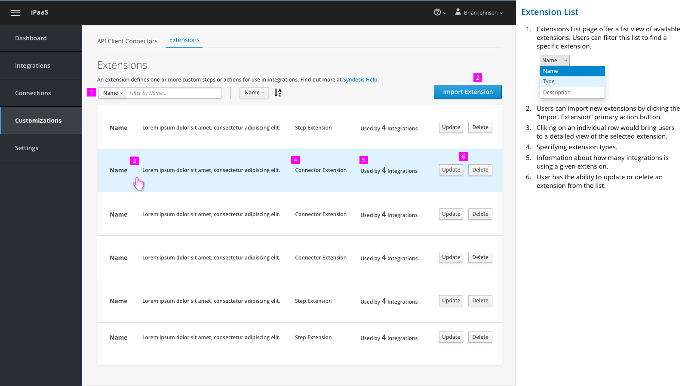

1.	Extensions List page offer a list view of available extensions. Users can filter this list to find a specific extension.







2.	Users can import new extensions by clicking the “Import Extension” primary action button.

3.	Clicking on an individual row would bring users to a detailed view of the selected extension.

4.	Specifying extension types.

5.	Information about how many integrations is using a given extension.

6.	User has the ability to update or delete an  extension from the list.  

### Extension Details

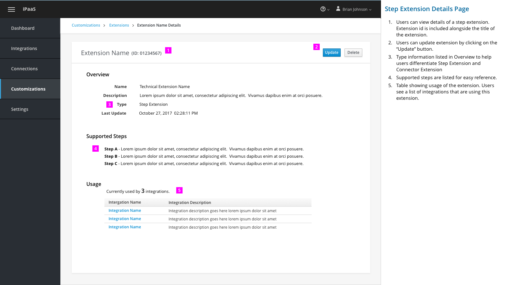

1.	Users can view details of a step extension. Extension id is included alongside the title of the extension.

2.	Users can update extension by clicking on the “Update” button.  

3.	Type information listed in Overview to help users differentiate Step Extension and Connector Extension

4.	Supported steps are listed for easy reference.

5.	Table showing usage of the extension. Users see a list of integrations that are using this extension.

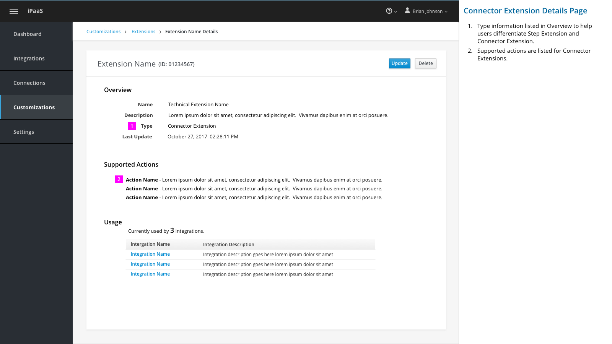

1.	Type information listed in Overview to help users differentiate Step Extension and Connector Extension.

2.	Supported actions are listed for Connector Extensions.

## Import New Extension

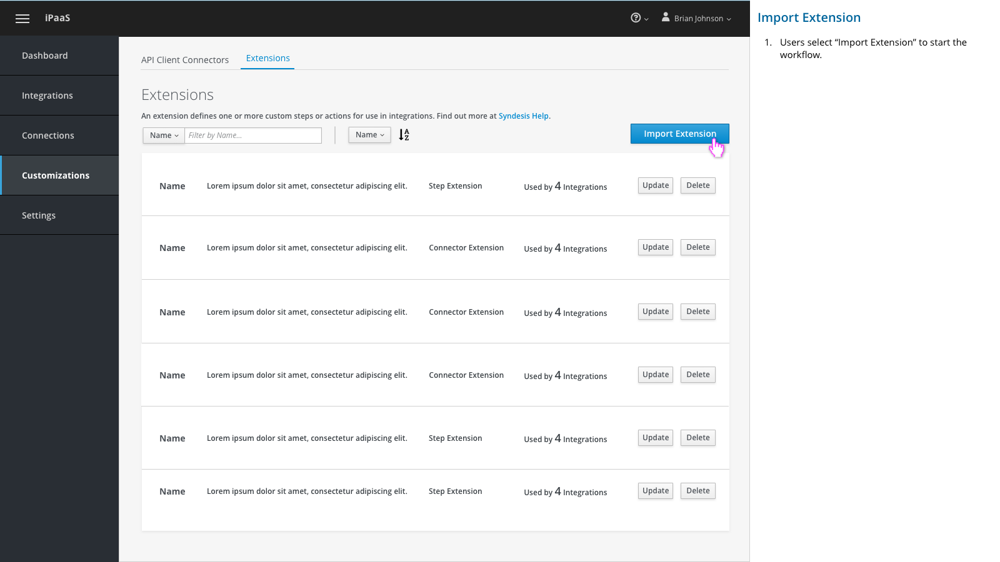

	1.	Users select “Import Extension” to start the workflow.

### Choose File

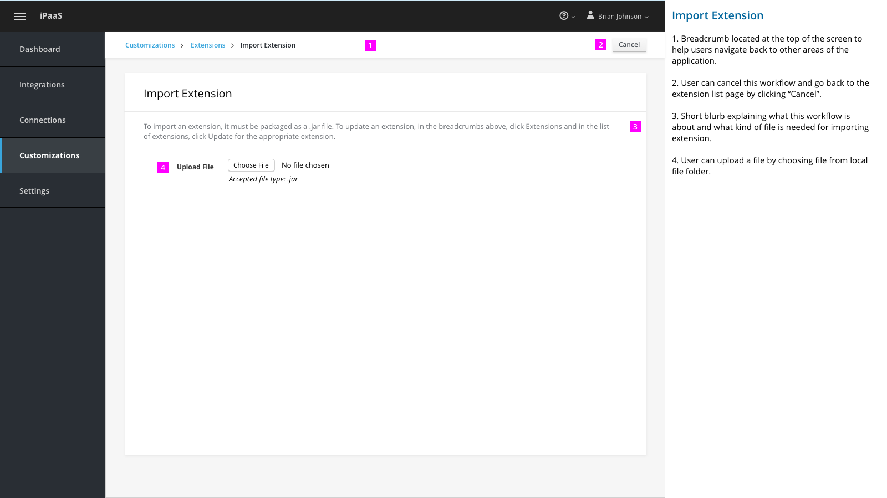

1. Breadcrumb located at the top of the screen to help users navigate back to other areas of the application.

2. User can cancel this workflow and go back to the extension list page by clicking “Cancel”.

3. Short blurb explaining what this workflow is about and what kind of file is needed for importing extension.

4. User can upload a file by choosing file from local file folder.

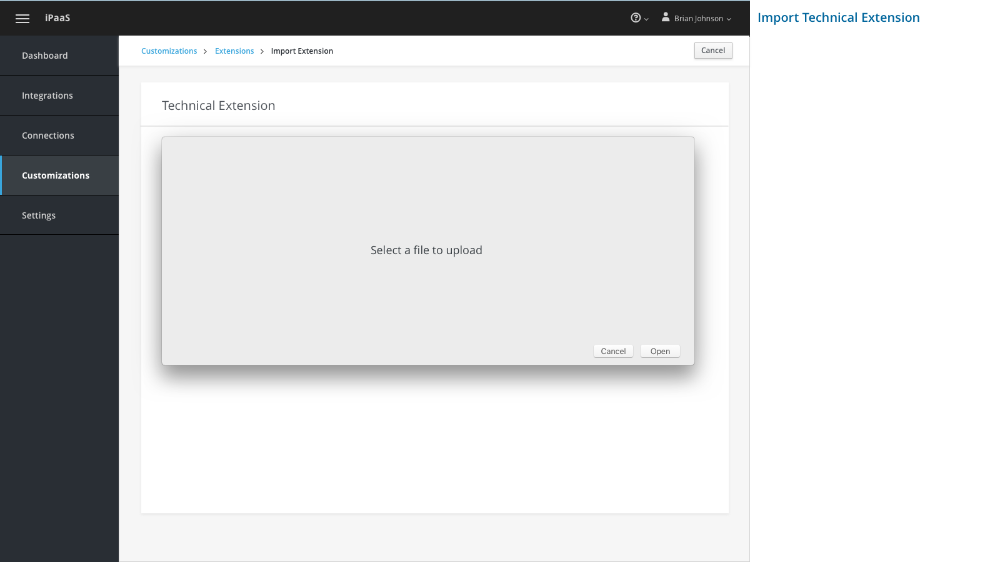

### Uploading File

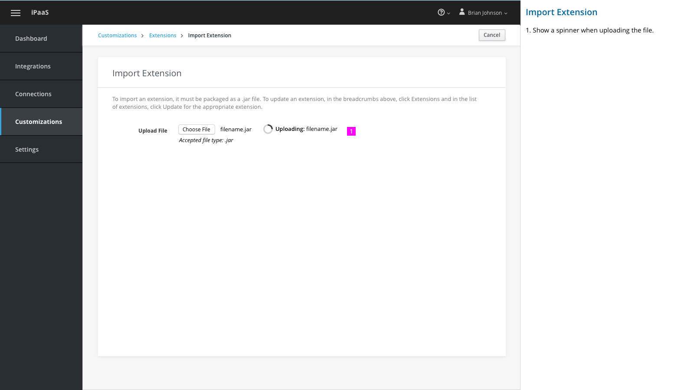

1. Show a spinner when uploading the file.

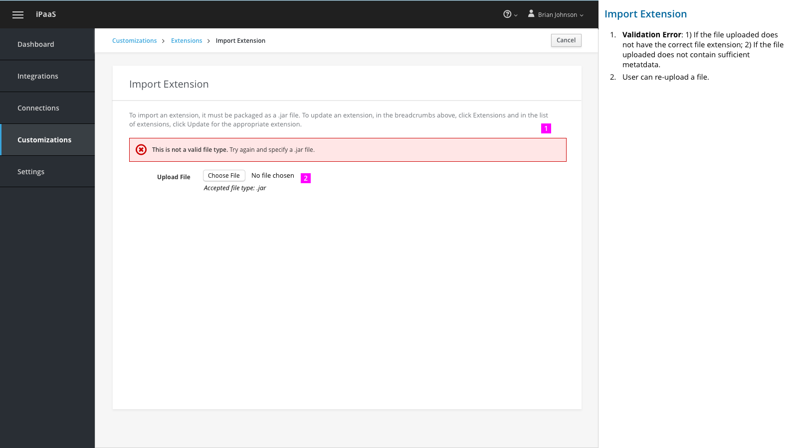

1. 	Validation Error: 1) If the file uploaded does not have the correct file extension; 2) If the file uploaded does not contain sufficient metatdata.

2. 	User can re-upload a file.

### Review Details and Confirm Import

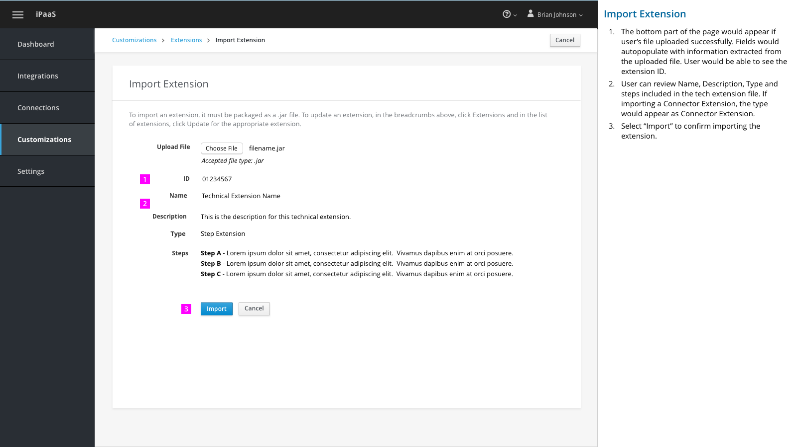

1. 	The bottom part of the page would appear if user’s file uploaded successfully. Fields would auto-populate with information extracted from the uploaded file. User would be able to see the extension ID.

2. 	User can review Name, Description, Type and steps or actions included in the extension file. If importing a Connector Extension, the type would appear as Connector Extension.

3. 	Select “Import” to confirm importing the extension.  

## Update Existing Extension

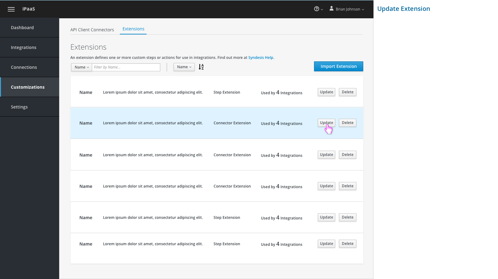

Select "Update" to update a specific extension.

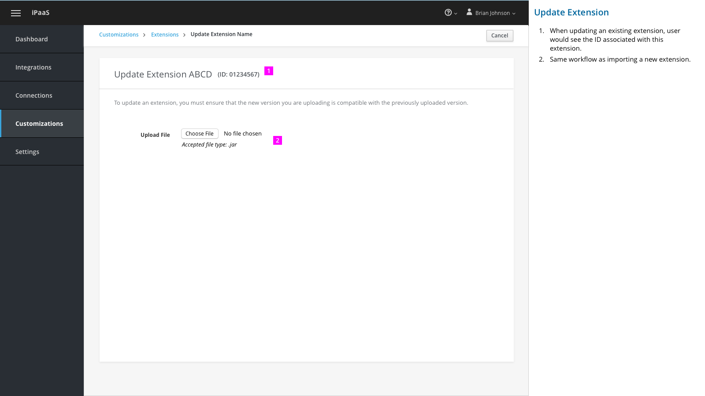

1. 	When updating an existing extension, user would see the ID associated with this extension.

2. 	Same workflow as importing a new extension.

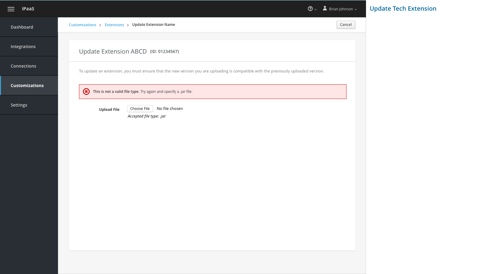

1. Show validation message if there's an error.

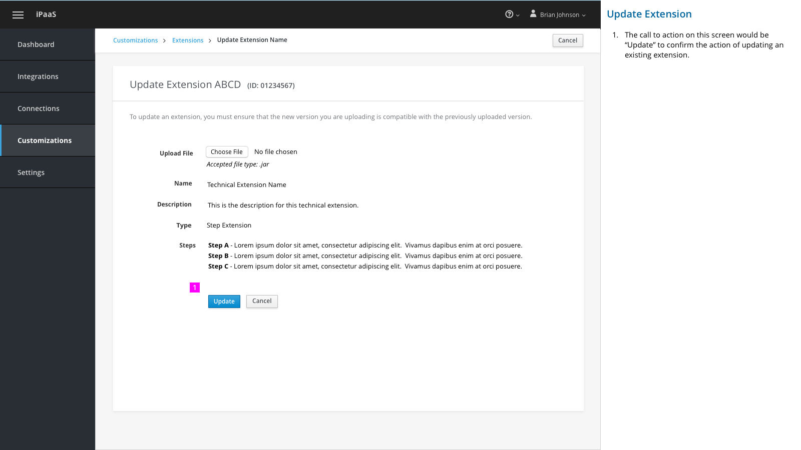

1. The call to action on this screen would be “Update” to confirm the action of updating an existing extension.

## Delete an Extension

Select "Delete" to delete a specific extension.

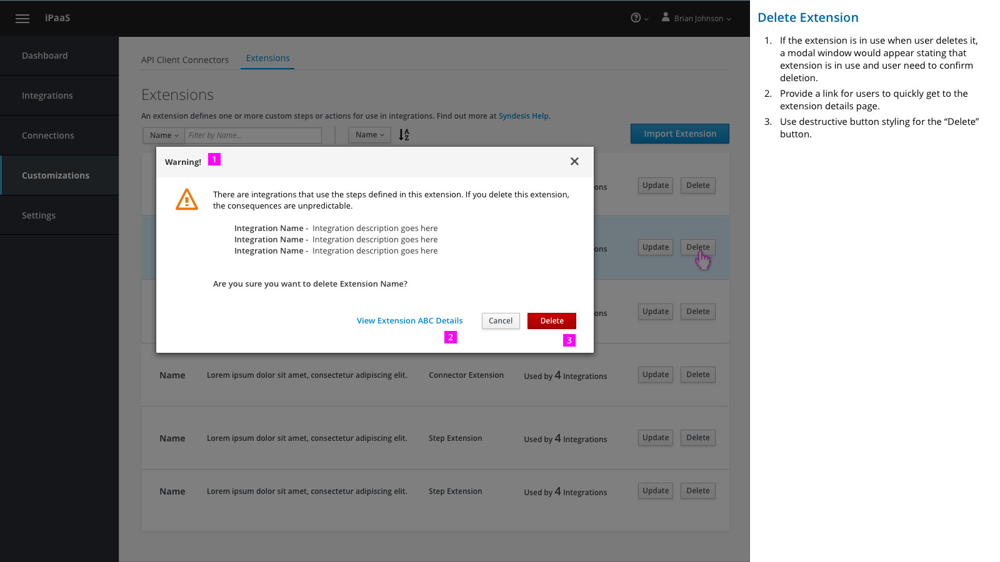

1. 	If the extension is in use when user deletes it, a modal window would appear stating that extension is in use and user need to confirm deletion.

2. 	Provide a link for users to quickly get to the extension details page.

3. 	Use destructive button styling for the “Delete” button.

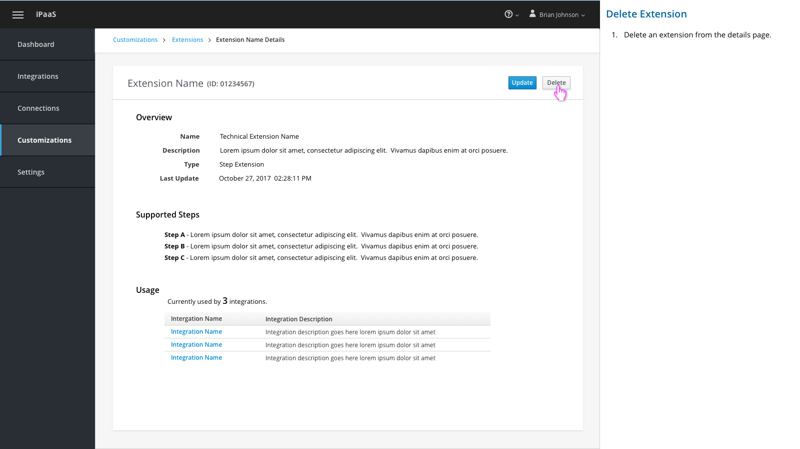

1.  Delete an extension from the details page.

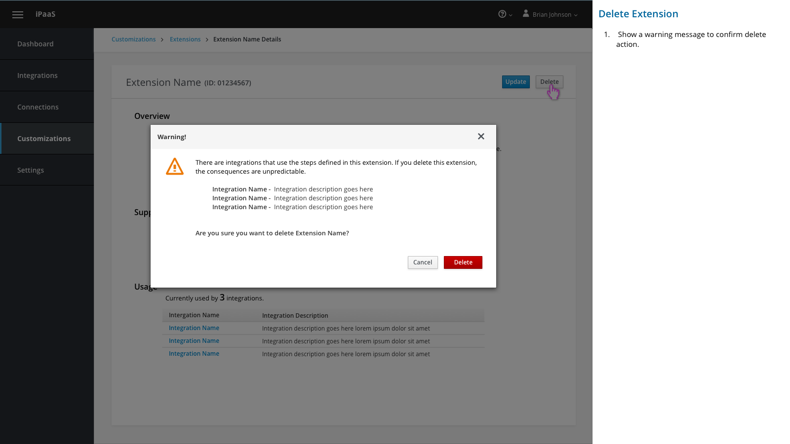

1.  Show a warning message to confirm delete action.  

## Extensions in Create Integration - Add a Step

1. Add the ability to filter on the Add a Step page. User can user filter to narrow down the list when looking for a specific filter.

1. When user selects Custom Steps, only custom steps are shown on this page.
