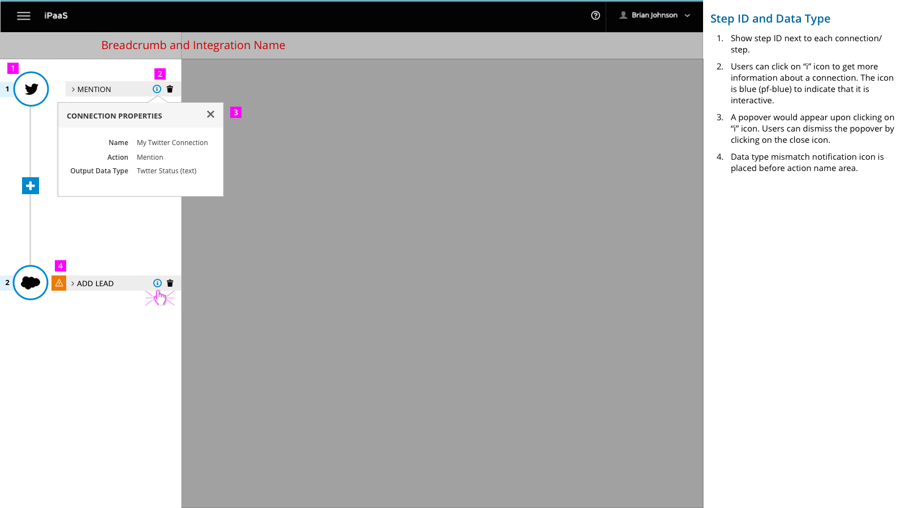
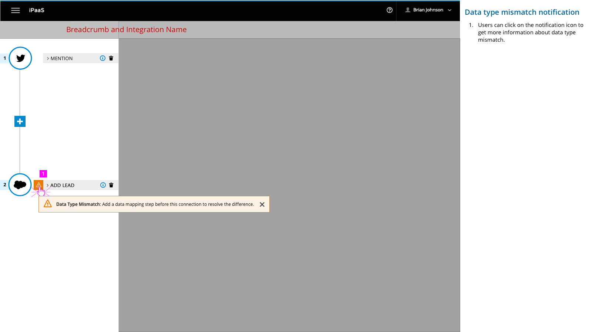
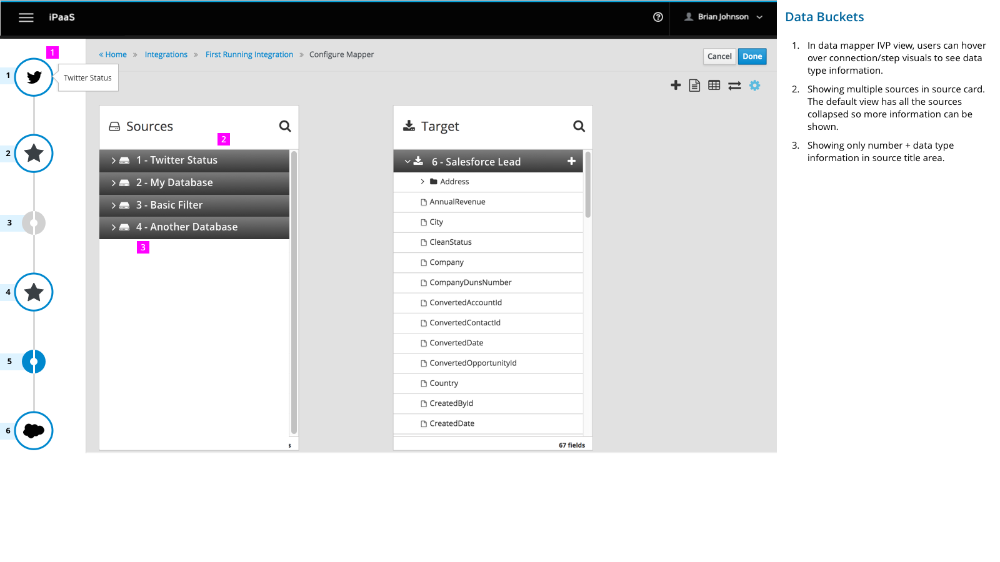

# Data Buckets

This design covers the following aspects of data buckets:
- Visualizing Step ID and showing data type information in Integration Visualization Panel (IVP)
- Showing visual indicator when data types don't match
- Displaying multiple source documents in data mapper source card

## Visualizing Step ID and showing data type information Integration Visualization Panel (IVP)

1.	Show step ID next to each connection/step.

2.	Users can click on “i” icon to get more information about a connection. The icon is blue (pf-blue) to indicate that it is interactive.

3.	A popover would appear upon clicking on “i” icon. Users can dismiss the popover by clicking on the close icon.

4.	Data type mismatch notification icon is placed before action name area.

## Visual indicator for data type mismatch

1.  Users can click on the notification icon to get more information about data type mismatch.

## Displaying multiple source documents in data mapper source card

1.	In data mapper IVP view, users can hover over connection/step visuals to see data type information.

2.	Showing multiple sources in source card. The default view has all the sources collapsed so more information can be shown.

3.	Showing only number + data type information in source title area.
