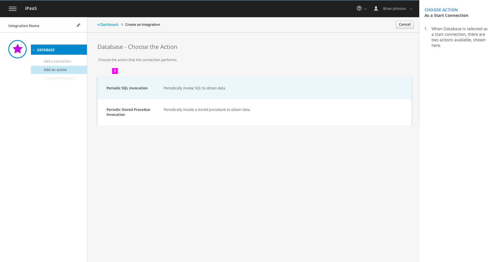
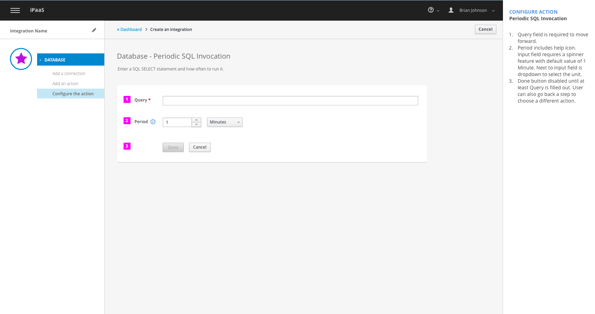
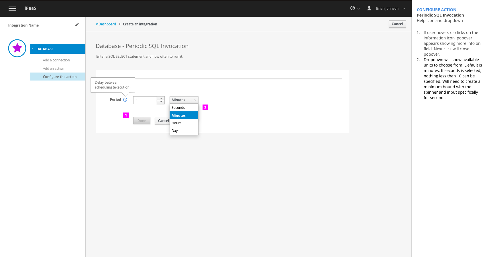
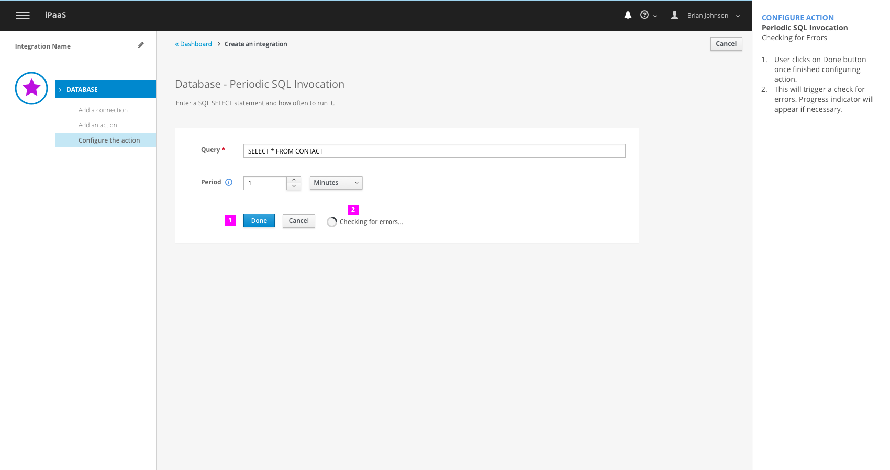
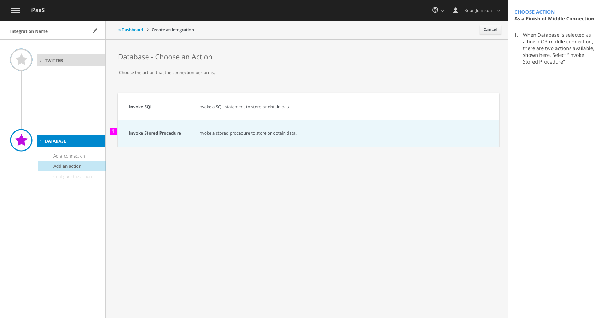
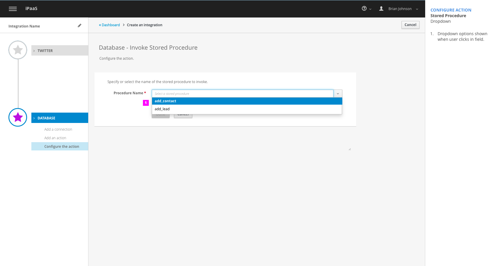
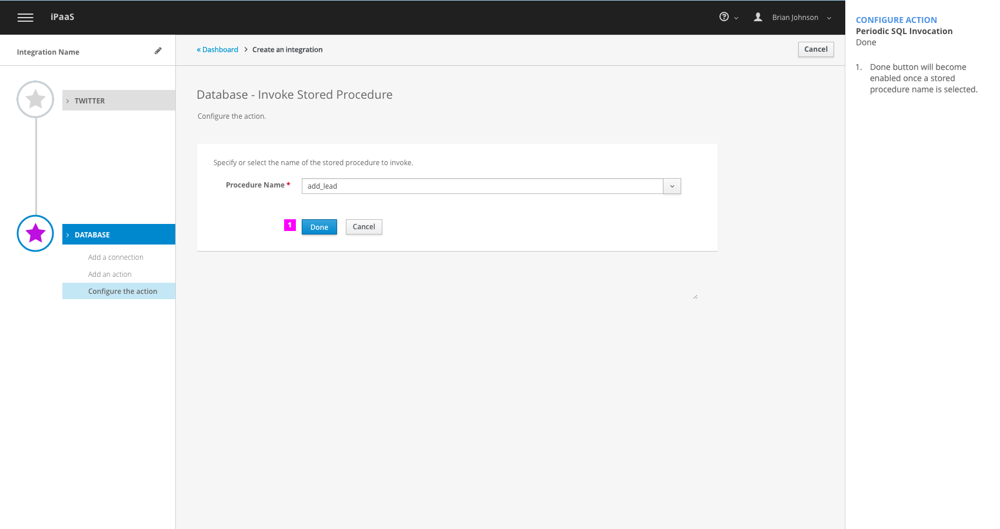
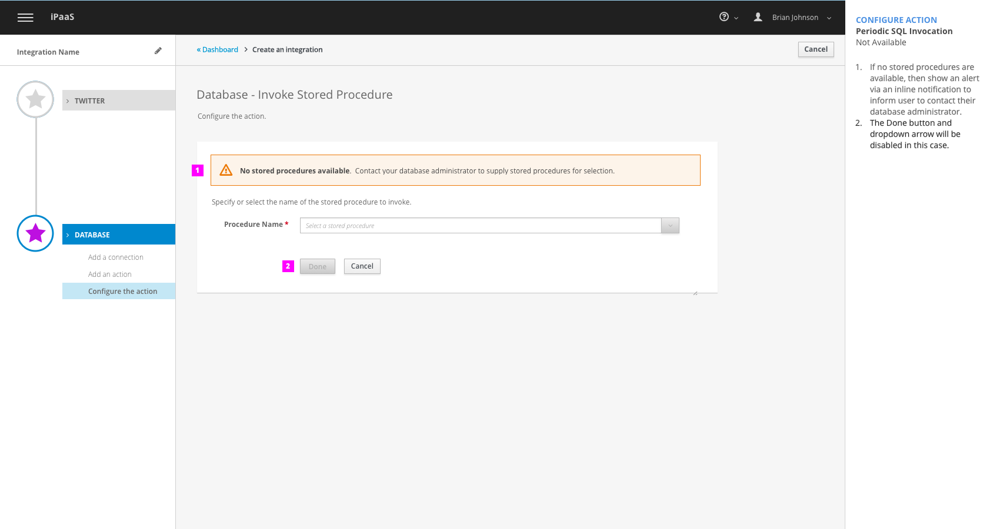
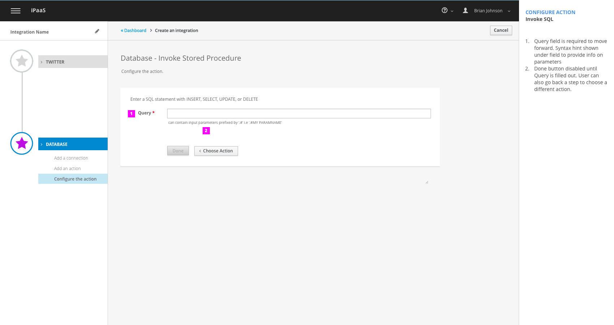

# Database Connection
This design covers the following workflows:

- Create integration with Database as a start connection: Periodic SQL
- Create integration with Database as a finish/middle connection: Stored procedure
- Create integration with Database as a finish/middle Connection: Invoke SQL

## Create an Integration with Database as a start connection

User select Database connection as the start connection.

1. When Database is selected as a start connection, there are two actions available, shown here. Select "Periodic SQL Invocation"

1. Query field is required to move forward
1. Period includes help icon. Input field requires a spinner feature with default value of **1 Minute**. Next to input field is dropdown to select the unit.
1. Done button disabled until at least Query is filled out. User can also go back a step to choose a different action.

1. If user hovers or clicks on the information icon, popover appears showing more info on field. Next click will close popover.
1. Dropdown will show available units to choose from. Default is minutes. If seconds is selected, nothing less than 10 can be specified. Will need to create a minimum bound with the spinner and input specifically for 'seconds' unit.

1. User clicks on Done button once finished configuring action and all required fields are filled in.This will trigger a check for errors to validate query and parse the SQL Query in order to calculate the output shape.
2. Progress indicator will appear if necessary.

1. If an error is detected, use inline notification error to inform user of error type.
2. Input field with error will be highlighted in red.

## Create integration with Database as a finish/middle connection

### Stored procedure

1. When Database is selected as a finish OR middle connection, there are two actions available, shown here. Select "Invoke Stored Procedure"

1. User must select procedure name from dropdown menu.
1. Done button disabled until a stored procedure is selected. User can select cancel to choose an different connection

1. Dropdown options shown when user clicks in field. Stored procedures are supplied by administrator

1. Done button will become enabled once a stored procedure name is selected.

1. If no stored procedures are available, then show an alert via an inline notification to inform user to contact their database administrator.
1. The "Done" button and dropdown arrow will be disabled in this case.

## Create integration with Database as a finish/middle connection

### Invoke SQL

1. When Database is selected as a finish OR middle connection, there are two actions available, shown here. Select "Invoke SQL"

1. Query field is required to move forward. Syntax hint shown under field to provide info on parameters
1. Done button disabled until Query is filled out. User can also go back a step to choose a different action.
