# Describe Data

When using a shapeless connection in integration, users need to specify data type.

This design uses AMQ connection as an example to demonstrate the user workflow.

## Select Connection and Action

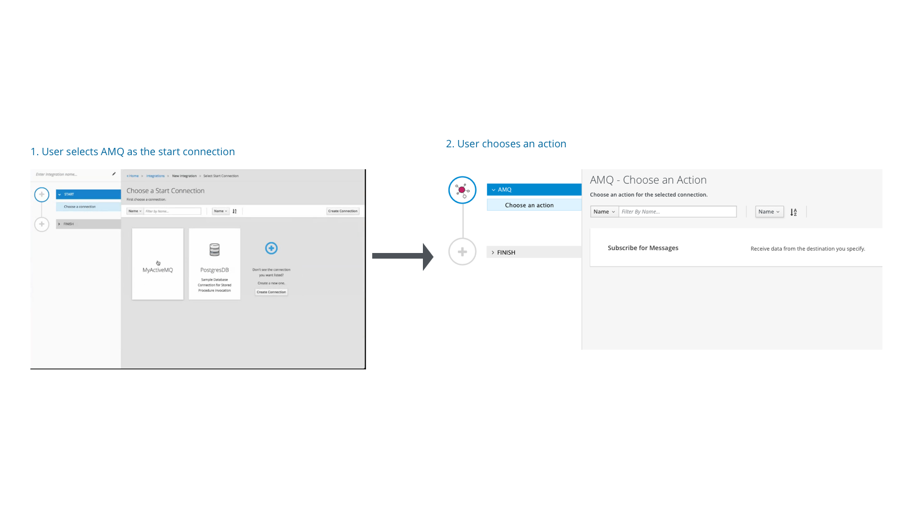

## Configure Action

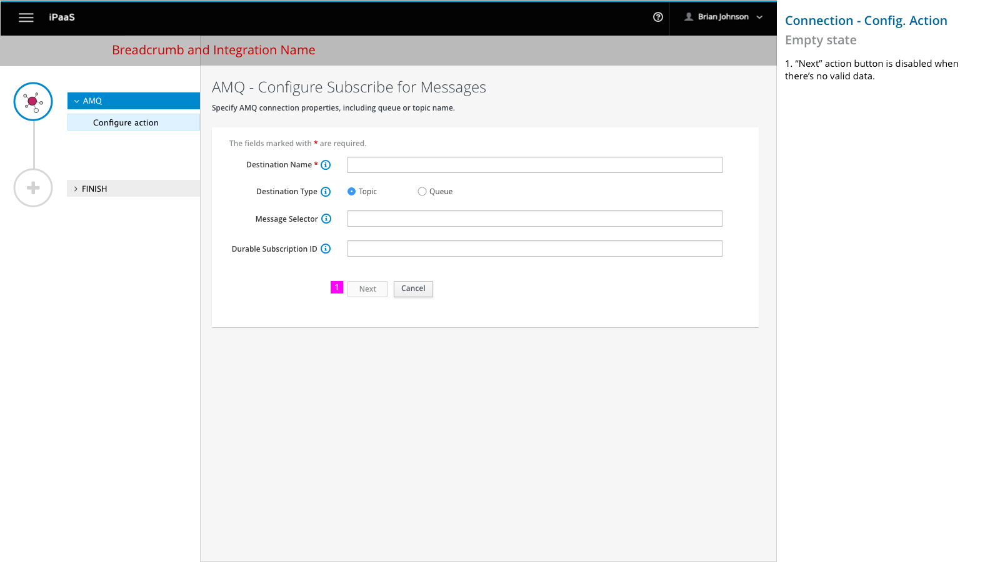

1. “Next” action button is disabled when there’s no valid data.  

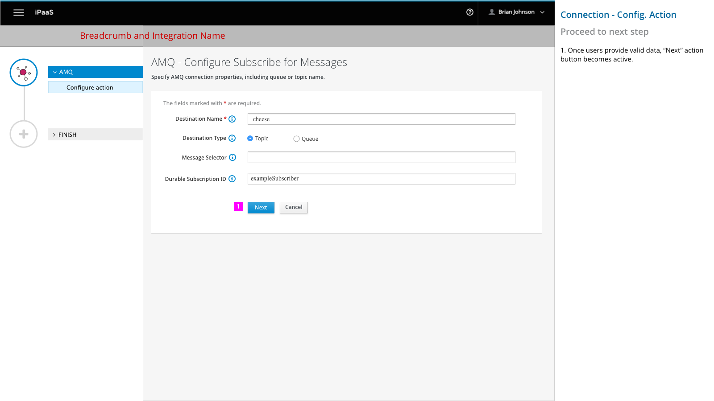

1. Once users provide valid data, “Next” action button becomes active.  

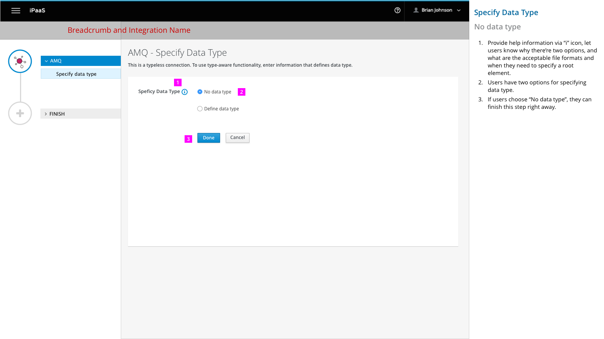

1.	Provide help information via “i” icon, let users know why there’re two options, and what are the acceptable file formats and when they need to specify a root element.

2.	Users have two options for specifying data type.

3.	If users choose “No data type”, they can finish this step right away.

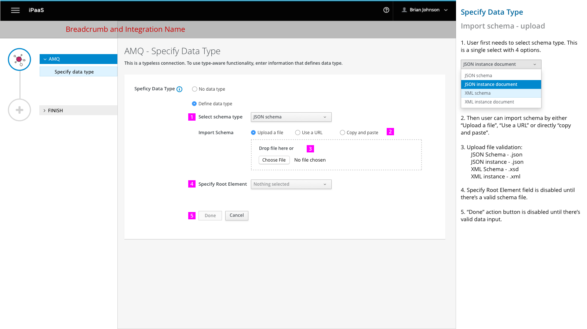

1. User first needs to select schema type. This is a single select with 4 options.

2. Then user can import schema by either “Upload a file”, “Use a URL” or directly “copy and paste”.

3. Upload file validation:
    - JSON Schema - .json
    - JSON instance - .json
    - XML Schema - .xsd
    - XML instance - .xml

4. Specify Root Element field is disabled until there’s a valid schema file.

5. Users can specify Data Type Name and Data Type Description that would be displayed in the data mapper UI and integration visualization panel.

6. “Done” action button is disabled until there’s valid data input.

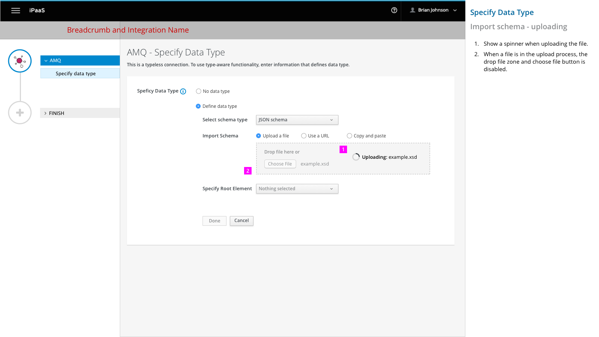

1. 	Show a spinner when uploading the file.

2. 	When a file is in the upload process, the drop file zone and choose file button is disabled.

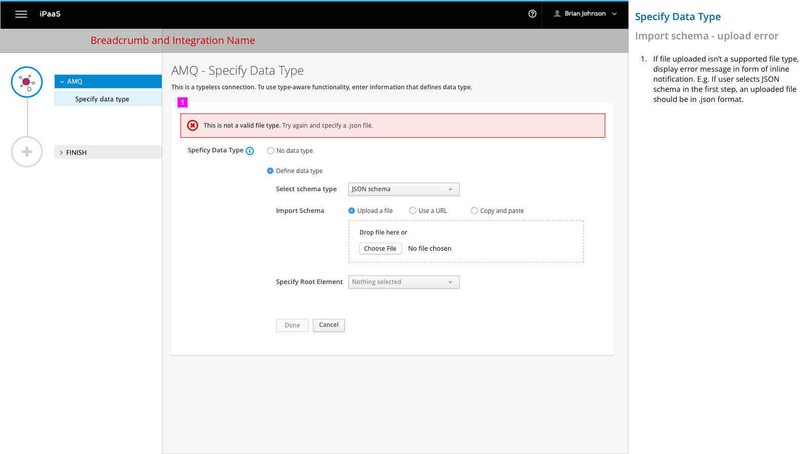

	1. 	If file uploaded isn’t a supported file type, display error message in form of inline notification. E.g. If user selects JSON schema in the first step, an uploaded file should be in .json format.

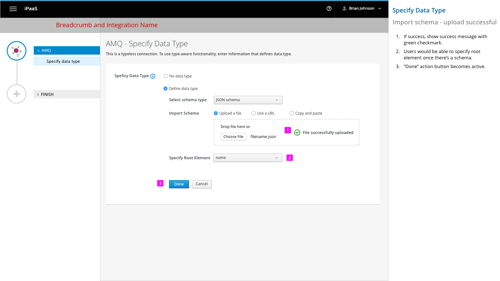

1.	If success, show success message with green checkmark.

2.	Users would be able to specify root element once there’s a schema.

3.	“Done” action button becomes active.

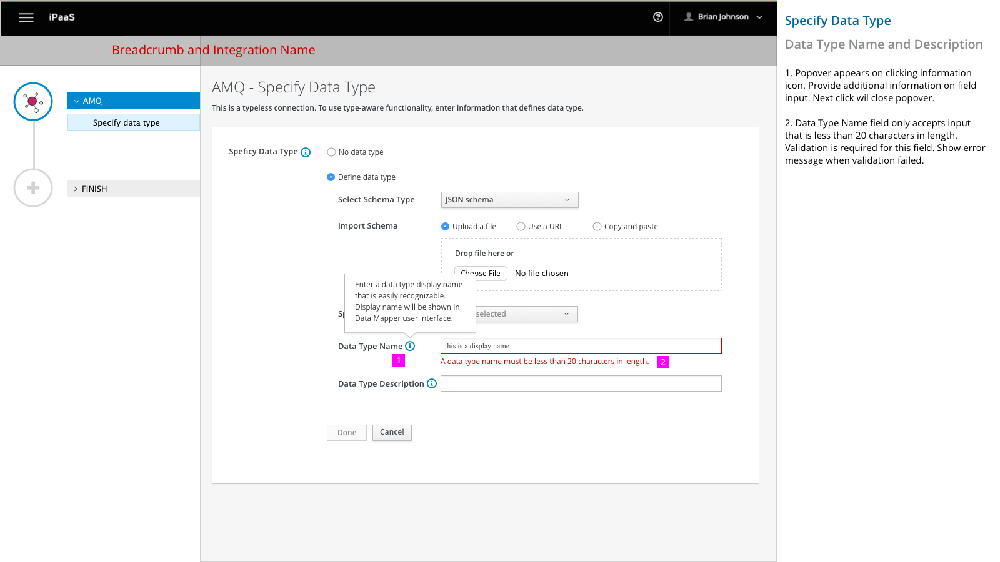

1. Popover appears on clicking information icon. Provide additional information on field input. Next click wil close popover.

2. Data Type Name field only accepts input that is less than 20 characters in length. Validation is required for this field. Show error message when validation failed.

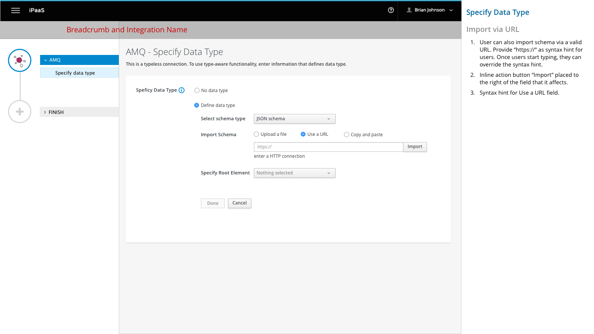

1. 	User can also import schema via a valid URL. Provide “https://“ as syntax hint for users. Once users start typing, they can override the syntax hint.

2. 	Inline action button “Import” placed to the right of the field that it affects.

3. 	Syntax hint for Use a URL field.

1. 	If URL isn’t valid or reachable, display error message in form of inline notification. Highlight the form field with a red border and hightlight the syntax hint in red.

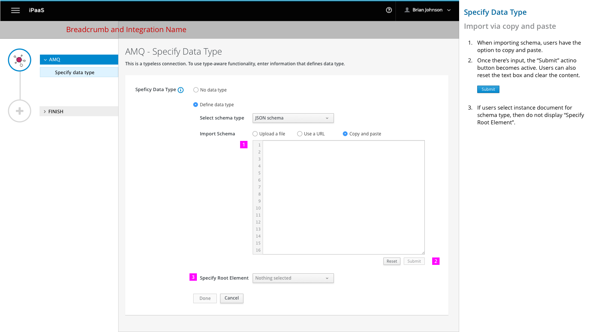

1.	When importing schema, users have the option to copy and paste.

2.	Once there’s input, the “Submit” action button becomes active. Users can also reset the text box and clear the content.
 



3.	If users select instance document for schema type, then do not display “Specify Root Element”.

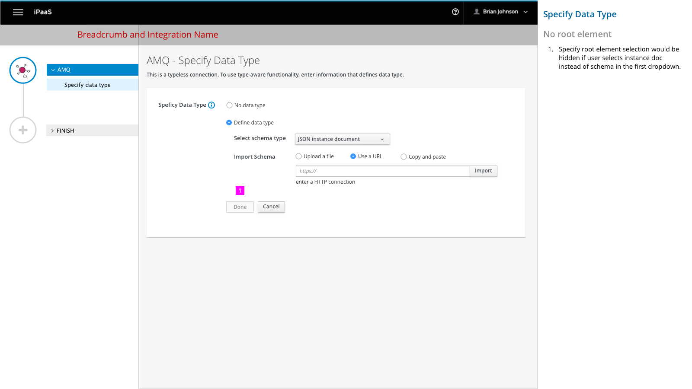

1. 	Specify root element selection would be hidden if user selects instance doc instead of schema in the first dropdown.
