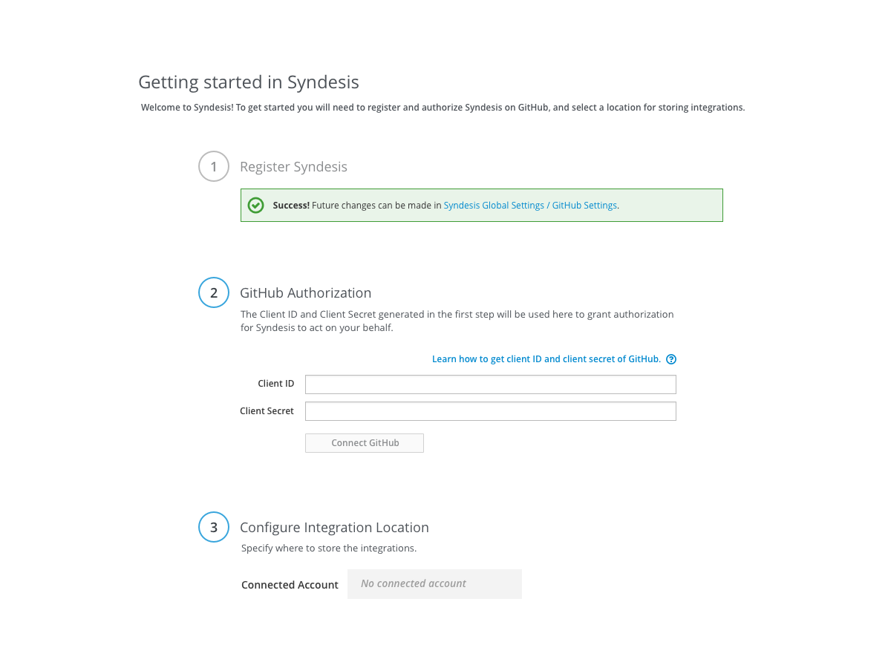
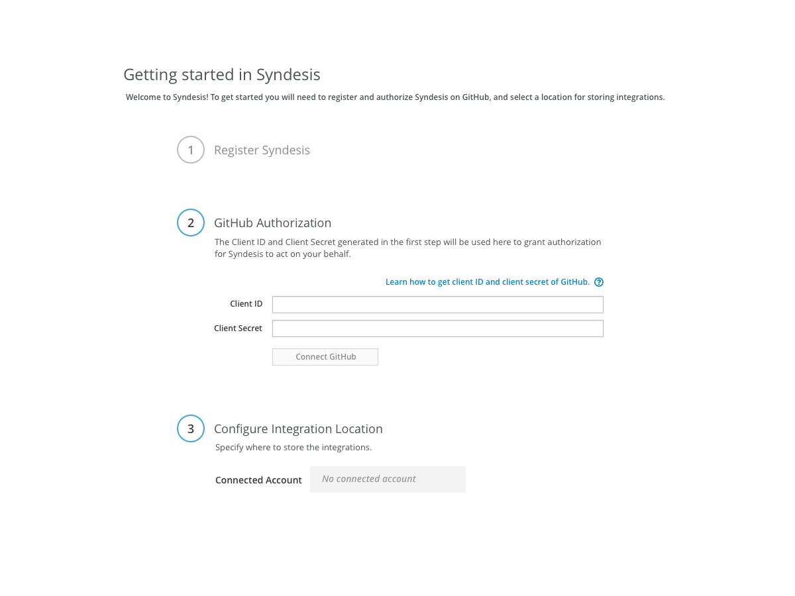
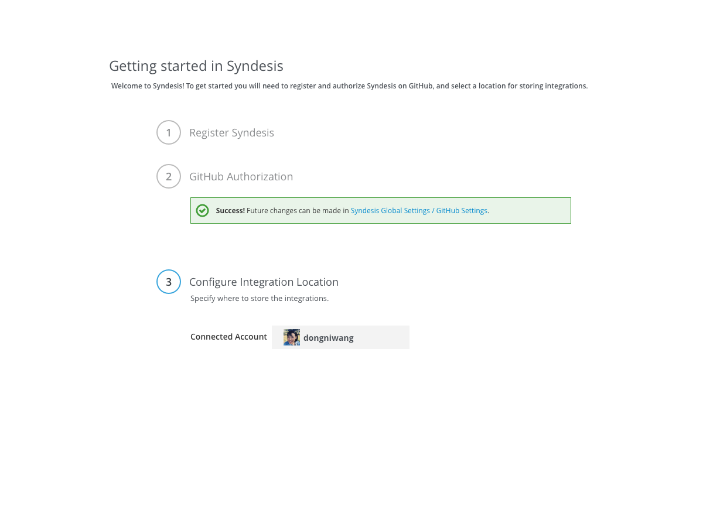
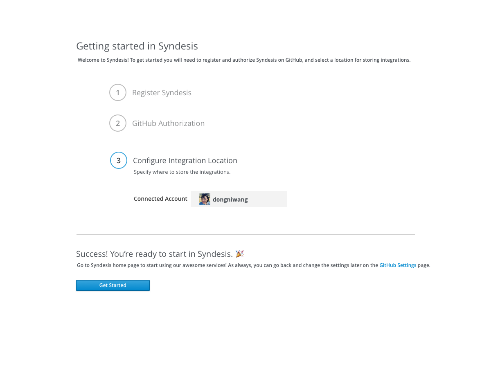
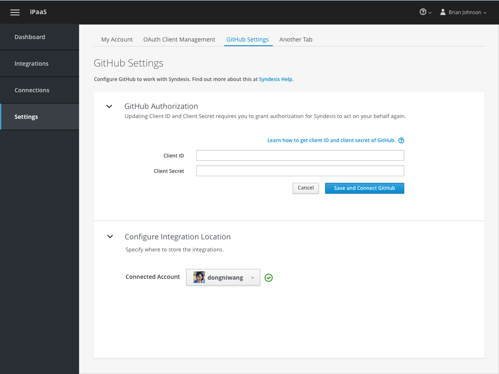
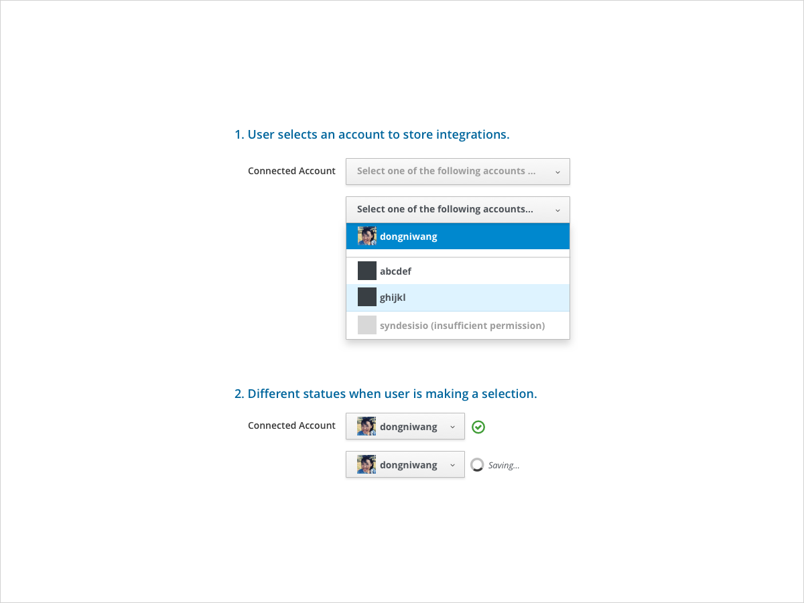

# GitHub Settings

## Getting Started Page

1. User would see all three steps for configuring GitHub on one page.
2. Links to help documentation on how to register OAuth app and how to get client id and client secret.

1. Use is directed back to this page after successfully registered Syndesis on GitHub.  
2. A success message is displayed when user is taken back to this page. The title of the first step turns gray to let user know this step is completed.

1. The success message is displayed for ~10 secs then it would disappear to let user focus on the next step.  
2. For the second step, user will fill in client ID and client secret. User needs to get this from GitHub page.

1. Disable "Connect GitHub" button until both client ID and client secret have been filled in.
2. Clicking on "Connect GitHub" will bring users to the OAuth flow where they can grant access for Syndesis.  

1. A success message is displayed once user has successfully connected to GitHub. Step two turns gray.

1. The success message is displayed for ~10 secs than it would disappear to let user focus on the next step.  
2. Users would be able to see their personal account as the default connected account.

## Global Settings > GitHub Settings

1. GitHub Settings page for user to update client id and client secret, as well as changing connected account. User can only connect to one account at a time.

1. User fills the form to update GitHub client id and client secret.
2. Users click on "Save and Connect GitHub" to go through the OAuth flow for GitHub again.

