# Import / Export
This design covers the following workflows:

- Exporting an integration from the integration summary page
- Import / Export from integration list page
- Importing a single integration
- Importing multiple integrations

## Exporting Integrations

**Export from Integration Summary Page**

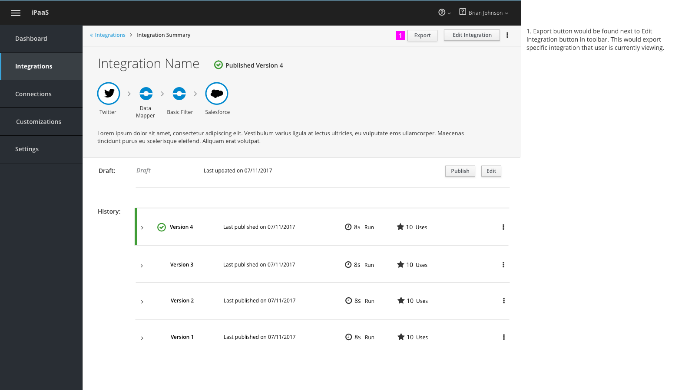

1. Export button would be found next to Edit Integration button in toolbar. This would export specific integration that user is currently viewing.

**Import/Export from Integration List Page**

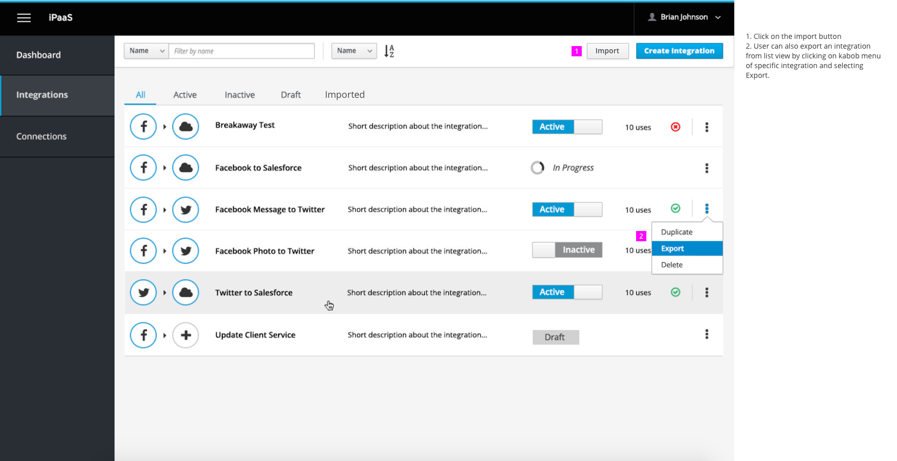

1. Click on the import button in toolbar to start import integration workflow.
1. User can also export an integration from list view by clicking on kabob menu of specific integration and selecting export option from dropdown.

## Importing a Single Integration

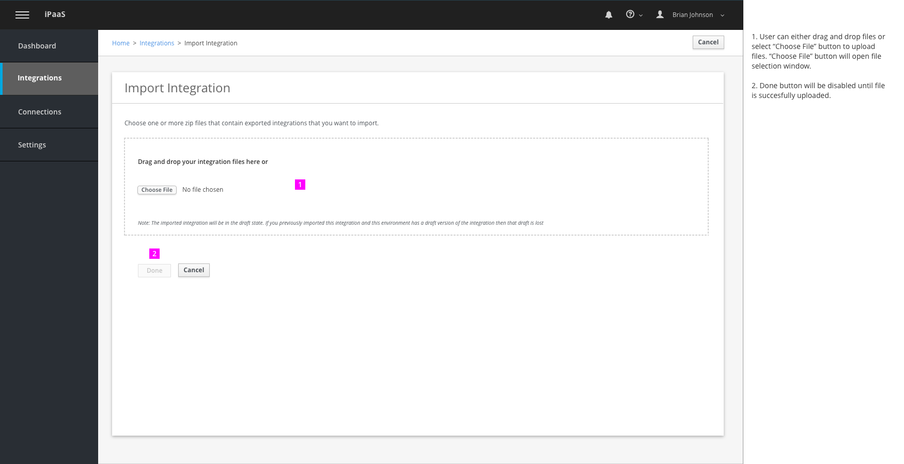

1. User can either drag and drop files or select “Choose File” button to upload files. “Choose File” button will open file selection window.

2. Done button will be disabled until file is successfully uploaded.

1. Active state of drag and drop box if a user is dragging a file over upload box.

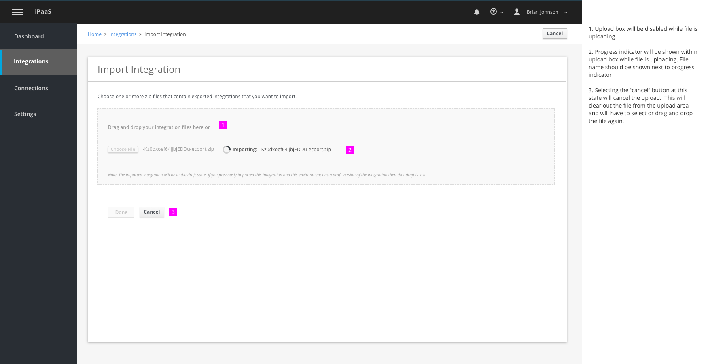

1. Upload box will be disabled while file is uploading.

2. Progress indicator will be shown within upload box while file is uploading. File name should be shown next to progress indicator

3. Selecting the “cancel” button at this state will cancel the upload.  This will clear out the file from the upload area and will have to select or drag and drop the file again.

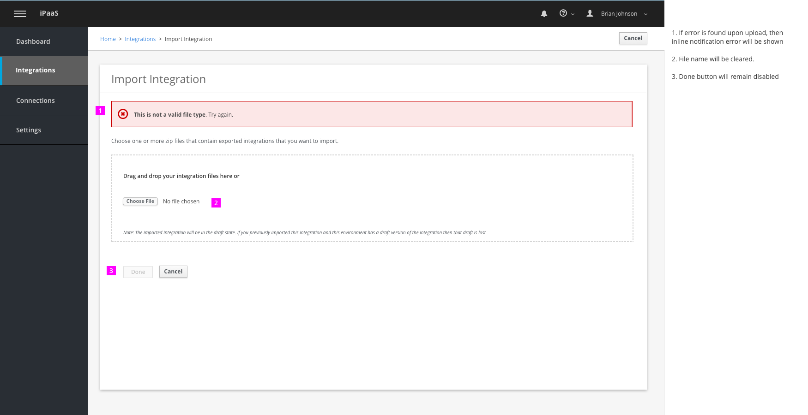

1. If error is found upon upload, then inline notification error will be shown

2. File name will be cleared.

3. Done button will remain disabled

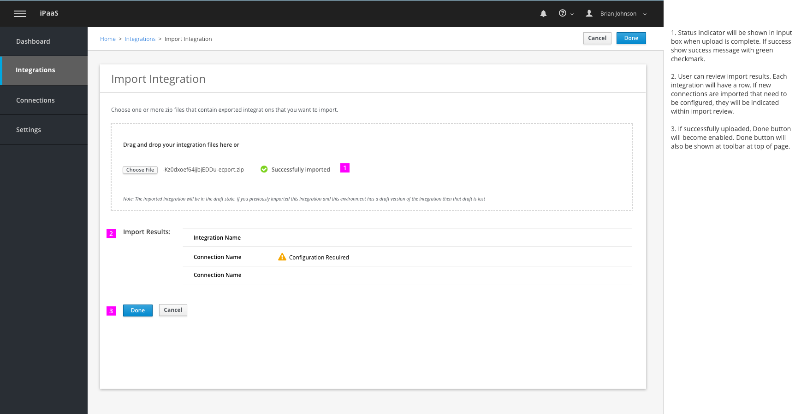

1. Status indicator will be shown in input box when upload is complete. If success show success message with green checkmark.

2. User can review import results. Each integration will have a row. If new connections are imported that need to be configured, they will be indicated within import review.

3. If successfully uploaded, Done button will become enabled. Done button will also be shown at toolbar at top of page.

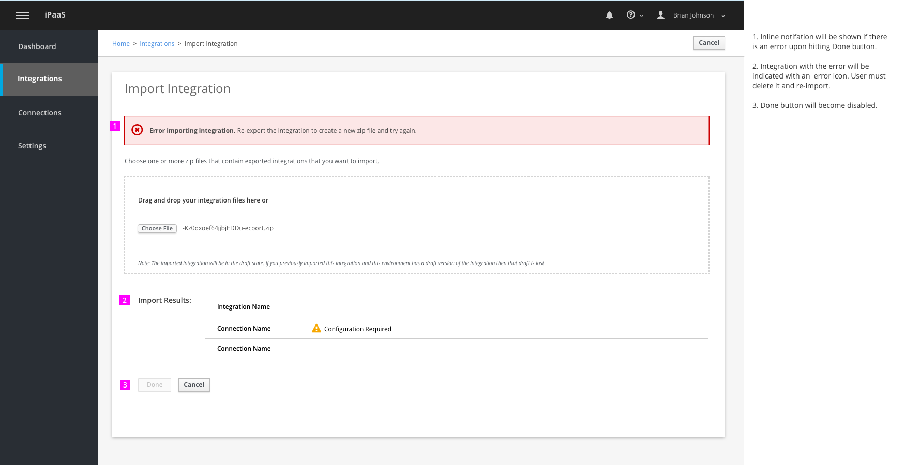

1. Inline notifation will be shown if there is an error upon hitting Done button.

2. Integration with the error will be indicated with an  error icon. User must delete it and re-import.

3. Done button will become disabled.

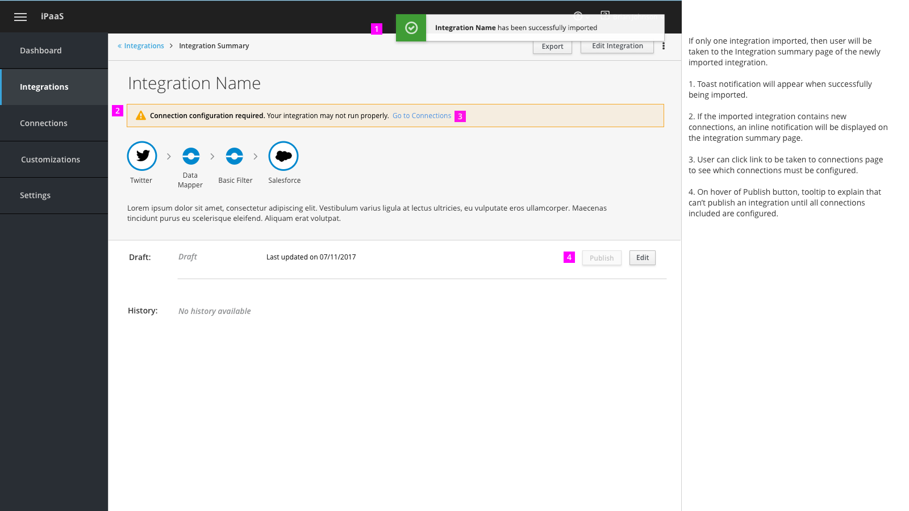

If only one integration imported, then user will be taken to the Integration summary page of the newly imported integration.

1. Toast notification will appear when successfully being imported.

2. If the imported integration contains new connections, an inline notification will be displayed on the integration summary page.

3. User can click link to be taken to connections page to see which connections must be configured.

4. On hover of Publish button, tooltip to explain that can’t publish an integration until all connections included are configured.

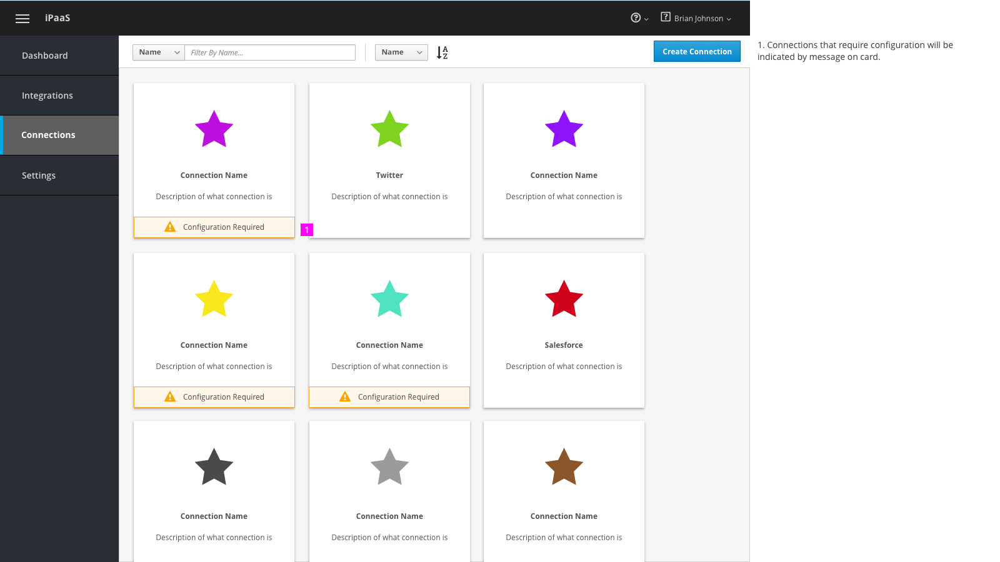

1. Connections that require configuration will be indicated by message on card in connections page.

## Importing Multiple Integrations
Same general behavior of integrating a single integration with a couple differences described below.

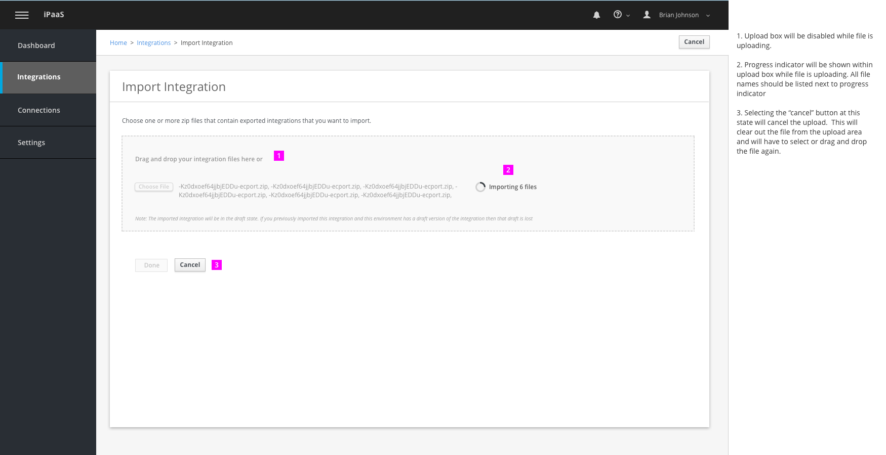

1. Upload box will be disabled while file is uploading.

2. Progress indicator will be shown within upload box while file is uploading. All file names should be listed next to progress indicator

3. Selecting the “cancel” button at this state will cancel the upload.  This will clear out the file from the upload area and will have to select or drag and drop the file again.

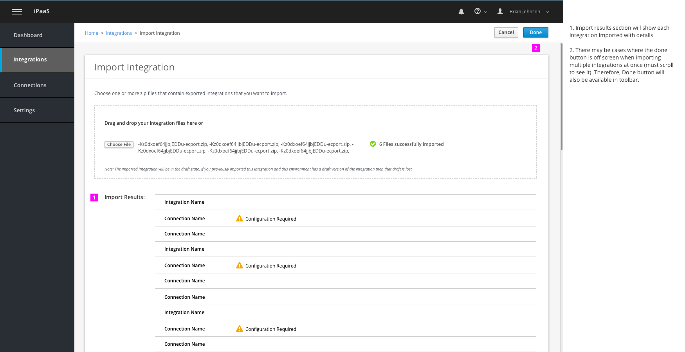

1. Import results section will show each integration and connection imported.

2. There may be cases where the done button is off screen when importing multiple integrations at once (must scroll to see it). Therefore, Done button will also be available in toolbar.

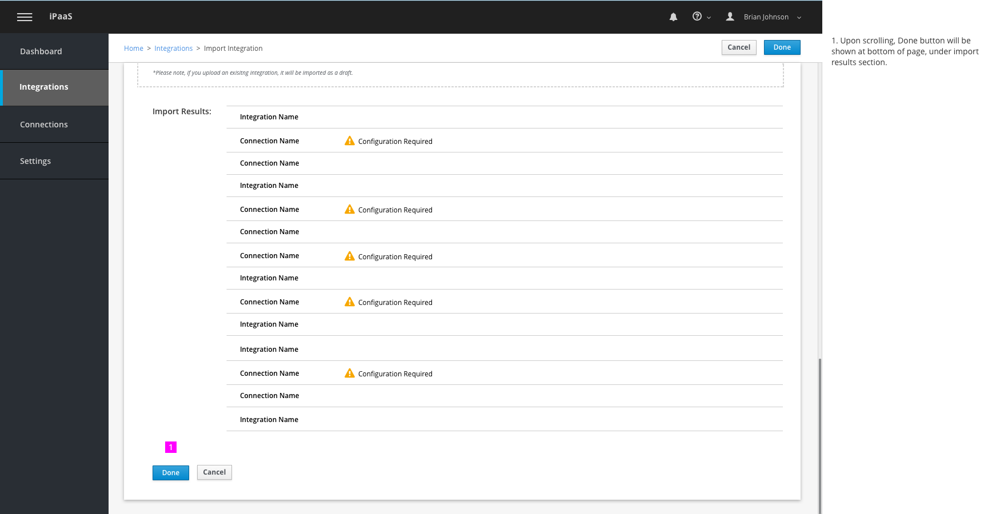

1. Upon scrolling, Done button will be shown at bottom of page, under import results section.

1. Take user to integration list page under All tab after successfully importing more than one integration. Newly imported integrations will be indicated by a green triangle.

2. Integrations that require configuration of connections will be indicated here as well.
