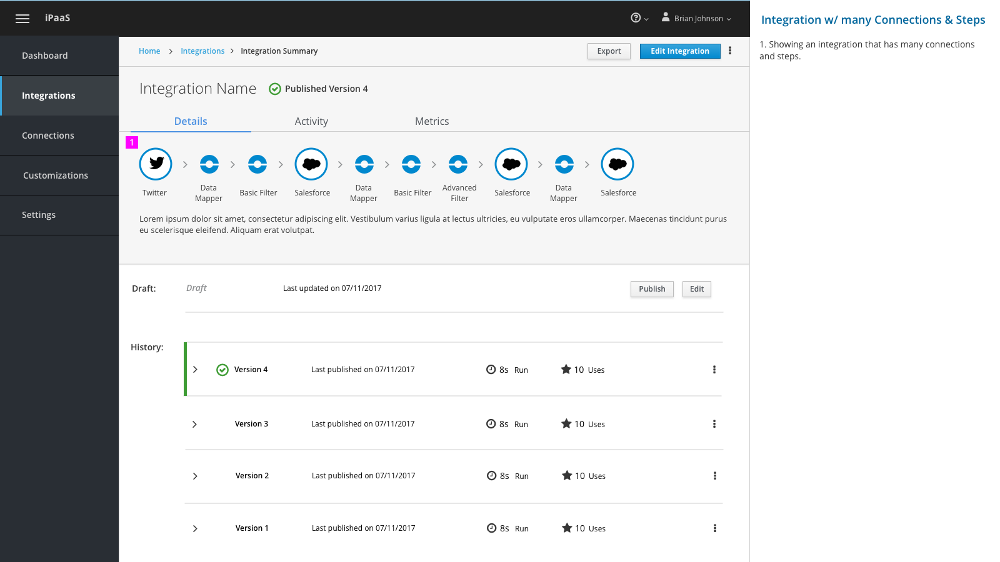
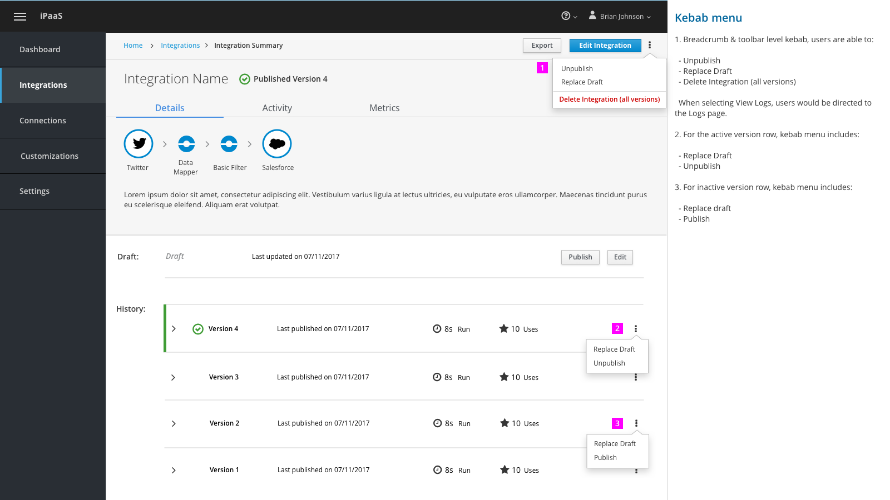
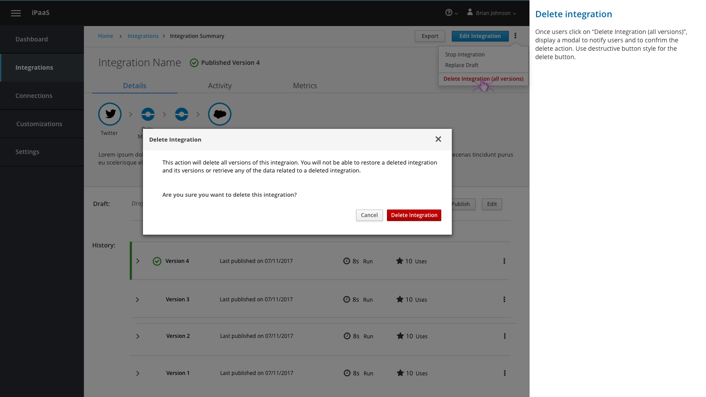
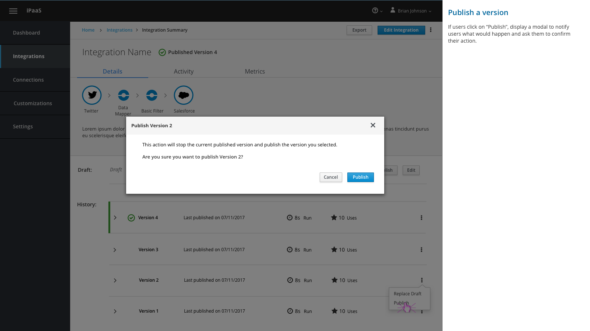
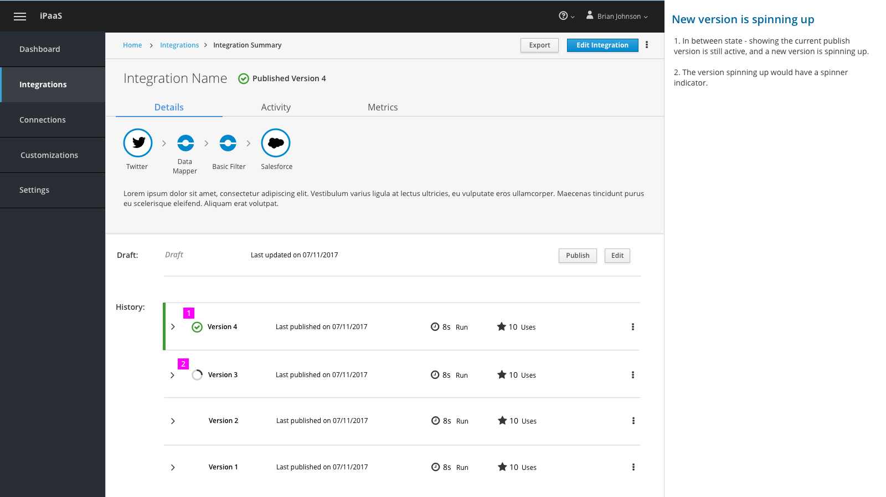
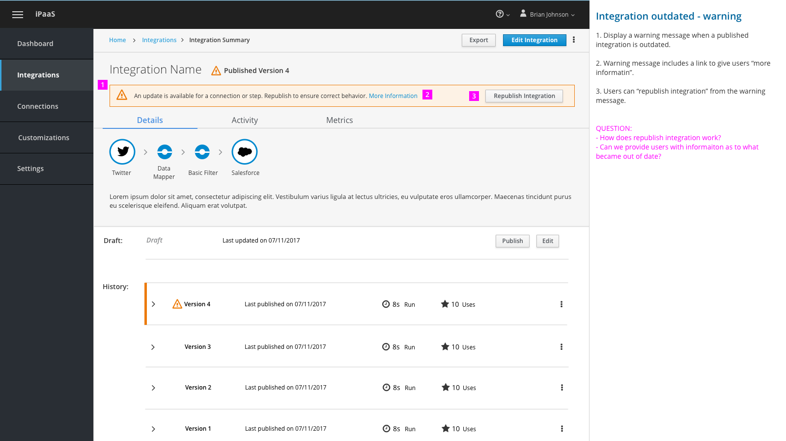
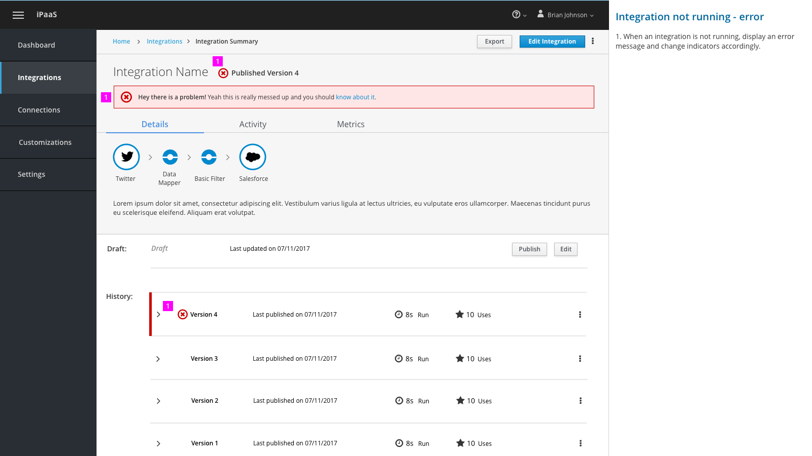

# Integration Details Page

The designs covers the following user interactions:
- Integration Details Page basic layout
  - Expandable row for integration history (versions)
  - Kebab menu
  - Integration visualization (normal vs. many steps/connections)
- Creating/Replacing integration draft and publish a version from integration history
  - Status indicators at row level
  - Having notifications in place for publish action
  - Modal for confirming user actions

## Overview

### Integration Details Page

#### No Draft  

1. If there’s no draft for an integration. The draft section would not be shown on this page.

2. Users would be able to “Create Draft” from the current version.

#### Basic layout

1. Moved status label to the top section right next to Integration Name. Using “check mark” icon to indicate this integration is active.

2. Moving Draft out of the integration history. Users would be able to “Publish” and “Edit” the draft.

3. Added row indicator (green bar) and checkmark icon to indicate active and running version. For active version, users would only be able to perform “Replace Draft” with the active version.

1. Showing an integration that has many connections and steps.

#### Expanding a row

1. When expanding a row item, show more details about that version.

  - Start Date/Time
  - Last Run
  - Last Modified: user name and timestamp
  - Modification Notes: works like commit message or note to self

2. Users are able to scroll on this page. When scrolling, the whole page scrolls.

### Interacting with the page

#### Kebab menu

1. Breadcrumb & toolbar level kebab, users are able to:

  - Unpublish
  - Replace Draft
  - Delete Integration (all versions)

  When selecting View Logs, users would be directed to the Logs page.  

2. For the active version row, kebab menu includes:

  - Replace Draft
  - Unpublish

3. For inactive version row, kebab menu includes:

  - Replace draft
  - Publish

#### Modal for confirming actions

Once users click on “Delete Integration (all versions)”, display a modal to notify users and to confrim the delete action. Use destructive button style for the delete button.

Once users click on “Replace Draft”, display a modal to notify users and to confirm the replace draft action.

If users click on “Publish”, display a modal to notify users what would happen and ask them to confirm their action.

#### Status indicators

1. In between state - showing the current publish version is still active, and a new version is spinning up.

2. The version spinning up would have a spinner indicator.

In this case, the published version is being “decommissioned” and the new version is being published.

1. Show spinner for overall integration status.

2. Show spinners for both the “decommissioning” version and the being published version.

#### Notifications (alerts)

1. Display a warning message when a published integration is outdated.

2. Warning message includes a link to give users “more informatin”.

3. Users can “republish integration” from the warning message.

1. When an integration is not running, display an error message and change indicators accordingly.
