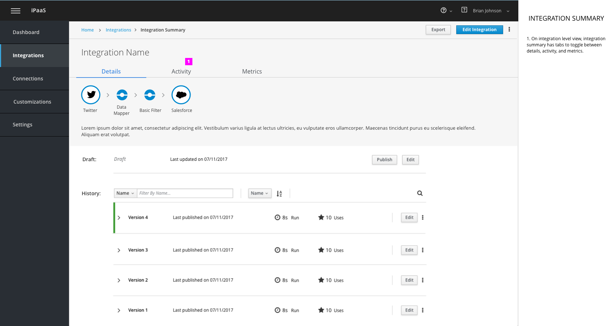
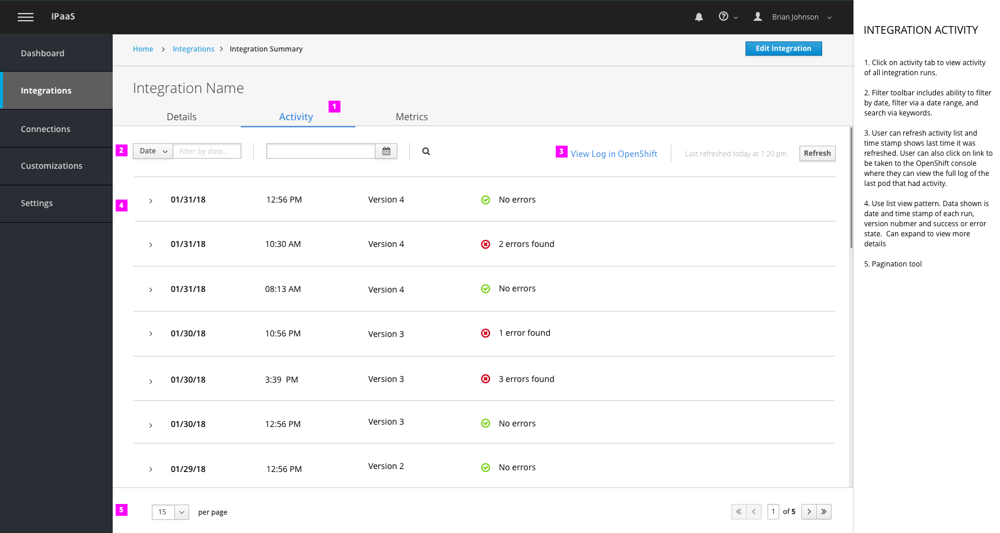
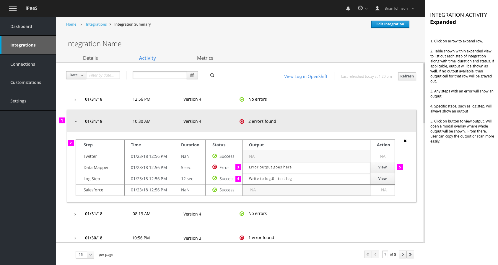
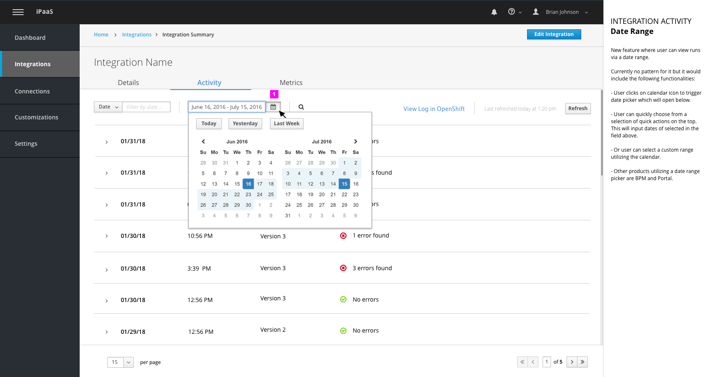

# Monitor: Integration Activity
This design covers the following workflows:

- Viewing integration activity via tabs in Integration Summary Page
- Viewing output of a specific step within an integration run
- Filtering integration runs via a date range

## Integration Summary

1. On integration level view, integration summary has tabs to toggle between details, activity, and metrics.

## Activity Tab

View integration activity via Activity

1. Click on activity tab to view activity of all integration runs.

2. Filter toolbar includes ability to filter by date, filter via a date range, and search via keywords.

3. User can refresh activity list and time stamp shows last time it was refreshed. User can also click on link to be taken to the OpenShift console where they can view the full log of the last pod that had activity.

4. Use list view pattern. Data shown is date and time stamp of each run, version nubmer and success or error state.  Can expand to view more details

5. Pagination tool

1. Click on arrow to expand row.

2. Table shown within expanded view to list out each step of integration along with time, duration and status. If applicable, output will be shown as well. If no output available, then output cell for that row will be grayed out.

3. Any steps with an error will show an output.

4. Specific steps, such as log step, will always show an output

5. Click on button to view output. Will open a modal overlay where whole output will be shown.  From there, user can copy the output or scan more easily.

1. Upon clicking on “view” button, modal overlay appears showing full output for that specific step (when applicable)

2. User can copy full text by clicking on “Copy” button

3.  Close modal by clicking on button on bottom or “X” as the top of modal. Close button will act as primary button.

## Date Range

New feature where user can view runs filtering via a date range.

Currently no pattern for it but it would include the following functionalities:

- User clicks on calendar icon to trigger date picker which will open below.

- User can quickly choose from a selection of quick actions on the top. This will input dates of selected in the field above.

- Or user can select a custom range utilizing the calendar.

- Other products utilizing a date range picker are BPM and Portal.

### PatternFly Reference

- [List View](http://www.patternfly.org/pattern-library/content-views/list-view/#code)
- [Table View](http://www.patternfly.org/pattern-library/content-views/table-view/#code)
- [Modal Overlay](http://www.patternfly.org/pattern-library/forms-and-controls/modal-overlay/#overview)
- [Pagination](http://www.patternfly.org/pattern-library/navigation/pagination/#overview)
