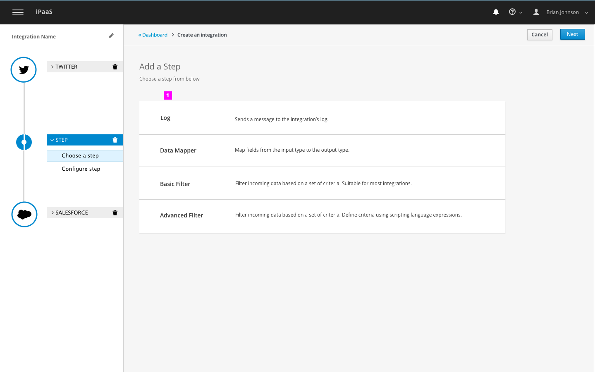
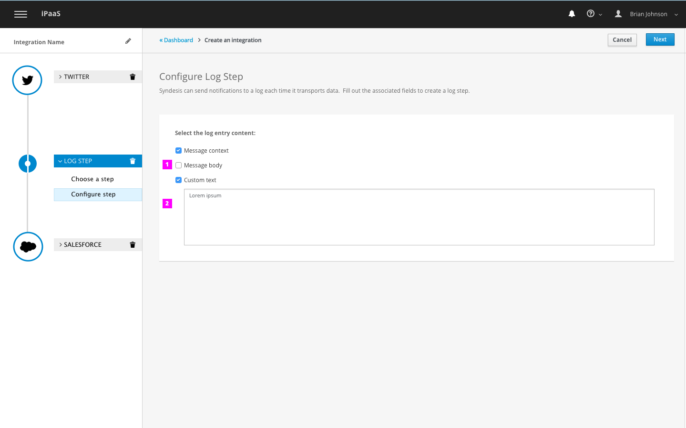

# Monitor: Log Step
This design covers the following workflows:

- Adding a log step to an integration

## Log Step

1. Choose Log from list of step options

1. There are 3 types of entries you can add for each log step. Select the ones you want to include.
1. If selected "Custom Text" then must input content in input field. If you start inputing text into input field before selecting checkbox, then the "Custom text" field will automatically be selected.
