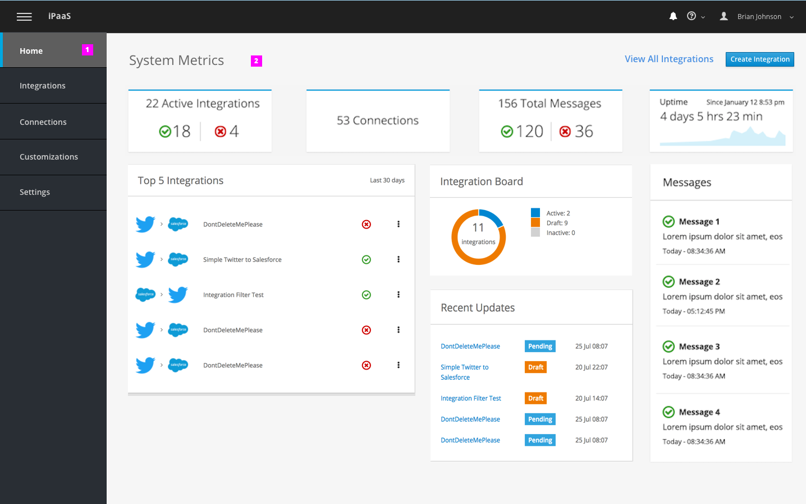

# Monitor: System Metrics
This design covers the following workflows:

- System wide metrics via the Home page

## System Metrics

1. System wide metrics will be shown on the Home page of the application.
1. Status aggregate cards will be used to show high level metrics.
  - **Integrations**: Card shows number of total active integrations. Option to break down integrations via success vs. error.
  - **Connections**: Shows total number of available connections. Optional - click on text to drill down to connection page.
  - **Messages**: Show total number of messages. Option to break down via success vs error.
  - **Uptime**: Shows time that current pod is running since last restart

### Questions

  1.  Discuss functionality to drill down per card. To drill down, click on active text within cards. Is this something we would want for TP4?
    - For Example: Clicking on "53 Connections" could take user to Connections page.
  1. How long will messages be? If long, will there be a need to take user to a separate page to view full message?

### PatternFly Reference

Please reference [Aggregate Status Card](http://www.patternfly.org/pattern-library/cards/aggregate-status-card/) for new metrics being introduced to Home Page.
