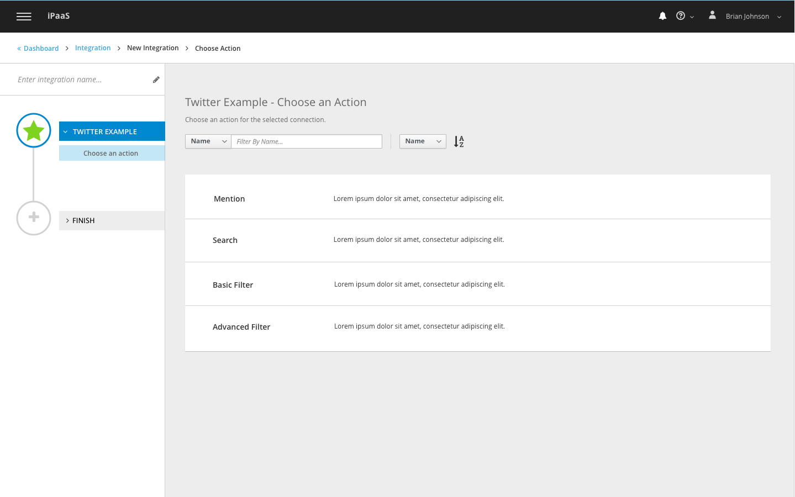
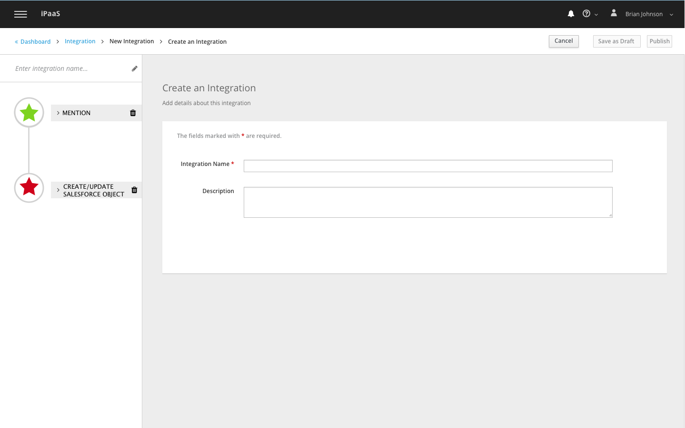

# Navigation

## Integration Breadcrumb
General rules:
- Create integration breadcrumb is now consistent with create connection.
- Breadcrumb is now right below application masthead to ensure visual hierarchy.
- Buttons in create integration flow:
  - Buttons with actions that affecting integration level should be placed at the breadcrumb level;
  - Step specific action buttons should be placed right below the action area.

