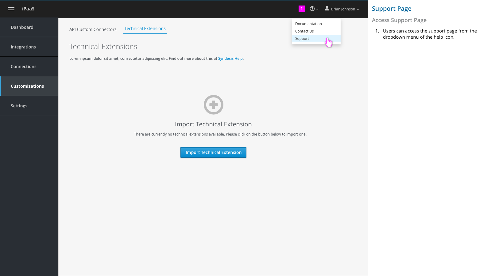
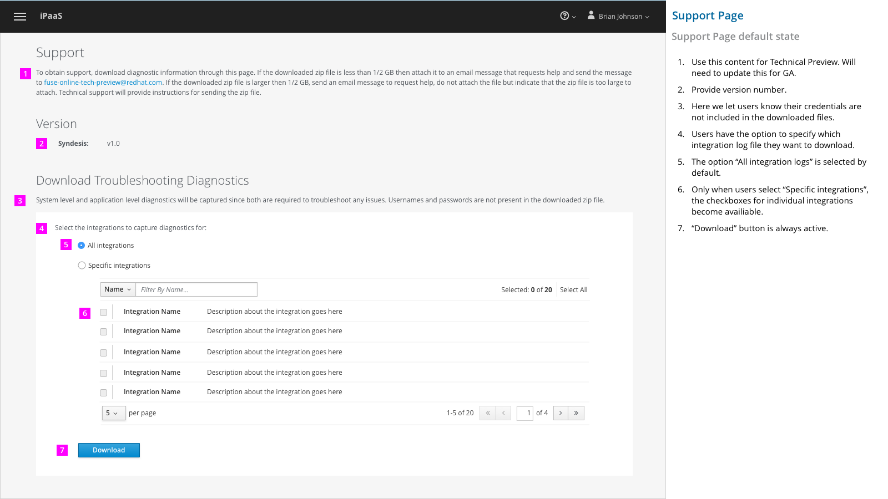
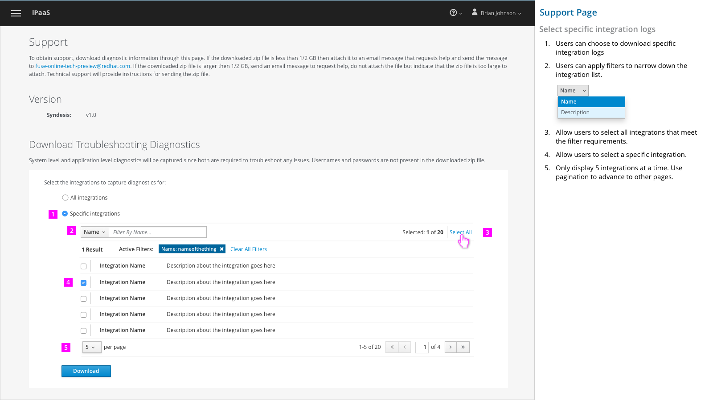

# Support Page

Users can find Syndesis version information on support page, and download diagnostics files as well.

## Access Support Page

1. Users can access the support page from the dropdown menu of the help icon.

## Support Page Default State

1.	Use this content for Technical Preview. Will need to update this for GA.

2.	Provide version number.

3.	Here we let users know their credentials are not included in the downloaded files.

4.	Users have the option to specify which integration log file they want to download.

5.	The option “All integration logs” is selected by default.

6.	Only when users select “Specific integrations”, the checkboxes for individual integrations become availiable.

7.	“Download” button is always active.

## Selecting specific integration diagnostics to download

1.	Users can choose to download specific integration logs

2.	Users can apply filters to narrow down the integration list.






3.	Allow users to select all integrations that meet the filter requirements.

4.	Allow users to select a specific integration.

5.	Only display 5 integrations at a time. Use pagination to advance to other pages.
